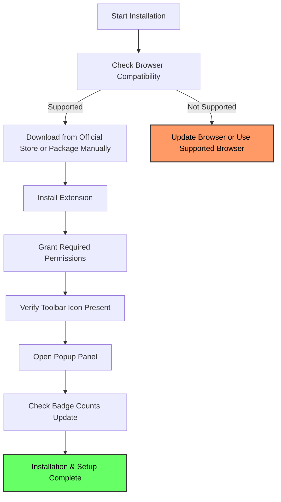

# Installation and Setup Guide for uBO Scope

Welcome to the essential guide for installing and getting started with uBO Scope, your transparent window into all remote network connections made by your browser. This documentation walks you through installing uBO Scope on supported browsers, verifying the installation, and configuring it for your first use.

---

## 1. Introduction

uBO Scope is a lightweight browser extension that reports every network connection your browser attempts—allowed, blocked, or stealth-blocked—helping you understand your web exposure clearly. This guide ensures you install the extension correctly across supported browsers, access the extension interface, and verify that it's actively monitoring network traffic.

---

## 2. Prerequisites

Before beginning the installation, ensure the following:

- **Supported Browsers**: Chromium-based browsers (Chrome, Edge, etc.) version 122.0 or higher, Firefox version 128.0 or higher, or Safari version 18.5 or higher.
- **Permissions**: Ability to install extensions from the official browser stores or manual installation methods on Safari.
- **Network Connectivity**: Active internet connection to download the extension from the trusted sources.

---

## 3. Step-by-Step Installation

Follow these instructions based on your browser.

### 3.1 Installing on Chromium Browsers

1. **Open Chrome Web Store:** Navigate to the official uBO Scope page in the [Chrome Web Store](https://chromewebstore.google.com/detail/ubo-scope/bbdpgcaljkaaigfcomhidmneffjjjfgp).

2. **Add to Browser:** Click the _Add to Chrome_ button to install the extension.

3. **Confirm Permissions:** Accept the requested permissions (`activeTab`, `storage`, and `webRequest`) essential for uBO Scope’s operation.

4. **Verify Installation:** The uBO Scope icon should appear in the toolbar.

### 3.2 Installing on Firefox

1. **Open Firefox Add-ons:** Go to the official uBO Scope page on [Firefox Add-ons](https://addons.mozilla.org/firefox/addon/ubo-scope/).

2. **Add to Firefox:** Click on _Add to Firefox_ and approve permissions.

3. **Confirm Permissions:** Ensure that requested permissions (`activeTab`, `storage`, `webRequest`) are granted.

4. **Verify Installation:** Look for the uBO Scope icon in the toolbar.

### 3.3 Installing on Safari

1. **Manual Installation:** Because Safari requires manual packaging and installation, please refer to the official [Safari platform manifest and packaging instructions](https://github.com/gorhill/uBO-Scope/tree/main/platform/safari).

2. **Set Minimum Version:** Ensure Safari is version 18.5 or newer.

3. **Enable Extension:** After installation, enable uBO Scope in Safari’s Extensions preferences.

---

## 4. First-Time Setup & Configuration

Once installed, uBO Scope requires minimal configuration to start revealing network activity.

### 4.1 Access the Extension Interface

- Click the uBO Scope icon in your browser toolbar to open the popup panel.

### 4.2 Understand Toolbar Badge

- The badge shows the number of distinct third-party remote servers your browser connected to on the current tab.

- A **lower badge count** represents fewer exposed connections and typically better privacy.

### 4.3 Initial Behavior

- On loading a webpage, uBO Scope detects allowed, blocked, and stealth-blocked connections and tallies these in real time.

- The popup panel categorizes connections under _not blocked_, _stealth-blocked_, and _blocked_.

### 4.4 No Additional User Settings

- uBO Scope operates automatically, requiring no manual configuration or filter lists.

---

## 5. Verifying Installation

To confirm uBO Scope is fully operational:

1. **Open a Known Site:** Visit a popular website (e.g., news or your favorite social media).

2. **Check Toolbar Badge:** The number on uBO Scope’s icon should reflect your distinct third-party connections.

3. **Open Popup Panel:** Click the icon to see detailed domains categorized as allowed, stealth-blocked, or blocked.

4. **Check for Updates:** Ensure the extension version is up to date (current stable is 1.0.1).

---

## 6. Troubleshooting Common Installation Issues

<AccordionGroup title="Troubleshooting Common Issues">
<Accordion title="Extension Icon Missing After Installation">
- Make sure the browser version meets the minimum requirement.
- In Chromium and Firefox, verify the extension is enabled in the extensions settings page.
- Restart the browser to refresh extension loading.
- Check for conflicting extensions that may hide icons.
</Accordion>

<Accordion title="Badge Count Not Updating">
- Ensure the site you visit is loaded completely.
- Verify that browser permissions (`webRequest`, `storage`) are granted.
- Check for browser privacy settings or extensions blocking web requests interception.
</Accordion>

<Accordion title="Installation Fails on Safari">
- Confirm Safari’s version is 18.5 or newer.
- Follow manual packaging steps accurately using the provided scripts and manifest.
- Enable the extension explicitly in Safari preferences.
</Accordion>
</AccordionGroup>

---

## 7. Advanced Notes for Power Users

- uBO Scope relies on browser `webRequest` API permissions to monitor traffic; any limitations or browser-specific restrictions on this API will affect visibility.

- The extension’s badge count is **not** a block count but a count of distinct third-party allowed connections — a crucial distinction for evaluating privacy exposure.

- The extension operates independently of any content blockers you may have installed.

---

## 8. Summary Diagram: Installation Flow

---

## 9. Additional Resources

- [System Requirements & Prerequisites](../getting-started/setup-installation/prerequisites-requirements)
- [Installing uBO Scope on Supported Browsers](../getting-started/setup-installation/installing-extension)
- [First-Time Setup & Configuration](../getting-started/setup-installation/initial-configuration)
- [Understanding the Toolbar Badge](../guides/essential-workflows/understanding-the-badge)

---

## 10. Next Steps

- After installation, explore the popup panel to understand the network connections being reported.
- Use the guide on [Exploring the Popup Panel](../guides/essential-workflows/exploring-the-popup) for details on interpreting data.
- In case of issues, consult [Troubleshooting Common Issues](../getting-started/first-use-validation/troubleshooting-common-issues).

---

For more detailed architecture and integration info, visit the [System Architecture](../overview/core-architecture-concepts/architecture-overview) and [Integration & Browser Compatibility](../overview/core-architecture-concepts/integration-and-dependencies) documentation.

---

Thank you for choosing uBO Scope to empower your browsing transparency.