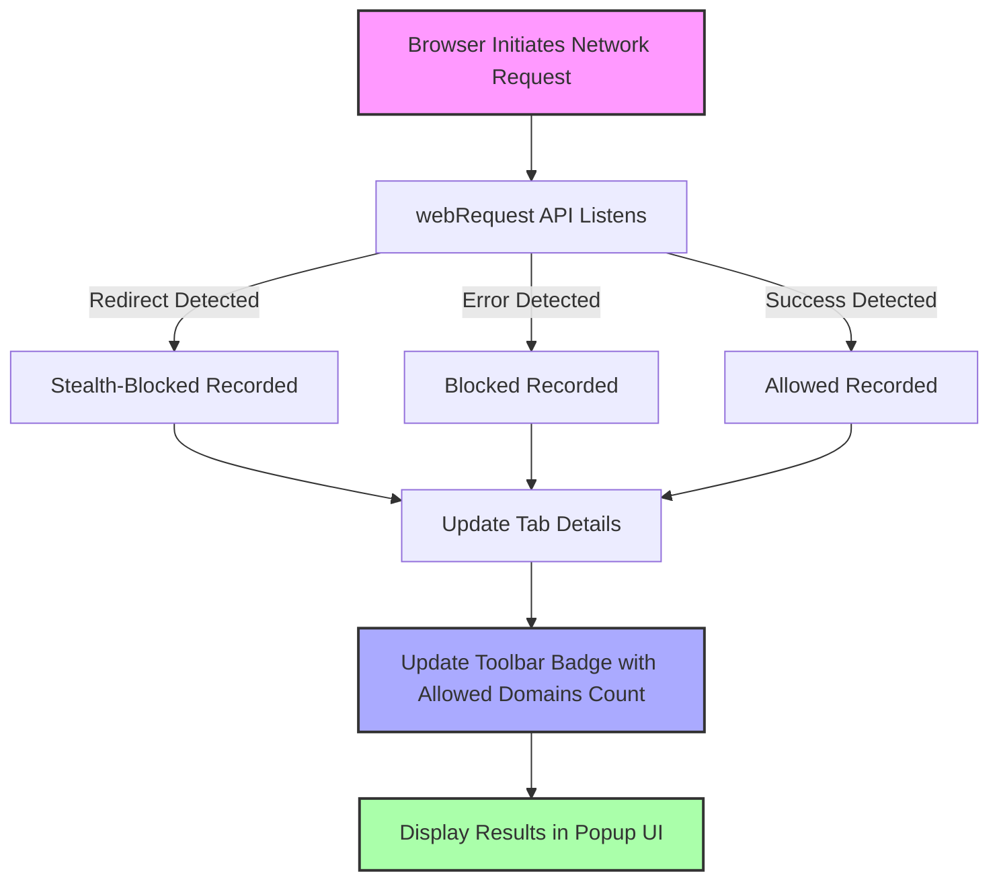

# Detecting Stealth Blocking and Invisible Requests with uBO-Scope

## Overview

This guide helps you **use uBO-Scope to uncover stealth blocking techniques** employed by advanced content blockers and to identify network requests that are blocked or hidden before they reach your browser's network API. Stealth blocking masks blocking actions to evade detection by websites and other monitoring tools. By understanding how to detect these invisible requests, you will gain deeper insight into your browser's true network activity and content blocker behavior.

---

## Prerequisites

Before starting, ensure you have:

- Installed uBO-Scope on a supported browser (Chromium, Firefox, or Safari). See the [Installing and Setting Up uBO-Scope](https://github.com/gorhill/uBO-Scope) guide for details.
- Enabled the extension and granted necessary permissions, including network request monitoring.
- Familiarity with the uBO-Scope popup UI, especially understanding of allowed, blocked, and stealth-blocked connection categories (see [Using the Popup: Viewing and Interpreting Results](https://github.com/gorhill/uBO-Scope)).
- An active browsing session with pages to analyze.

---

## What You Will Achieve

By following this guide, you will:

- Detect when content blockers are stealth blocking requests—blocking without leaving typical traces.
- Identify _invisible_ network requests that might not appear in browser tools or content blocker logs.
- Interpret uBO-Scope's classification of allowed, blocked, and stealth-blocked connections effectively.
- Empower yourself to assess content blocker transparency and effectiveness beyond simple block counts.

---

## Time Estimate

This workflow should take approximately 10-20 minutes, allowing hands-on exploration with real websites.

---

## Difficulty Level

Intermediate: requires understanding of browser network activity and basic content blocker behavior.

---

# Step-by-Step Instructions

### 1. Understand the Key Concepts

Start by reviewing the key terms specific to stealth blocking:

- **Allowed Connections:** Network requests that were successfully completed and fetched resources.
- **Blocked Connections:** Requests that were stopped by content blockers and reported by standard browser network APIs.
- **Stealth-Blocked Connections:** Requests that were blocked silently, often by tricks like redirection or cancellation before the browser fully logs them.

uBO-Scope categorizes requests using browser `webRequest` API events and heuristics to detect these stealth blocks.

---

### 2. Open uBO-Scope Popup on an Active Tab

- Navigate to a website to analyze.
- Click the uBO-Scope toolbar icon to open the popup panel.
- Observe the summary domain count and the three distinct sections:
  - _Not Blocked_ (allowed domains)
  - _Stealth-Blocked_ (domains suspected of stealth blocking)
  - _Blocked_ (domains with visibly blocked requests)

### 3. Analyze Stealth-Blocked Indicators

- Review the domains listed under the _Stealth-Blocked_ section.
- These represent connections where uBO-Scope detected network requests that were redirected or canceled early, implying stealth blocking.
- Use this list to identify which third-party servers might be blocked invisibly by your content blocker.

---

### 4. Cross-Reference with Browser Developer Tools

- Open your browser's Developer Tools Network panel.
- Look for missing or suppressed requests to domains identified as stealth-blocked by uBO-Scope.
- Notice these requests might never appear in the network tab due to stealth blocking.

This cross-validation deepens your understanding of stealth blocking behavior.

---

### 5. Inspect the Toolbar Badge

- The uBO-Scope badge shows the count of distinct allowed third-party domains.
- A low badge count combined with a significant stealth-blocked list suggests aggressive stealth blocking.

---

### 6. Repeat on Multiple Websites

- Test different sites, including those with active content blockers enabled.
- Watch how stealth-blocked domains vary per site and blocker configuration.

---

# Practical Tips

- **Refresh the page** and monitor the popup; stealth blocking effects often appear dynamically.
- **Contrast stealth-blocked vs blocked:** Some blockers visibly block requests, others silently redirect or prevent them; uBO-Scope uncovers both.
- **Investigate stealth-blocked domains:** These can indicate trackers or ads blocked quietly.
- Keep in mind that not all stealth-blocked domains are malicious; some may be benign services silently prevented.

---

# Common Pitfalls

- **No stealth-blocked domains shown:** Your content blocker may not use stealth techniques, or the tested page might not trigger such requests.
- **Confusing network errors with stealth blocking:** uBO-Scope distinguishes errors but ensure you differentiate actual block events from transient failures.
- **Browser limitations:** Browsers that do not report all network requests via `webRequest` API may have blind spots.

---

# Troubleshooting

- If the popup shows no data or inaccurate info:
  - Confirm uBO-Scope has necessary permissions (`webRequest`, `activeTab`, `storage`).
  - Reload the extension or restart the browser.
  - Verify you are viewing an active tab with network activity.

- If stealth-blocked section is always empty:
  - Stealth blocking might not be enabled or present in your current content blocker.
  - Experiment by changing blocker settings or testing other blockers.

- For deeper debug, consult the uBO-Scope logs (if available) or the GitHub repo for advanced configuration.

---

# How uBO-Scope Detects Stealth Blocking (Behind the Scenes)

Understanding detection helps interpret results:

- uBO-Scope listens to `webRequest` events such as `onBeforeRedirect`, `onErrorOccurred`, and `onResponseStarted`.
- Redirected requests that disappear unexpectedly are flagged as stealth blocks.
- Requests that error out without visible reasons may also be stealth-blocked.

This method captures blocking that avoids conventional browser request error reporting.

---

# Example Scenario

Suppose you visit a news website protected by a sophisticated content blocker.

- Open the uBO-Scope popup after loading the page.
- The badge shows a very low count of allowed third-party domains, suggesting privacy.
- The stealth-blocked section lists several ad-related domains.
- Checking Developer Tools' network tab, you notice these domains never generated requests.

This confirms stealth blocking is active, preventing detection by typical network monitors.

---

# Next Steps & Related Documentation

- Explore [Using the Popup: Viewing and Interpreting Results](https://github.com/gorhill/uBO-Scope) to expand your skills in reading uBO-Scope data.
- Read [Understanding Third-Party Connections and Badge Counts](https://github.com/gorhill/uBO-Scope) to relate stealth detection to overall privacy insights.
- Compare other content blockers using [Comparing Content Blockers with uBO-Scope](https://github.com/gorhill/uBO-Scope).
- For deeper architecture understanding, see [Architecture Overview](https://github.com/gorhill/uBO-Scope).

---

# Additional Resources

- Official uBO-Scope repository: [https://github.com/gorhill/uBO-Scope](https://github.com/gorhill/uBO-Scope)
- Public Suffix List for domain classification: [https://publicsuffix.org/](https://publicsuffix.org/)

---

## FAQ

<AccordionGroup title="Frequently Asked Questions">
<Accordion title="What is stealth blocking exactly?">
Stealth blocking refers to content blockers silently preventing network requests from being made or completed without reporting errors or visible blocks. It hides blocking actions from websites and browser utilities to avoid detection or page breakage.
</Accordion>
<Accordion title="Can uBO-Scope detect all stealth blocking?">
uBO-Scope detects stealth blocking only when network requests are visible to the browser's `webRequest` API before being blocked or redirected. Requests blocked before reaching this layer or network requests made outside the API scope remain invisible.
</Accordion>
<Accordion title="Why do some requests not appear in browser dev tools but show in uBO-Scope?">
uBO-Scope captures early redirect and error events that may not populate the browser’s typical network tab, thus revealing stealthy blocking usually hidden from developers.
</Accordion>
<Accordion title="How do I interpret 'stealth-blocked' vs 'blocked' sections?">
Blocked requests are those visibly stopped by blocking rules and typically produce network errors. Stealth-blocked requests are silently prevented and avoid errors or block indicators, making them harder to detect.
</Accordion>
</AccordionGroup>

---

By mastering stealth blocking detection in uBO-Scope, you elevate your privacy awareness and gain tools to hold content blockers accountable for transparency and effectiveness.

---

# Diagram: Detection of Request Outcomes in uBO-Scope

---