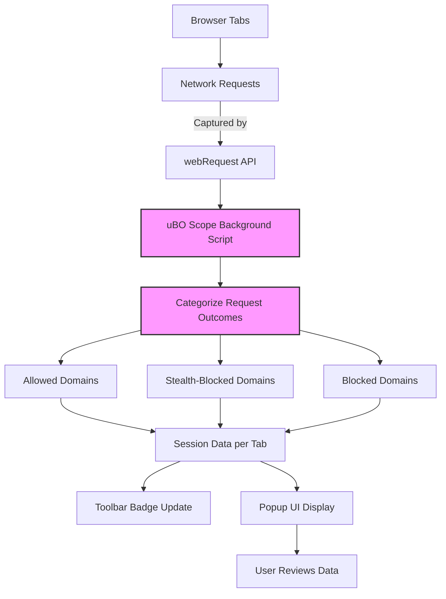

# Best Practices: Interpreting Content Blockers with uBO Scope

## 1. Understanding the Role of uBO Scope in Auditing Content Blockers

uBO Scope serves as a powerful auditing tool to transparently reveal the behavior of content blockers and filters by reporting all network connections attempted by webpages in your browser. This guide focuses specifically on how to use uBO Scope to audit filter performance, interpret its outcomes, and gain valuable insights into your browsing privacy and security posture.

### 1.1 What You Will Achieve

By following this guide, you will learn to:

- Use uBO Scope’s data to understand which third-party domains your browser attempts to connect with during web sessions.
- Distinguish between connections that were allowed, stealth-blocked, or explicitly blocked by content blockers.
- Interpret the badge counts and popup domain lists accurately to assess your true exposure to third-party connections.
- Make informed decisions about content blockers and filter lists based on meaningful network connection data.

### 1.2 Prerequisites

- uBO Scope extension installed and enabled in your browser (Chromium, Firefox, or Safari).
- Basic familiarity with browser extension popups and network request concepts.
- Browsing some web pages to generate network activity for analysis.

---

## 2. How uBO Scope Categorizes Network Connections

uBO Scope captures and categorizes network requests per browser tab into three distinct groups:

- **Allowed:** Third-party domains where connections were successful and not blocked.
- **Stealth-blocked:** Domains where connections were blocked through stealth mechanisms, often employed to prevent detection or breakage.
- **Blocked:** Domains explicitly blocked, typically by content blockers such as uBlock Origin.

### 2.1 Why These Categories Matter

Understanding these categories gives you granular insight into your browsing exposure:

- **Allowed connections** indicate third-party servers your browser downloaded resources from. Fewer allowed domains imply better privacy.
- **Stealth-blocked entries** reveal domains blocked in a less obvious manner to webpages, indicating a careful filter strategy that avoids breaking sites.
- **Blocked connections** show domains completely denied, highlighting the filter’s active blocking surface.

### 2.2 The Toolbar Badge Count Explained

The number shown on uBO Scope’s toolbar badge represents the count of distinct third-party domains **allowed** to connect for the active tab. This is the critical privacy metric:

- A **lower badge count is better** — it means fewer external entities accessed your browsing session.
- Avoid using block counts from other blockers as a proxy for effectiveness; uBO Scope’s focus is on unique allowed domains.

---

## 3. Step-by-Step Workflow to Interpret uBO Scope Data

<Steps>
<Step title="Open the uBO Scope Popup">
Click the uBO Scope icon in your browser toolbar to open the popup which displays domain-level connection information for the currently active tab.
</Step>
<Step title="Review the Domain Header">
The header shows the current tab's hostname and domain. This contextualizes the source of connections.
</Step>
<Step title="Analyze the Summary Section">
Look at the "domains connected" count — this tells you how many distinct third-party domains were allowed connection.
</Step>
<Step title="Examine Allowed Domains">
Under the 'not blocked' section, find all third-party domains your browser connected to without any blocking. These represent your network exposure.
</Step>
<Step title="Check Stealth-Blocked Domains">
Review the 'stealth-blocked' section to see domains whose connections were blocked using stealth techniques, indicating subtle filtering or blocking.
</Step>
<Step title="Inspect Blocked Domains">
Under 'blocked', identify domains explicitly prevented by content blockers. These represent known unwanted or suspicious third parties.
</Step>
<Step title="Evaluate Counts and Patterns">
The badge and popup list counts help you assess if the filter list is effectively preventing undesired connections or if you are exposed to many third parties.
</Step>
</Steps>

---

## 4. Practical Tips and Best Practices

- **Focus on allowed domain counts instead of block numbers:** High block counts can paradoxically accompany high allowed connections, revealing less privacy.
- **Use stealth-blocked entries as indicators of sophisticated filtering:** These blocks reduce detection risks and site breakage.
- **Compare counts across different filter lists or content blockers:** Use uBO Scope consistently as your auditing baseline.
- **Interpret domain counts in context:** Popular sites often require some third-party CDNs, which is normal and often necessary.
- **Regularly clear session data or restart browser to refresh connections:** This ensures the current popup accurately represents active browsing.

<Tip>
Avoid relying on ad blocker test sites for judging filter performance. These fabricated scenarios do not reflect real-world networking and may mislead you.
</Tip>

---

## 5. Common Challenges and Troubleshooting

### 5.1 Missing or Zero Counts in the Badge or Popup

- Verify uBO Scope is enabled and has the right permissions (webRequest, activeTab, storage).
- Make sure you are browsing sites that issue network requests; static pages or cached content may not generate data.
- Refresh the page and popup to update counts.
- Check for browser-specific limitations (e.g., Safari minimum version is 18.5).

### 5.2 Unexpectedly High Allowed Domain Count

- Remember some sites legitimately load resources from multiple trusted CDNs.
- A high allowed count could mean your filter list has gaps or your content blocker settings are permissive.
- Consider using more restrictive filter lists for tighter privacy.

### 5.3 Stealth-Blocked Domains Not Showing

- Some content blockers may not implement stealth blocking, so this section might be empty.
- This absence does not necessarily imply poor blocking; it means no stealth blocking was detected.

<Warning>
The number of stealth-blocked domains relies on the browser's ability to report such outcomes through webRequest APIs and the content blocker’s techniques.
</Warning>

---

## 6. Example Scenario: Assessing Privacy on a News Website

Suppose you visit a popular news website. Opening uBO Scope's popup shows:

- **Domains connected:** 8
- **Not blocked:** cdn.news-site.com (5 requests), ads.network.com (not blocked), analytics-service.com
- **Stealth-blocked:** tracker.adsprovider.com (2 requests)
- **Blocked:** adserver.badads.com

Interpretation:

- Your content blocker allowed 8 distinct third-party domains.
- The stealth blocking is protecting against covert trackers without breaking the site.
- Explicitly blocked domains confirm your filter actively removes known ad servers.

Conclusion:

- The badge number (8) and details give a realistic picture of exposure.
- You understand where privacy risks might still exist and can adjust filters.

---

## 7. Advanced Considerations for Filter Maintainers

Filter list authors benefit from uBO Scope to validate the impact of their lists across real-world browsing data, especially in environments where full browser devtools access is unavailable.

Recommendations:

- Use uBO Scope popup data regularly to monitor domains that remain allowed.
- Analyze stealth-blocked domains for potentially hidden tracker connections.
- Cross-reference with network traffic data and existing filter rules.

---

## 8. Next Steps & Related Resources

- Read **[How uBO Scope Monitors Connections](/getting-started/first-steps-usage-validation/how-it-works)** for foundational understanding of request tracking.
- Review **[Debunking Block Count Myths](/guides/exploring-network-insight-workflows/debunking-block-count-myths)** to clarify common misconceptions.
- Explore **[Investigating Third-Party Requests in Real Time](/guides/exploring-network-insight-workflows/investigating-third-party-requests)** for practical investigative workflows.
- For installation, visit **[Installing uBO Scope on Your Browser](/guides/getting-started-with-ubo-scope/installation-on-chromium-firefox-safari)**.

---

## 9. Visual Workflow: How Data Flows in uBO Scope

---

## 10. Additional Tips

- Regularly update your filter lists and uBO Scope to incorporate improvements.
- Use the counts to balance privacy needs versus site functionality.
- Consider using uBO Scope on locked-down devices to audit connections where standard tools aren’t available.

---

<Check>
This guide equips you to confidently interpret uBO Scope’s reports, helping to ensure your browsing privacy by understanding which connections are truly allowed, stealth-blocked, or blocked.
</Check>

---

## 11. References

- [uBO Scope Product Overview](/overview/intro-core-concepts/product-overview)
- [Understanding Badge and Popup](/guides/getting-started-with-ubo-scope/understanding-badge-and-popup)
- [How uBO Scope Works (Architecture)](/overview/architecture-usage/how-it-works-architecture)
- [Troubleshooting Guide](/getting-started/first-steps-usage-validation/troubleshooting)

---

_For the latest source files, see the [GitHub repository](https://github.com/gorhill/uBO-Scope/tree/main)._