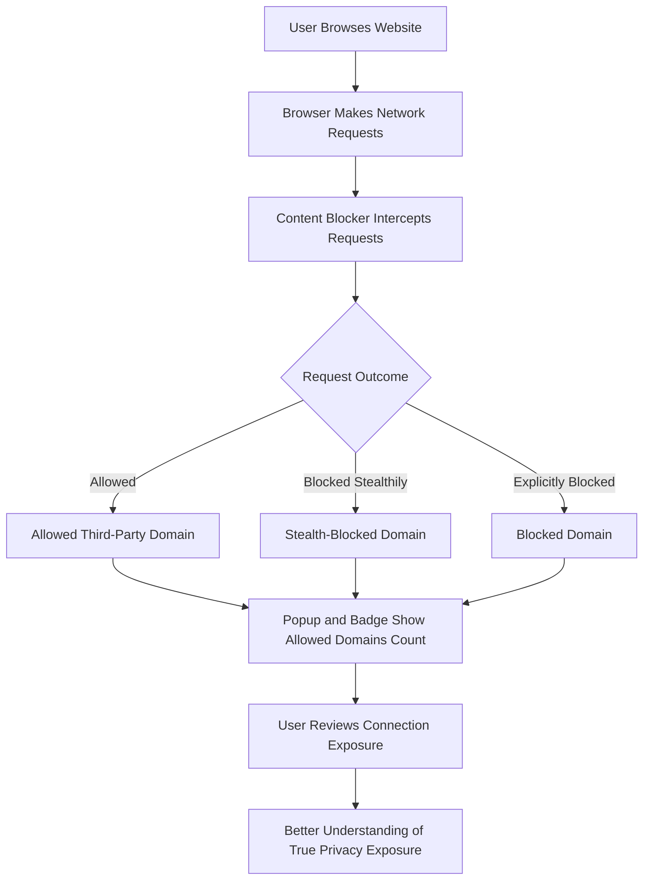

# Debunking Block Count Myths with uBO Scope

Understanding the real effectiveness of content blockers requires more than just glancing at block counts displayed on badges. This guide uses real-world scenarios with uBO Scope to reveal why relying on toolbar badge block counts can mislead users, and provides practical insights on how to interpret true third-party exposure.

---

## 1. Why Block Count Alone Is Misleading

Most content blockers display a block count badge indicating the number of blocked network requests or connections. However, this raw block count:

- **Does not accurately reflect the number of distinct third-party servers blocked**.
- **Fails to show how many third-party connections were ultimately allowed**, which directly impacts real privacy exposure.
- Is often misunderstood as a measure of blocker effectiveness, which is incorrect.

### Real-World Problem

Imagine two content blockers:

- Blocker A shows a higher block count but actually allows connections to more third-party domains.
- Blocker B blocks fewer requests numerically but leaves fewer distinct third-party connections open.

Simply trusting block counts would wrongly favor Blocker A, while in reality, Blocker B offers stronger privacy protection.

<Tip>
The crucial metric is the number of distinct third-party domains from which resources are **actually allowed** — fewer allowed domains signify better blocking.
</Tip>

---

## 2. How uBO Scope Helps Visualize True Third-Party Exposure

uBO Scope focuses on accurately counting **unique third-party remote servers connected to by each browser tab**. It categorizes connections as:

- **Allowed:** Connections successfully made.
- **Stealth-blocked:** Connections blocked stealthily by content blockers.
- **Blocked:** Connections explicitly blocked.

### Badge Meaning

The toolbar badge count represents the number of unique third-party **allowed** domains—enabling users to understand their real exposure at a glance.

### Popup UI

Opening the uBO Scope popup shows detailed lists of domains per category with connection counts. This gives context beyond the badge number.

---

## 3. Real Scenarios Illustrating Block Count Myths

### Scenario 1: Higher Block Count May Mean More Allowed Third Partaries

- A content blocker with aggressive blocking lists might block many requests (high block count).
- However, due to how the browser fetches resources after blocking, it may still allow requests to numerous distinct third-party domains.
- uBO Scope's report would show many allowed third-party domains despite the high block count.

This clarifies developer misconception: a higher block count doesn’t always correlate with stronger privacy.

### Scenario 2: Low Block Count Can Coincide with Low Third-Party Exposure

- Some blockers minimize the number of fetched resources by avoiding triggering further network requests.
- They may show modest block counts but have fewer allowed third-party servers.
- uBO Scope's data confirms the true reduction in third-party connections even when block counts seem low.

---

## 4. Step-by-Step: Using uBO Scope to Uncover Block Count Truths

<Steps>
<Step title="Install and Enable uBO Scope">
Install uBO Scope on your preferred browser (Chromium, Firefox, Safari) from official stores. Confirm permissions are granted.
</Step>
<Step title="Browse a Website of Your Choice">
Open a tab with a rich content website known to connect to multiple third-party servers.
</Step>
<Step title="Observe Toolbar Badge">
Look at the uBO Scope badge on the toolbar; it shows the number of distinct allowed third-party domains for the current tab.
</Step>
<Step title="Open the Extension Popup">
Click the toolbar icon to open the uBO Scope popup and review detailed domain lists under Allowed, Stealth-Blocked, and Blocked.
</Step>
<Step title="Compare with Content Blocker Block Counts">
Contrast the uBO Scope allowed domains count with your content blocker's block count badges to see differences.
</Step>
<Step title="Interpret the True Exposure">
Understand that the allowed domains list reflects actual third-party network exposure more effectively than block counts.
</Step>
</Steps>

---

## 5. Best Practices for Interpreting Block Counts and Exposure

- **Focus on Distinct Allowed Domains:** Use uBO Scope or similar tools to check how many unique third-party domains your browser actually contacts.
- **Beware of High Block Counts:** They may represent many blocked requests but do not necessarily reduce exposure if many domains remain allowed.
- **Use Real Websites for Testing:** Avoid synthetic ad blocker test pages—their network traffic rarely reflects real browsing.
- **Check Stealth Blocking Behavior:** Some blockers stealth-block requests to reduce breakage and detection; uBO Scope surfaces this with the stealth-blocked category.

---

## 6. Common Pitfalls and Troubleshooting

### Pitfall: Badge Shows Zero or No Data

- Verify the extension has permission to monitor network requests.
- Confirm you are on a valid webpage (not about:blank or browser internal pages).
- Refresh the tab or open a new one to trigger data collection.

### Pitfall: Misinterpretation of Data

- Remember the badge counts unique allowed domains, not total requests.
- Stealth-blocked domains indicate attempts intercepted quietly by blockers.
- If uncertain, refer to the popup for detailed domain counts and classification.

### Pitfall: Comparing Different Blockers Directly by Block Counts

- Avoid using numbers alone to pick content blockers.
- Review third-party domain exposure alongside block counts.

---

## 7. Visual Workflow: Understanding How uBO Scope Represents Data

---

## 8. Next Steps and Related Documentation

- **Read** the [Understanding the Toolbar Badge & Popup](/guides/getting-started-with-ubo-scope/understanding-badge-and-popup) guide to explore UI details.
- **Explore** [Investigating Third-Party Requests in Real Time](/guides/exploring-network-insight-workflows/investigating-third-party-requests) to deepen monitoring skills.
- **Consult** [Best Practices: Interpreting Content Blockers with uBO Scope](/guides/exploring-network-insight-workflows/best-practices-content-blockers) for expert advice.
- **Verify** your installation and operation with [Quick Validation: Is It Working?](/getting-started/first-steps-usage-validation/quick-verification).
- **Understand** core concepts and terms in the [Core Concepts and Terminology](/overview/intro-core-concepts/core-terminology) page.

---

By grounding your evaluation in unique third-party connections rather than simple block counts, uBO Scope empowers you to assess content blocker effectiveness with clarity and confidence.

---