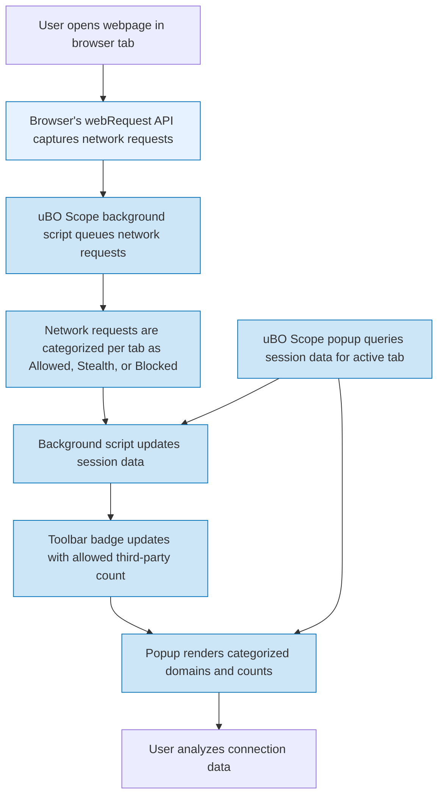

# Investigating Third-Party Requests in Real Time

Discover how to monitor and analyze outgoing network requests in your browser using uBO Scope. This guide walks you through the workflow to identify which third-party domains a webpage accesses, distinguish between direct connections and stealth-related network activities, and interpret what these details mean for your browsing security and privacy.

---

## 1. Understanding the Workflow

### What This Guide Helps You Accomplish
This guide enables you to:  
- Track outgoing network requests initiated by the active browser tab.
- Identify third-party domains contacted by the webpage.
- Differentiate between allowed, stealth-blocked, and blocked connections.
- Analyze real-time data reflecting how resources are fetched behind the scenes.

### Prerequisites
- **uBO Scope must be installed** on your supported browser (Chromium, Firefox, Safari).
- Extension **permissions enabled properly** including WebRequest, storage, and activeTab permissions.
- At least one webpage loaded and active where connections will be monitored.

### Expected Outcome
By following this guide, you will confidently read and interpret uBO Scope’s connection data, empowering you to audit the network behavior of websites you visit.

### Time Commitment
Approximately 10-15 minutes.

### Skill Level
Beginner to Intermediate.

---

## 2. Step-by-Step Instructions to Investigate Third-Party Requests

<Steps>
<Step title="Access uBO Scope Popup for Active Tab">
Open the uBO Scope extension by clicking its toolbar icon in your browser. This opens a popup showing the connection data for the active tab.

- **Outcome:** Popup displays domain summary and categorized connection lists.
</Step>

<Step title="Interpret Tab Host and Domain">
At the top, observe the hostname and domain of the active webpage.

- Hostname: Full hostname of the site.
- Domain: The registered domain extracted via the Public Suffix List.

This anchors the context of which tab’s network requests you are analyzing.
</Step>

<Step title="Review Domain Categories: Allowed, Stealth, Blocked">
The popup divides all contacted domains into three categories:

- **Allowed:** Domains for which connections were successful and unblocked.
- **Stealth-Blocked:** Domains detected as redirected or blocked silently, reflecting stealthy content blocking.
- **Blocked:** Domains where connections failed due to explicit blocking or errors.

Each category lists domains alongside the count of distinct network requests made.

- **Decision:** Use these categories to understand which third parties the webpage communicates with, and which are blocked or stealth-blocked.
</Step>

<Step title="Analyze Domain Counts and Their Meaning">
The badge on the extension icon displays the count of distinct third-party domains with allowed connections for the active tab.

- A **lower badge count** signals fewer external connections, often indicating tighter privacy.
- The count excludes the top-level domain of the page itself.

- **Verification:** Confirm that the badge number reflects the number of distinct allowed third-party domains shown in the popup.
</Step>

<Step title="Identify Stealth and Redirected Requests">
Stealth-blocked entries represent requests redirected or blocked invisibly, which might evade detection by traditional content blockers.

- This helps reveal hidden third-party connections that a webpage attempts silently.

- Focus on this category to uncover network activity potentially unnoticed by other tools.
</Step>

<Step title="Refreshing and Continuing Analysis">
Reload your webpage or navigate to new pages in the active tab to observe how the domain lists update in real time.

uBO Scope updates its data via the background process that listens to browser `webRequest` events.

- **Tip:** Reload multiple pages to observe patterns and recurring third-party domains.
</Step>
</Steps>

---

## 3. Practical Examples

### Example Scenario: Auditing a News Website
You visit a news site and open the uBO Scope popup:

- **Tab Domain:** news.example.com
- **Allowed domains:** analytics.cdn.com (5 requests), ads.tracker.net (3 requests)
- **Stealth-blocked domains:** trackers.hidden.xyz (2 requests)
- **Blocked domains:** suspicious.advertisements.net (4 requests)

You learn that while some trackers are fully blocked, stealthy redirects are still being attempted, indicating partly hidden network activity.

### Sample Data Shown in Popup (Simulated)

| Category       | Domain                 | Count |
|----------------|------------------------|-------|
| Allowed        | analytics.cdn.com       | 5     |
|                | fonts.googleapis.com    | 3     |
| Stealth-Blocked| trackers.hidden.xyz    | 2     |
| Blocked        | suspicious.advertisements.net | 4 |

---

## 4. Troubleshooting Common Issues

<AccordionGroup title="Troubleshooting Network Request Analysis">
<Accordion title="No Data Appearing in Popup">
- Confirm the extension is active and permissions are granted.
- Reload the webpage after installation.
- Check that the browser supports and exposes the `webRequest` API.
</Accordion>

<Accordion title="Badge Count Not Updating">
- The badge shows distinct allowed third-party domains, so if no connections occurred yet, it stays empty.
- Reload the tab to force new network requests.
- Verify browser permissions and that other content blockers are not interfering.
</Accordion>

<Accordion title="Unexpected Domains in Categories">
- Remember some domains may be third parties essential for site functionality (e.g., CDNs).
- Use domain lookups or trusted lists to confirm domain identities.
- Stealth-blocked domains could result from redirect chains or content blockers.
</Accordion>
</AccordionGroup>

---

## 5. Best Practices and Tips

- Regularly check the badge and popup after browsing new sites to understand your exposure.
- Use the **stealth-blocked** category to find hidden trackers or redirects missed by your main content blocker.
- Refresh your tab or reload pages to keep data current.
- Combine with other uBO Scope guides like "Understanding the Toolbar Badge & Popup" for a richer user experience.
- Avoid overinterpreting block counts; focus on unique third-party connections instead.

---

## 6. Next Steps

- Explore [Understanding the Toolbar Badge & Popup](https://your-docs-url/guides/getting-started-with-ubo-scope/understanding-badge-and-popup) to deepen your knowledge of the UI.
- Read [Debunking Block Count Myths](https://your-docs-url/guides/exploring-network-insight-workflows/debunking-block-count-myths) to understand common misconceptions.
- Review [Best Practices: Interpreting Content Blockers with uBO Scope](https://your-docs-url/guides/exploring-network-insight-workflows/best-practices-content-blockers) for advanced insights.
- Use the [Installation & Setup Guides](https://your-docs-url/getting-started/installation-and-setup/installation) if you need to install or troubleshoot the extension.

---

# Appendix: Overview Diagram of Real-Time Investigation Workflow

---

_For more information and details, see related documentation linked below._

---

<Check>
If you encounter issues with interpreting third-party connections or blocked domains, revisit the core terminology in the [Core Concepts and Terminology](https://your-docs-url/overview/intro-core-concepts/core-terminology) page.
</Check>

---