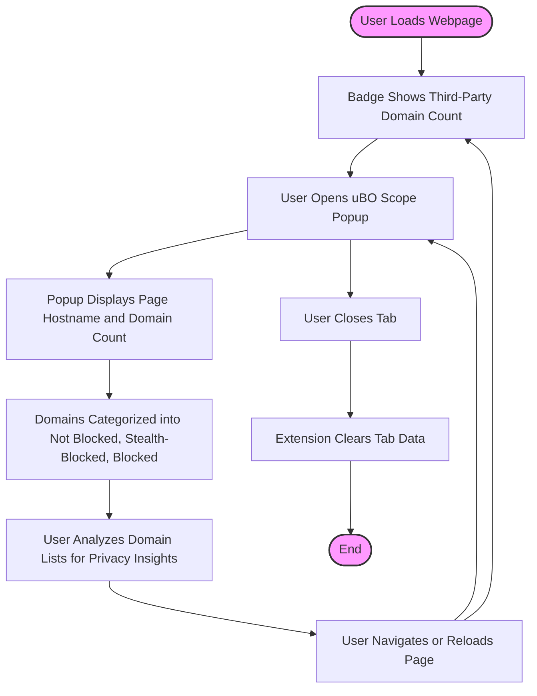

# Monitoring Network Requests on Any Webpage

## Overview
This guide walks you through monitoring and interpreting network connections made by any website you visit using uBO Scope. You will learn how to follow an end-to-end scenario — from visiting a new site, understanding the badge count on the extension icon, to exploring detailed lists of domains contacted or blocked. Along the way, you’ll find practical tips for spotting privacy risks and common third-party connections in real time.

## Prerequisites
- uBO Scope installed and enabled in your supported web browser (Chrome, Firefox, or Safari).
- Basic familiarity with browsing and managing browser extensions.
- Access to the uBO Scope toolbar icon and popup interface.

## Expected Outcome
By the end of this guide, you will be able to:

- See the number of unique third-party domains your browser connects to for any loaded webpage.
- Open and navigate the uBO Scope popup to review which domains were allowed, stealth-blocked, or blocked.
- Understand the implications of different connection categories on your privacy.
- Detect potential privacy risks by analyzing distinct third-party network requests.

## Time Estimate
Approximately 10-15 minutes for initial familiarization, depending on how deeply you inspect sites.

## Difficulty Level
Beginner to Intermediate — no advanced technical knowledge required.

---

## Step-by-Step Instructions

### Step 1: Browse to a New Website
Open a new tab and load the website you want to analyze. uBO Scope actively monitors network requests initiated by this page.

### Step 2: Check the Toolbar Icon Badge
Observe the uBO Scope icon in your browser toolbar:

- **Badge Number:** Displays the count of *distinct third-party domains* with successful connections.
- A higher count indicates more third-party servers are contacted.

<Tip>
A lower badge count is usually more desirable, indicating fewer third-party connections that could track or collect data.
</Tip>

### Step 3: Open the uBO Scope Popup
Click the extension icon to open the popup panel showing detailed data.

### Step 4: Interpret the Popup Summary
At the top, the popup shows:

- The page's primary hostname and its registered domain.
- A summary count of all distinct connected third-party domains.

### Step 5: Review Connection Outcomes by Category
The popup divides third-party domains into three categories:

- **Not Blocked:** Domains with successful network connections.
- **Stealth-Blocked:** Domains for which connections were redirected stealthily (not visibly blocked, but prevented).
- **Blocked:** Domains explicitly blocked and prevented from loading.

Each category lists the domains along with a count of how many requests were made.

### Step 6: Analyze Domains and Counts
Examine the domains in each list:

- Identify if any unexpected or suspicious domains appear.
- Note heavy third-party usage, e.g., many requests to CDNs or trackers.

<Tip>
Many legitimate third parties (like common CDNs) tend to appear in the "Not Blocked" list. Frequent unexpected domains should raise closer scrutiny.
</Tip>

### Step 7: Use the Popup to Monitor Network Activity Dynamically
As you navigate or reload pages:

- The badge count updates dynamically.
- The popup data refreshes, reflecting new or changing network requests.

### Step 8: Close Tabs to Clear Data
uBO Scope manages data by browser tab. Closing a tab clears its network data from the extension.

<Tip>
Keep this in mind when comparing connections across different sites or browsing sessions.
</Tip>

---

## Practical Example
Imagine you visit `https://example-news-site.com`:

- The uBO Scope badge shows **5**, meaning 5 distinct third-party servers were allowed.
- Opening the popup, you see:
  - **Not Blocked:** cdn.example-cdn.com, analytics.tracker.com (counts 20, 3)
  - **Stealth-Blocked:** suspicious-ad-network.com (count 1)
  - **Blocked:** tracking-ads.com (count 4)

From this, you learn:

- While some tracker domains are blocked, one stealth-blocked domain avoided visible blocking.
- You can decide to further investigate or apply stricter filters based on this insight.

---

## Tips & Best Practices
- **Consistent Monitoring:** Regularly check the badge and popup after visiting new sites to catch unexpected third-party connections.
- **Identify Legitimate vs. Suspicious Domains:** Many CDNs or service providers appear regularly; focus your attention on rare or unknown domains.
- **Understand Outcome Categories:** "Stealth-blocked" represents connections prevented silently; blocking patterns here can reveal subtle network behaviors.
- **Use with Other Content Blockers:** uBO Scope works alongside your existing content blockers to reveal actual network outcomes independently.

## Common Pitfalls
- **Misreading Badge Counts:** The badge counts distinct *domains*, not requests; a large number does not always indicate a privacy risk but signals multiple connections.
- **Assuming All Third Parties Are Malicious:** Many third parties are essential (fonts, CDNs, analytics) and do not necessarily harm privacy.
- **Relying Exclusively on "Ad Block Test" Pages:** These tests often produce misleading results; real-time monitoring with uBO Scope provides accurate visibility.

---

## Troubleshooting

### Popup Shows "NO DATA"
- Wait a moment after loading the webpage. Data collection happens asynchronously and updates typically within a second.
- Verify the extension is installed and enabled.

### Badge Number Does Not Update
- Reload the webpage.
- Check that you have given the necessary permissions (webRequest, storage).
- Ensure no browser security settings or privacy modes block background extension tasks.

### Domains Listed Seem Incorrect or Missing
- Confirm the website triggers network activity.
- Refresh the popup by closing and reopening it.
- Restart the browser to clear any session inconsistencies.

For further issues, see [Troubleshooting Setup Issues](/getting-started/first-use-validation/troubleshooting-setup).

---

## Next Steps & Related Documentation
- After mastering this workflow, explore how to interpret the Badge & Popup UI in more detail in [Understanding the UI: Badge & Popup Explained](/guides/getting-started-core-flows/understanding-ui-badge-popup).
- Learn installation and setup steps in [Installation & Browser Setup](/guides/getting-started-core-flows/install-configure-browsers).
- To deepen your understanding, read about the [Core Benefits and Use Cases](/overview/introduction-and-value/core-benefits) of uBO Scope.
- For advanced diagnostics and performance improvements, visit [Troubleshooting & Performance Optimization](/guides/advanced-usage-patterns/troubleshoot-optimizations).

---

## Additional Resources
- uBO Scope GitHub Repository: [https://github.com/gorhill/uBO-Scope](https://github.com/gorhill/uBO-Scope)
- Public Suffix List: Used internally to accurately map hostnames to domains for analysis, see: [https://publicsuffix.org](https://publicsuffix.org)

---

## How uBO Scope Works Under the Hood (Summary)

While not required for daily use, understanding the process can clarify what you see:

- The extension listens to browser `webRequest` events for HTTP, HTTPS, WS, and WSS connections.
- Requests are categorized by their outcome: success, redirected stealth, or error (blocked).
- The extension maintains a per-tab record of connected domains, aggregating counts.
- The badge displays the number of distinct domains allowed.
- The popup retrieves stored session data for the active tab and displays categorized domain lists.

---

## Diagram: User Workflow for Monitoring Network Requests

---

This completes your comprehensive guide to monitoring network requests on any webpage with uBO Scope, empowering you to better understand and control third-party connections during your browsing sessions.