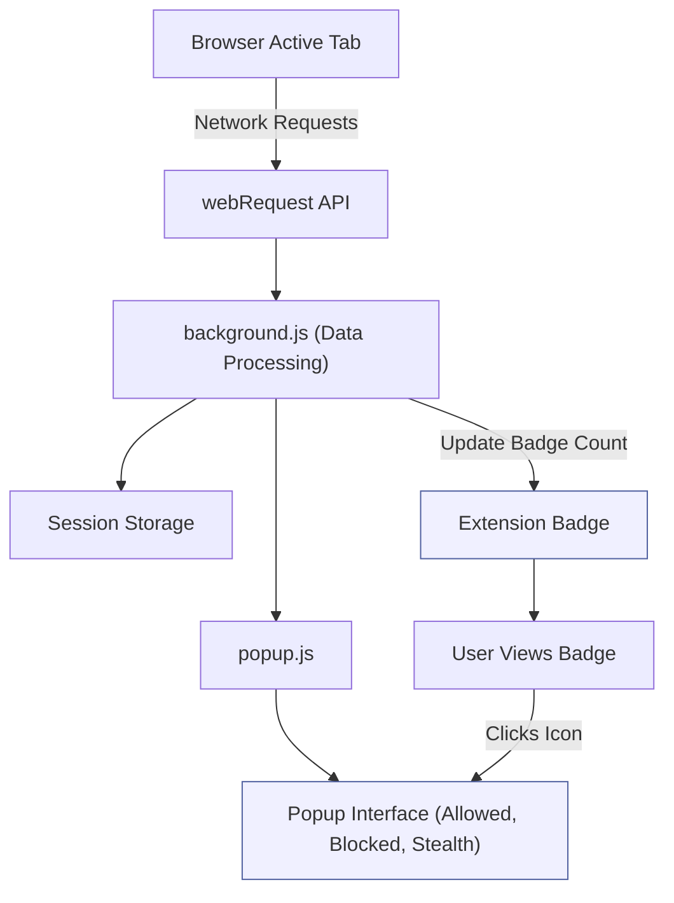

# Understanding the UI: Badge & Popup Explained

---

## 1. Overview of the UI Components

This guide provides a practical, step-by-step walkthrough of uBO Scope’s user interface, focusing solely on the badge and popup elements. These components give you immediate, clear insight into your browser's network connections related to third-party remote servers on a per-tab basis.

### What You Will Learn Here:

- How to interpret the **badge count** shown on the extension icon
- Navigating the **popup interface** to see categorized lists of domains
- Understanding the significance of the **allowed**, **blocked**, and **stealth-blocked** connection groups
- Using this information to quickly assess your privacy exposure on any webpage

---

## 2. Prerequisites

Before proceeding, ensure the following:

- uBO Scope is installed and active in your browser.
- You have visited at least one webpage after installation to generate connection data.
- The extension has proper permissions (`webRequest`, `storage`, `activeTab`) enabled as required by your browser.

---

## 3. Understanding the Badge Count

The badge count appears as a small number overlay on the uBO Scope toolbar icon in your browser.

### What It Represents:
- The **number of distinct third-party remote servers** with which connections were successfully allowed in the active tab.

### Key Details:
- A **lower badge count indicates fewer third-party connections** and generally better privacy exposure.
- The count tracks **domains**, not the number of connections or requests.
- **Only allowed connections contribute to this count**, not blocked or stealth-blocked ones.

### Example:

If you see a badge with “5”, it means your current tab connected to 5 unique third-party domains successfully.

<Check>
The badge count reflects real-time network activity filtered per active browser tab. Switching tabs will update the number accordingly.
</Check>

---

## 4. Navigating the Popup Interface

Clicking the uBO Scope icon opens the popup window. This popup organizes detailed connection information for the active tab, breaking down the domains involved by outcome.

### Key Sections of the Popup:

- **Header** (`#tabHostname`): Displays the hostname of the current page and its main domain in Unicode form.

- **Summary** (`#summary`): Shows the count of distinct domains connected to (allowed).

- **Outcome Sections**: Three categorized lists based on network connection results:
  - **Not blocked (Allowed)**: Domains from which resources were successfully fetched.
  - **Stealth-blocked**: Domains where connections were silently or stealthily blocked (not visibly reported to the webpage).
  - **Blocked**: Domains where connections were outright blocked and reported as errors.

Each section lists domains and the count of connections made to each.

### How to Read the Lists:

- Domains are sorted alphabetically.
- The number next to each domain indicates how many requests were registered during your browsing session for that domain.

---

## 5. Practical User Flow

<Steps>
<Step title="Open the uBO Scope Popup">
Click the extension icon while on a webpage you want to inspect.
</Step>
<Step title="Interpret the Header Information">
Verify the hostname and domain shown reflect the current tab.
</Step>
<Step title="Review the Summary">
Observe how many distinct domains were connected to in the active tab.
</Step>
<Step title="Explore Allowed Domains">
Scroll through the 'Not blocked' section to see which third-party domains successfully connected.
</Step>
<Step title="Check Stealth-Blocked and Blocked Domains">
Review any stealth-blocked or blocked domains to understand which connections were prevented.
</Step>
<Step title="Use this Data to Gauge Privacy Exposure">
Fewer allowed domains and more blocked or stealth-blocked domains usually indicate stronger privacy.
</Step>
</Steps>

<Info>
If the popup is empty or shows "NO DATA," it may indicate:
- The page hasn't initiated network connections yet.
- The extension hasn't gathered data for this tab.

Try reloading the page or navigating to a different website.
</Info>

---

## 6. Best Practices & Tips

- **Check the badge count frequently** as you navigate webpages to monitor exposure changes dynamically.
- Use the popup to **compare third-party interactions** across different sites.
- Be mindful that some legitimate services (like CDNs) will appear here; a high count isn’t necessarily a problem but may warrant review.
- The **stealth-blocked** category shows connections blocked silently by content blockers — valuable for understanding what your blocker is preventing without alerting sites.
- Refresh the popup or reload tabs if data seems out of sync.

<Tip>
Use the domain counts in the popup to identify unexpected or suspicious third parties connected by popular websites.
</Tip>

---

## 7. Common Troubleshooting

<AccordionGroup title="Troubleshooting Common UI Issues">
<Accordion title="The Badge Count Shows No Number or Zero">
- Verify uBO Scope is enabled and has the necessary permissions.
- Ensure you have navigated to pages that initiate network requests.
- Check if your browser supports the webRequest API properly.
</Accordion>
<Accordion title="The Popup Shows 'NO DATA' or Empty Lists">
- Data might not yet be collected for the current tab; reload the webpage.
- Make sure you are looking at an active tab with traffic.
- Restart the browser or the extension if problems persist.
</Accordion>
<Accordion title="Popup UI Does Not Update Dynamically">
- uBO Scope collects network data asynchronously; give it a few seconds.
- You can manually close and reopen the popup for updates.
</Accordion>
</AccordionGroup>

---

## 8. Visual Overview (Mermaid Diagram)

This diagram illustrates how the UI components relate to network connection data for the active tab.

---

## 9. Related Documentation & Next Steps

- **For installation details:** [Installation Instructions](/getting-started/installation-setup/installation-instructions)
- **To validate your first use:** [First Run: What to Expect](/getting-started/first-use-validation/first-run-verify)
- **For troubleshooting:** [Troubleshooting Setup Issues](/getting-started/first-use-validation/troubleshooting-setup)
- **To understand underlying architecture:** [System Architecture (with Diagram)](/overview/architecture-concepts/system-architecture-diagram)

Explore these guides to deepen your understanding of uBO Scope and maximize your privacy monitoring.

---

## 10. Summary

This guide has empowered you to:

- Read and interpret the badge count
- Navigate the popup for detailed domain connection outcomes
- Distinguish between allowed, blocked, and stealth-blocked connections
- Quickly gauge the privacy exposure on any tab

Use the UI insights to monitor your browsing habits and the effectiveness of your content blockers with confidence.

---