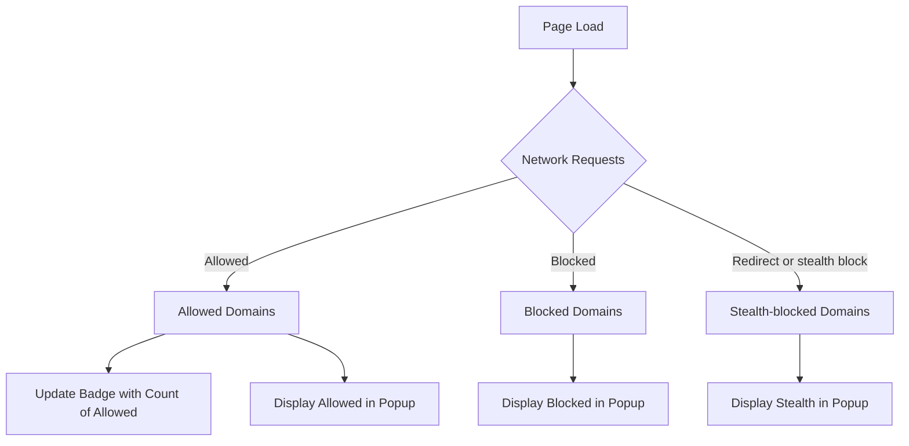

# Understanding the Toolbar Badge and Popup Data

## Overview
This guide helps you understand how the toolbar badge count in uBO Scope is calculated, what the numbers displayed in the extension popup represent, and how to interpret the different categories of network connections: **allowed**, **blocked**, and **stealth-blocked**. By the end of this guide, you'll be able to confidently read the data uBO Scope provides, distinguish meaningful network activity from browser noise, and make better privacy-informed decisions.

---

## What This Guide Covers
- How the **badge count** is computed and what it tells you
- The meaning of the **allowed**, **blocked**, and **stealth-blocked** connection sections in the popup
- Tips on filtering genuine third-party connections from browser-generated noise
- Practical examples showcasing how to read and analyze the data
- Troubleshooting common interpretative challenges

## Prerequisites
- uBO Scope installed and active in your browser (supported browsers include Chromium v122+, Firefox v128+, and Safari v18.5+)
- Basic understanding of browsing tabs and how to open extension popups

## Expected Outcome
- Confidently interpret the toolbar badge number
- Understand the details presented in the popup interface
- Distinguish between distinct third-party remote servers contacted by a webpage
- Identify and ignore common irrelevant noise

## Time Estimate
Approximately 10-15 minutes

## Difficulty Level
Beginner to Intermediate

---

## 1. Understanding the Toolbar Badge Count

The toolbar badge displays a **count of distinct third-party remote server domains** that your browser connected to for the current tab. This is crucial to expose the real network exposure of the webpage you are visiting.

### Key Points
- The badge counts **distinct domains** that successfully made **allowed** connections.
- Only third-party domains are counted — these are domains different from the main site's domain.
- A **lower** badge count means fewer distinct third-party remote servers were contacted, generally indicating less external exposure.

### How The Badge Count Is Updated
Behind the scenes, uBO Scope uses the browser's `webRequest` API to track network requests on each tab. For each new connection categorized as allowed, it records the domain and updates the badge to show the count of unique allowed third-party domains.

### When the Badge is Empty
- No third-party connections have been allowed yet.
- The main frame request has not fully loaded.

<Tip>
The badge only counts allowed third-party connections because these represent actual external network activity. Blocked or stealth-blocked domains do not count towards this badge.
</Tip>

---

## 2. Interpreting the Popup Interface
Clicking the uBO Scope icon opens a popup that breaks down all connections for the active tab into three categories:

### 2.1 Allowed ("Not Blocked")
- Lists third-party domains your browser successfully connected to.
- Each domain is shown with the count of how many resource connections were made.
- These represent actual data fetched from external servers.

### 2.2 Stealth-blocked
- Domains that uBO Scope detected as involved in a redirect or other network activity but were "stealth-blocked" by your content blocker.
- Stealth blocking means some network requests were prevented somewhat invisibly to avoid website breakage.
- These domains may show activity but are subtly controlled.

### 2.3 Blocked
- Domains for which network requests were explicitly blocked (e.g., by your content blocker).
- No data was fetched from these domains.

### Section Summary
Each category shows connected domains sorted alphabetically with a count of how many resource loads were attempted. The total number of distinct domains contacted (allowed category) is also summarized at the top.

---

## 3. Practical Steps to Analyze the Popup Data

<Steps>
  <Step title="Open the Popup">
    Click the uBO Scope toolbar icon while browsing an active tab with loaded content.
  </Step>
  <Step title="Identify the Main Site Domain">
    At the top, you will see the hostname and domain of the current tab.
  </Step>
  <Step title="Review Allowed Domains">
    Focus on the 'not blocked' section to see all distinct external domains your browser connected to for resource loading.
  </Step>
  <Step title="Examine Stealth-Blocked and Blocked Domains">
    Check if your content blocker is stealthily or explicitly blocking connections from third parties.
  </Step>
  <Step title="Compare Counts with Badge">
    Cross-reference the number of allowed domains with the badge count for consistent insight.
  </Step>
  <Step title="Identify Potential Noise">
    Some connections may be browser-internal or extensions-related; distinguish these by knowing common noise patterns (see Tips below).
  </Step>
</Steps>

---

## 4. Tips for Distinguishing Meaningful Data from Noise

- **High count of allowed domains could indicate extensive third-party tracking, but not all third parties are malicious.** CDNs and legitimate services often require external connections.
- **Stealth-blocked domains might be harder to understand**, but if you use advanced blockers, these show invisible blocking to prevent breakage.
- Browser background activities, extensions, or updates occasionally generate noise—usually identified by uncommon or internal domain names.
- The domain count reflects **unique remote server domains**, not the number of requests. Multiple requests from the same domain count as one.

<Tip>
If you see unexpected domains, consider visiting the site in a different browser profile or disabling other extensions to isolate noise sources.
</Tip>

---

## 5. Example Walkthrough

While visiting `https://example.com`, the badge shows '5'. Clicking the popup reveals:

- **Allowed:** `cdn.example.com` (10), `fonts.googleapis.com` (3), `analytics.example.net` (2), `images.examplecdn.com` (5), `api.example.com` (7)
- **Stealth-blocked:** `tracking.exampletracker.org` (4)
- **Blocked:** `ads.examplead.com` (6)

Interpretation:
- The browser contacted 5 distinct allowed third-party domains, which matches the badge count.
- Some tracking domains were stealth blocked, protecting you without breaking the site.
- Ads domains were actively blocked.

This granular data helps you see the real exposure of the page beyond simple block counters.

---

## 6. Troubleshooting Common Interpretive Issues

### Issue: Badge Count is Zero but You Expect Connections
- **Cause:** The tab is new or data has not yet updated.
- **Solution:** Reload the tab and wait a few seconds.

### Issue: Domains in Blocked Section but Badge Still Shows Count
- **Explanation:** Badge counts only allowed domains. Blocked domains do not affect it.

### Issue: Stealth Blocked Domains Appear Confusing
- **Explanation:** These are subtle blocks applied by advanced blockers to prevent user-visible breakage.
- **What To Do:** Consider this normal behavior and an indicator that your blocker is working quietly.

### Issue: Unexpected High Number of Domains
- **Tip:** Check if extensions or browser processes are generating noise.
- Visit the site in a clean profile to validate.

---

## 7. Next Steps & Related Documentation

- **Launching and Accessing the Extension:** Learn how to open and interact with the uBO Scope popup.
- **Installing and Setting Up uBO Scope:** Step-by-step installation instructions.
- **First Website Analysis:** Walkthrough of analyzing network data on a real site.
- **Core Terminology and Concepts:** Deepen understanding of key terms such as third-party, allowed, blocked.

Explore these to expand your mastery and maximize privacy insights from uBO Scope.

---

## 8. Additional Resources
- GitHub Repository: [uBO-Scope on GitHub](https://github.com/gorhill/uBO-Scope)
- Browser Compatibility and Prerequisites
- Troubleshooting Common Issues Guide

---

## Appendix: Data Flow Brief

When a tab loads a page, uBO Scope's background script listens for network requests. For each request it categorizes the outcome:
- **Allowed:** Records the domain.
- **Blocked:** Adds domain to blocked list.
- **Redirect/Stealth:** Records as stealth-blocked.

This data is aggregated per tab, saved in session storage, and then displayed in the popup. The badge count reflects the allowed third-party domain distinct count.

This seamless flow ensures you see an accurate snapshot of network exposure per active tab.

---

# Visual Summary of Data Categories

---

For more details on installation, setup, and usage, visit the relevant guides in this documentation.

---