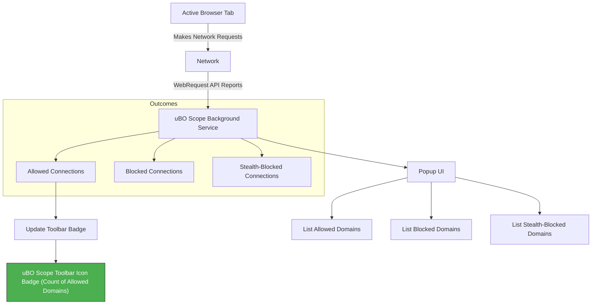

# Making Sense of Badge Counts and Toolbar Indicators

## Understanding the Badge Count

The uBO Scope toolbar badge is your immediate privacy dashboard, showing **the number of distinct third-party remote servers** your browser connected to on the active tab. Contrary to intuition, a **lower badge count is preferable** — it means fewer remote servers have been contacted, reducing your exposure to tracking, ads, or unwanted communications.

### What the Badge Represents

- **Distinct Third-Party Servers**: The badge counts unique third-party domains your browser attempted or completed connections to.
- **Not Total Requests**: It does *not* reflect the total number of all network requests, but unique remote servers involved.
- **Dynamic and Per-Tab**: The count updates live per browsing tab, reflecting real-time activity for the page you are viewing.

> Third-party domains are those separate from the main website's domain and represent external sources your browser talks to (e.g., ad servers, analytics, CDNs).

## Why a Lower Badge Count Is Often Better

Many users instinctively believe a higher badge or block count means better protection — that more blocking represents stronger privacy. This is a misconception.

- **Lower count means less exposure**: Fewer distinct third-party connections suggest the page loads fewer external resources.
- **High block counts can mean more complex tracking**: Paradoxically, allowing more connections to diverse third parties can increase the block count when filtering tries to catch more requests.
- **Block counts alone don’t indicate privacy**: It's the number of *allowed* third-party domains that reveals real exposure.

### Example Scenario

Imagine loading two news websites:

| Site          | 3rd-Party Domains Allowed | Block Count Badge |
|---------------|---------------------------|------------------|
| Site A        | 3                         | 5                |
| Site B        | 8                         | 12               |

- **Site A** loads fewer external servers, improving privacy.
- **Site B** contacts more servers; even if it blocks some, the exposure is higher.

Remember, the badge count reflects allowed connections, helping you identify which pages have less third-party footprint.

## Relationship Between Badge and Popup Information

Opening the uBO Scope popup gives you a detailed breakdown of domains contributing to the badge count:

- **Allowed Domains**: Shown in the "not blocked" section, these are third parties your browser connected to successfully.
- **Blocked Domains**: Listed under "blocked," these domains had connections prevented.
- **Stealth-Blocked Domains**: These are special cases where connections were implicitly prevented, often for extra privacy.

When the badge count is high, you will likely see many domains listed in the popup's allowed section.

<Tip>
If the badge count is zero or unexpectedly low, open the popup to verify whether uBO Scope is monitoring the current tab properly. This helps diagnose if permissions or connectivity are working.
</Tip>

## Common Misconceptions Debunked

<u><b>Myth 1:</b> “A higher block count means a content blocker is stronger.”</u>

- False. Block counts measure how many blocked connections occurred, but what matters for privacy is how many third parties were ultimately contacted (allowed). A content blocker that blocks fewer requests but yields a *lower* badge count is often protecting your privacy better.

<u><b>Myth 2:</b> “Ad blocker test pages tell me how effective my blocker is.”</u>

- These pages simulate artificial scenarios not representative of real web behavior. They can’t detect stealth blocking or nuanced behaviors of modern blockers. Use uBO Scope’s badge and popup data on real websites instead for trustworthy assessments.

## Practical Tips for Badge Interpretation

- **Monitor badge changes as you browse**: Watch how the badge evolves on different sites. Sites with many third-party connections inflate your badge count.
- **Cross-check with popup data**: Always open the popup to see which exact domains contribute to the badge. This offers actionable insight into what is happening behind the scenes.
- **Use in conjunction with block lists and content blockers**: uBO Scope reports independently of other blockers, so you can verify the actual network footprint regardless of other filters.

## How to Use Badge Counts for Privacy Assessment

1. **Open a new browser tab and browse to a site of interest.**
2. **Observe the badge count on the uBO Scope toolbar icon.**
3. **Click the icon to open the popup and examine domains under "not blocked."**
4. **Note if many third-party domains are listed — this indicates a large external footprint.**
5. **Compare with sites you trust or visit frequently to understand typical badges.**
6. **Use this insight to adjust your blocking strategies or to audit suspicious sites.**

## Troubleshooting Badge and Popup Issues

- **Badge does not update or shows no data**:
  - Ensure uBO Scope has the necessary browser permissions (especially `webRequest`).
  - Verify your browser version is supported and meets extension requirements.
  - Open the popup; if "NO DATA" appears, see the Troubleshooting Installation guide.

- **Badge count seems inconsistent with browsing activity**:
  - Some network requests may occur in background tabs or browser internals.
  - Refreshing the page often resets the badge to reflect updated data.
  - Background service worker or extension restart may be necessary.

- **Popup lists no domains even though badge shows a count**:
  - Try refreshing the popup or reloading the tab.
  - Check for any errors in the browser's extension console.

<Tip>
Consult the Getting Started guides if you encounter persistent issues, focusing on Installation Verification and Troubleshooting Installation sections.
</Tip>

## Summary

Understanding the uBO Scope badge count empowers you to quickly assess your browsing privacy footprint in terms of remote third-party connections. Remember, **a lower badge count signals fewer contacted third-party servers and generally improved privacy.** Combine this awareness with the detailed popup view for full transparency.

---

## See Also

- [Understanding the Badge and Popup](/getting-started/first-run-experience/understanding-badge-popup)
- [Opening the uBO Scope Popup](/getting-started/first-run-experience/opening-popup)
- [Core Concepts & Terminology](/overview/about-ubo-scope/core-concepts-terminology)
- [Troubleshooting Installation](/getting-started/installation-basics/troubleshooting-install)

---

## Visualization: How Badge Data Relates to Network Connections

This flow illustrates that the badge reflects the count of allowed third-party domains reported through the background service watching your network requests.

---

By mastering badge interpretation and popup exploration, you harness uBO Scope's full value as a window into your browser's real network connections and privacy exposure.