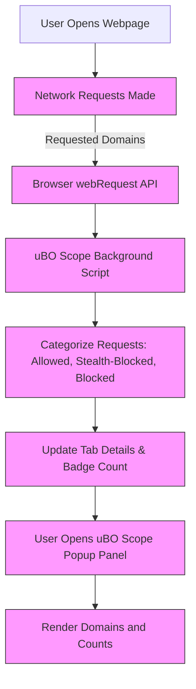

# Performing a Basic Connection Analysis

## Workflow Overview

### Task Description
This guide walks you through using uBO Scope to audit the third-party domains a webpage contacts. You'll learn to identify patterns and trends among allowed, stealth-blocked, and blocked connections to evaluate privacy exposure and site behavior effectively.

### Prerequisites
- uBO Scope extension installed and active in your supported browser (Chrome 122+, Firefox 128+, Safari 18.5+).
- Confirmed extension activation with permissions granted (webRequest, activeTab, storage).
- Access to the uBO Scope toolbar icon and popup panel.
- A webpage loaded in your active browser tab to analyze.

### Expected Outcome
By following this guide, you will be able to:
- View and interpret the distinct third-party domains contacted by the active webpage.
- Understand the difference between allowed, stealth-blocked, and blocked connections.
- Recognize connection patterns and identify privacy-relevant insights.

### Time Estimate
Approximately 5-10 minutes for a single webpage analysis.

### Difficulty Level
Beginner to Intermediate.

---

## Step-by-Step Instructions

<Steps>
<Step title="Open the uBO Scope Popup Panel">
Locate the uBO Scope icon in your browser toolbar (a shield icon with a badge count). Click the icon to open the popup panel.

- **What you see:** The popup displays the primary domain of the active tab and three sections labeled "not blocked", "stealth-blocked", and "blocked".
- **Verification:** The popup should load without errors and show counts of domains connected in the current tab.
</Step>

<Step title="Identify the Active Tab's Domain">
At the top of the popup, observe the domain name shown. This represents the main site you are inspecting.

- Domains are shown using Unicode where needed, helping correctly reveal internationalized names.
- Ensure this matches the website loaded in your active tab.
</Step>

<Step title="Review Allowed Connections">
Look at the "not blocked" section to view domains where connections succeeded without obstruction.

- Domains listed here represent third-party servers contacted by the page successfully.
- Each domain has a count badge indicating how many requests were made.
- Sort through these domains to detect common third-party service patterns (e.g., CDN, ads, analytics).
</Step>

<Step title="Examine Stealth-Blocked Domains">
Check the "stealth-blocked" section to see domains where requests were redirected, typically by content blockers or privacy tools.

- These connections were attempted but stealthy blocking mechanisms altered or redirected them.
- Understanding these can reveal where privacy tools actively manipulate network traffic.
- Domain counts help identify frequent stealth-blocked third parties.
</Step>

<Step title="Analyze Blocked Domains">
Review the "blocked" section to spot domains where network requests failed or were explicitly blocked.

- These represent third parties that did not successfully serve content.
- Blocking often results from filter lists or browser-level blocking.
- Observing this list reveals sites that are prevented from tracking or serving resources.
</Step>

<Step title="Interpret Domain Counts and Trends">
Focus on the total domain count summary at the top, representing distinct allowed third-party domains.

- A low count is indicative of better privacy.
- Compare counts across allowed, stealth-blocked, and blocked domains to understand blocking effectiveness and exposure.
- Identify domains that repeatedly appear as allowed or blocked to track persistent third parties.
</Step>

<Step title="Repeat Analysis for Different Pages or Configurations">
Reload various webpages or toggle content blockers to observe changes.

- This iterative approach lets you detect behavioral changes in third-party connections.
- Use these insights to validate your content blocking setup or assess site privacy risks.
- Closing tabs resets session data, ensuring fresh tracking for new pages.
</Step>
</Steps>

---

## Practical Tips & Best Practices

- **Focus on Domains, Not Requests:** uBO Scope highlights distinct domains contacted, giving a clearer privacy picture than raw request counts.
- **Unicode Decoding:** The extension converts domain names to Unicode for better recognition of IDNs (Internationalized Domain Names).
- **Use Domain Counts as a Privacy Metric:** The toolbar badge number is your effective privacy score for each tab; lower is better.
- **Consider Stealth Blocking as Active Privacy:** Stealth-blocked entries indicate your filtering tools are interfering subtly with network traffic.
- **Refresh or Navigate to New Pages to Reset Context:** Each tab's network data accumulates fresh upon navigation or reload.

---

## Common Pitfalls & Troubleshooting

<AccordionGroup title="Troubleshooting Basic Connection Analysis">
<Accordion title="Popup Shows 'NO DATA' or Is Empty">
- Ensure the active tab has fully loaded a webpage using HTTP/HTTPS protocols.
- Confirm uBO Scope extension is active and has required permissions (see Configuration guides).
- Try refreshing the page or restarting the browser.
</Accordion>

<Accordion title="Badge Count Is Zero Unexpectedly">
- Confirm you are analyzing a tab that actually attempts network connections.
- Verify no conflicting extensions block extension communications.
- Check extension activation and session persistence with 'Launching & Validating Extension Activation' guide.
</Accordion>

<Accordion title="Domain Names Are Hard to Read or Not Decoded">
- uBO Scope automatically converts Unicode domain names; if names appear encoded, check browser or extension version.
- Refer to Unicode domain handling tips in Key Terminology pages.
</Accordion>
</AccordionGroup>

---

## Examples

### Example: Analyzing a News Website
1. Open https://example-news-site.com in your browser.
2. Click the uBO Scope icon.
3. The popup shows 12 allowed domains, 3 stealth-blocked, and 2 blocked domains.
4. Notable allowed domains: cdn.example-news-site.com, ads.example-adserver.com
5. Stealth-blocked domains might include trackers known to your content blocker.
6. Use this insight to assess exposure and adjust blocking rules as needed.

---

## Next Steps & Further Reading

- **Interpreting the Toolbar Badge & Popup Panel:** Deep dive into understanding outcomes and badge values.
- **Configuring Core Settings:** Adjust permissions and monitoring for customized insights.
- **Validating Network Monitoring:** Confirm uBO Scope’s active monitoring on your browser.
- **Comparing Content Blockers:** Use uBO Scope to evaluate different privacy setups.

Explore the links in the Getting Started and Overview sections for a comprehensive understanding:
- [What is uBO Scope?](overview/intro-and-value/what-is-ubo-scope)
- [Why Use uBO Scope?](overview/intro-and-value/value-proposition)
- [Key Terminology](overview/core-concepts-features/core-terminology)
- [Launching & Validating Extension Activation](getting-started/first-run-and-configuration/launch-validate-extension)

---

## Visual Summary

This flow illustrates the analysis path from webpage loading to user viewing third-party domain connections in the popup.

---

## Summary
This guide equips you with practical steps to leverage uBO Scope for auditing third-party domains contacted by webpages. By systematically reviewing allowed, stealth-blocked, and blocked lists, you gain actionable insights into privacy exposure and network behavior with clarity and confidence.

---