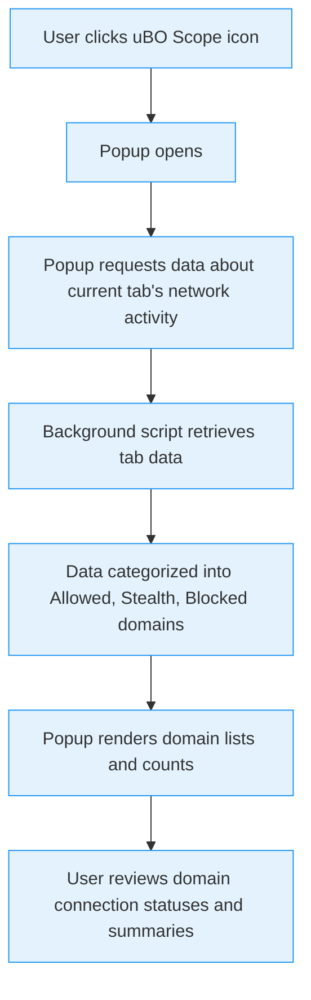

# Understanding the Popup: A First Walkthrough

## Workflow Overview

### What This Guide Covers
This guide walks you through the uBO Scope main popup interface—the window you see when you click the uBO Scope icon in your browser toolbar. It explains how to interpret the domain connection statuses shown, understand the badge counts, and make sense of domain outcomes such as "allowed," "blocked," and "stealth-blocked." This walkthrough demystifies the data you see and connects it to real network activity on the current browser tab.

### Prerequisites
- You have successfully installed uBO Scope on a supported browser (Chrome, Firefox, or Safari).
- uBO Scope has the necessary permissions (activeTab, storage, webRequest).
- The extension is active and has collected data from the active tab.

### Expected Outcome
After following this guide, you will confidently interpret the popup’s information to understand which third-party domains your active tab connected to, in what manner, and how uBO Scope categorizes that network traffic.

### Time Estimate
Approximately 5–10 minutes for your first walkthrough.

### Difficulty Level
Beginner – No advanced technical knowledge required.

---

## Step-by-Step Walkthrough of the Popup

### 1. Opening the Popup
- Click the uBO Scope icon in your browser toolbar to open the popup.
- The popup automatically queries the current active tab for network connection details and displays them.

**What You Should See:**
- The hostname of the active tab prominently displayed.
- A summary section showing the total number of distinct third-party domains connected.
- Three sections listing domains under the outcomes: "not blocked," "stealth-blocked," and "blocked."

---

### 2. Understanding the Header — Tab Hostname
- At the top, the popup displays the hostname of the active tab as two parts:
  - The subdomain (if any, for example, "www." or "news.")
  - The registered domain (second-level domain plus public suffix, e.g., "example.com")

This separation helps identify the exact domain context the extension is reporting on.

---

### 3. Interpreting the Domains Connected Summary
- The summary line displays the count of distinct third-party domains the active tab has connected to.
- Note: This count corresponds to domains classified as "allowed" — those connections allowed by the browser and blockers.
- A lower count is preferable, indicating fewer remote third-party connections.

---

### 4. Examining the Outcome Sections
The popup categorizes domains based on connection outcomes:

#### a) Not Blocked
- Domains listed here represent third parties to which connections were allowed.
- Each domain entry shows:
  - The domain name (converted from punycode as needed to display Unicode domains).
  - A badge count indicating how many times that domain was contacted.

#### b) Stealth-Blocked
- Domains here show third-party connections that were stealth-blocked.
- "Stealth-blocked" means the blocker applied techniques to conceal the blocking, often to prevent the site or trackers from detecting the content blocking.
- The list format mirrors the "Not Blocked" section, showing domain and count.

#### c) Blocked
- These domains have connections that were outright blocked.
- This is a direct block where the request failed due to filtering rules.
- Like other sections, this includes domain names and count badges.

---

### 5. Understanding Badge Counts on the Popup and Toolbar Icon
- The badge count displayed on the toolbar icon mirrors the number of distinct allowed third-party domains.
- This count helps you quickly assess how many unique third-party servers your active tab communicates with.
- A high badge count indicates multiple third-party connections, which may have privacy implications.

---

### Practical Scenario Example
Imagine you are visiting a news website.

- Opening the popup, you see the hostname split as:

  - Subdomain: "www."

  - Domain: "examplenews.com"

- The summary indicates "domains connected: 5".

- Under "not blocked," you find domains like "cdn.examplenews.com" and "analytics.examplecdn.com" with respective counts.

- Under "stealth-blocked," a domain like "trackers.adsnetwork.net" appears.

- Under "blocked," you might see "ads.badsite.com."

This tells you where content was loaded from, where trackers were stealthily blocked, and which outright block rules applied.

---

## Practical Tips & Best Practices

- **Refresh the popup** frequently when navigating to new pages — it shows current tab data only.
- **Interpret domain counts carefully:** Multiple requests to a single domain increase the badge count only once; the popup clarifies counts per domain.
- **Use the domain lists to identify unwanted connections:** Cross-reference domains in "stealth" and "blocked" to understand what was prevented.
- **Consider the impact of stealth blocking:** It's designed to prevent detection by sites but may sometimes cause subtle webpage issues.
- **Understand punycode:** Domains using international characters are displayed in Unicode format for readability.

---

## Troubleshooting Common Issues

### Problem: No Data or "NO DATA" in Header
- This appears if uBO Scope has not received any network request details for the active tab.
- **Solution:** Switch to the tab and reload the page to trigger new network activity.
- Ensure uBO Scope has permission to access the active tab and monitor web requests.

### Problem: Badge Count Does Not Update
- Could be due to delayed processing or session data not yet saved.
- **Solution:** Wait a few seconds and reopen the popup.
- Reload the page if counts seem stale.

### Problem: Domain Lists Are Empty
- No third-party network requests may have occurred.
- **Solution:** Confirm the website loads content from multiple domains; static or offline pages won’t show much activity.

---

## Next Steps & Related Guides

- Explore [Interpreting Connection and Blocked Server Data](/guides/getting-started-essentials/interpreting-connection-data) to deepen your understanding of the connection categories.
- Learn about [Analyzing Third-party Server Behaviors](/guides/advanced-scenarios-best-practices/analyzing-third-party-behavior) for more advanced insights.
- For installation and permissions setup, see [Installing and Setting Up uBO Scope](/guides/getting-started-essentials/installation-and-setup).

---

## Visualizing the Popup Workflow

---