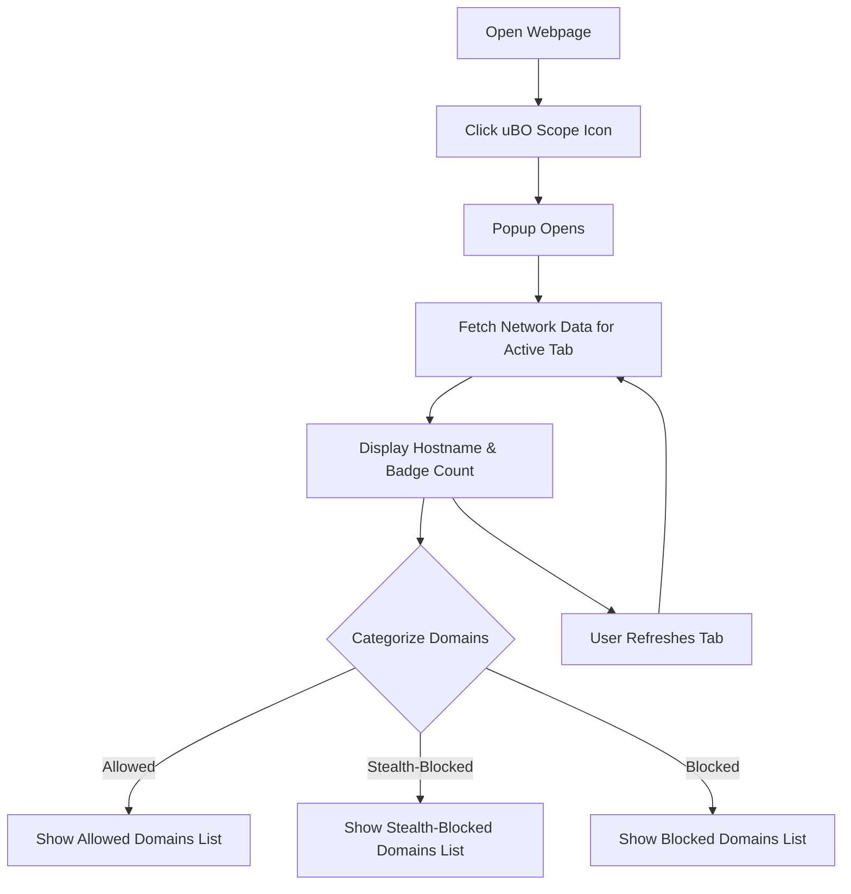

# Monitoring Third-Party Connections: A Basic Workflow

## Overview

This guide walks you through the essential workflow of using uBO Scope to analyze the network activity of a real website. You will learn how to open the popup interface, interpret the badge count in real time, and identify connections classified as allowed, stealth-blocked, or blocked. By mastering this workflow, you'll be empowered to assess which remote servers your browser is interacting with and understand the behavior of the site you are visiting.

---

## 1. What You Will Achieve

- See connections to remote third-party domains initiated by your browser.
- Understand the meaning behind badge counts on the extension icon.
- Identify which connections are allowed, stealth-blocked (hidden), or blocked.
- Refresh and inspect real-time network data for active tabs.

---

## 2. Before You Begin

Ensure the following prerequisites are met before starting this workflow:

- uBO Scope is installed and enabled in your browser.
- The extension has necessary permissions to monitor network requests.
- You have a webpage open with active network activity to analyze.
- Familiarity with basic web navigation and browser extension usage.

<Tip>
If you have not installed or configured uBO Scope yet, refer to the [Installing and Setting Up uBO-Scope]( /guides/getting-started-essentials/installing-and-setup ) and [Initial Configuration & Permissions]( /getting-started/installation-setup/first-run-config ) guides first.
</Tip>

---

## 3. Step-by-Step Workflow

<Steps>
<Step title="Open the uBO Scope Popup">
- Click on the uBO Scope icon in your browser toolbar.
- The popup appears, showing network connection data for the active tab.
- Wait a moment for data to load if the popup shows 'NO DATA' initially.

<Check>
A hostname or partial hostname should display prominently at the top.
</Check>
</Step>

<Step title="Observe the Badge Count">
- Look at the badge number on the toolbar icon.
- This number represents the count of distinct allowed third-party domains connected by the active tab.
- A lower count indicates fewer unique third-party connections, often desirable for privacy.

<Tip>
Refresh the webpage to see the badge count update in real time.
</Tip>
</Step>

<Step title="Interpret Domain Categories in the Popup">
- The popup lists domains grouped into three categories:
  - **Not Blocked (Allowed):** Domains your browser connected to successfully.
  - **Stealth-Blocked:** Domains that appear blocked but connections were redirected or hidden.
  - **Blocked:** Domains where network requests were blocked (e.g., by content blockers).
- Each domain shows the count of its requests.

<Note>
The grouping helps understand which third-party servers are actively contacted versus blocked or stealth-blocked.
</Note>
</Step>

<Step title="Refresh to Update Data">
- Reload the browser tab to capture fresh network requests.
- Reopen the popup or click inside it to trigger the data refresh.
- Watch the badge count and domain lists update accordingly.

<Check>
Ensure the counts and domain lists reflect the current tab’s network activity.
</Check>
</Step>

<Step title="Spot and Analyze Stealth-Blocked Domains">
- Pay particular attention to the 'stealth-blocked' category.
- These represent connection attempts that were redirected or altered stealthily.
- This insight helps reveal connections that content blockers may mask silently.

<Tip>
Use this information to identify potentially unexpected or suspicious background connections.
</Tip>
</Step>

<Step title="Use Domain Information for Assessment">
- Correlate the connections with your understanding of the visited site.
- Recognize if many third-party connections are suspicious or related to ads, trackers, or CDNs.
- Use domain patterns to inform content blocking or privacy decisions on your browser.

<Info>
This basic workflow forms the foundation for more advanced analysis covered in other guides.
</Info>
</Step>
</Steps>

---

## 4. Practical Example

Imagine you're browsing a news website. Open uBO Scope’s popup and see:

- Badge count shows "5".
- Under **Not Blocked**: domains like `cdn.news-site.com` and `fonts.googleapis.com` appear, showing legitimate resources.
- Under **Stealth-Blocked**: domains such as `ads.thirdparty.com` show some activity, indicating attempted but stealthily redirected requests.
- Under **Blocked**: domains like `trackers.analytics.com` are listed, meaning they were successfully blocked.

This overview helps you confirm that primary site assets load as expected, while ads and trackers are partially or fully blocked.

---

## 5. Tips & Best Practices

- **Regularly Refresh:** Network requests vary with page interactions; refreshing ensures accurate data.
- **Focus on Unique Third-Party Domains:** The badge count measures unique domains, a better privacy metric than raw request counts.
- **Use in Conjunction with Content Blockers:** uBO Scope complements your blocker by showing outcomes transparently.
- **Beware of False Positives:** Some redirects flagged as stealth might be benign optimizations (e.g., CDN caching).

---

## 6. Troubleshooting Common Issues

<AccordionGroup title="Common Popup & Badge Issues">
<Accordion title="Popup shows NO DATA or empty lists">
- Ensure you have an active tab with network activity.
- Verify uBO Scope has proper permissions (refer to the first run configuration guide).
- Try closing and reopening the popup.
</Accordion>
<Accordion title="Badge count does not update">
- Check if the extension is enabled.
- Reload the page; network tracking updates asynchronously.
- Confirm that uBO Scope’s permissions include activeTab and webRequest.
</Accordion>
<Accordion title="Domains appear without recognizable names">
- The extension uses the Public Suffix List and punycode translation to decode domains.
- Some domains may be obfuscated or internal to certain CDNs.
</Accordion>
</AccordionGroup>

---

## 7. What to Do Next

- Explore the [Understanding the Popup Interface]( /guides/getting-started-essentials/understanding-the-popup-interface ) guide to deepen insights on interpreting data.
- Consult [Quick Validation Checklist]( /getting-started/first-steps-usage/validate-network-tracking ) to confirm uBO Scope is operating correctly.
- Learn advanced scenarios in guides like [Debunking Block Count Myths]( /guides/advanced-analysis-patterns/debunking-block-count-myths ) for greater confidence in analysis.
- Review the [Installation and Setup]( /guides/getting-started-essentials/installing-and-setup ) guide if you encounter setup issues.

---

By following this workflow, you gain clear, actionable visibility into your browser's third-party connections and can start making informed privacy and security decisions based on real-time network data.

---

## References

- [uBO Scope GitHub Repository](https://github.com/gorhill/uBO-Scope)
- [Public Suffix List](https://publicsuffix.org/list/)

---

## Diagram: Basic Popup Workflow

