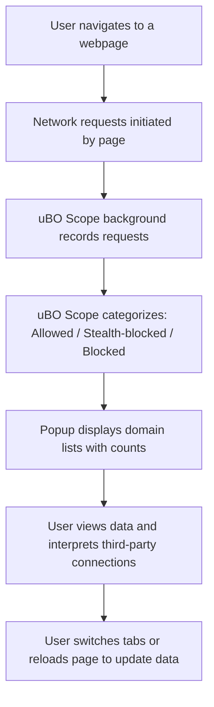

# Basic Use: Monitoring Connections on Any Webpage

## Overview
This guide shows you how to use **uBO Scope** while browsing the web to instantly reveal all remote servers a webpage connects to. Whether you want to see which third-party domains a site communicates with or verify what connections your browser is actually making, this workflow will walk you through the core capabilities — including toggling between visited sites and troubleshooting when no data displays.

_uBO Scope_ is a lightweight browser extension that reports all remote server connections initiated by webpages, categorizing them as allowed, stealth-blocked, or outright blocked. This guide focuses narrowly on using the popup interface during everyday browsing to uncover real-world network activity.

---

## Prerequisites

- You must have uBO Scope installed and enabled in your browser. If you have not yet installed the extension, see [Installing uBO Scope on Your Browser](./install-on-your-browser).
- The extension requires permission to monitor network requests — ensure you accepted any permission prompts upon installation.
- Use a supported browser (Chromium-based, Firefox 128+, or Safari 18.5+).
- Internet connectivity to browse websites and view dynamic network activity.

---

## What You Will Achieve

By following this guide, you will:

- Open uBO Scope's popup for any active webpage to see real-time reports of domains contacted by that page.
- Understand how to interpret the popup's domain lists: allowed (not blocked), stealth-blocked, and blocked.
- Navigate between tabs or sites to compare their third-party connections.
- Identify and fix common issues such as no data appearing in the popup.

Estimated time: **5-10 minutes**  
Difficulty: **Beginner**

---

## Step-by-Step Instructions

<Steps>
<Step title="1. Start Browsing Normally">
Open your web browser and navigate to any webpage where you'd like to inspect network connections.

> Expected Result: The webpage loads as usual, triggering network requests behind the scenes.
</Step>
<Step title="2. Open the uBO Scope Popup">
Click the uBO Scope toolbar icon adjacent to your address bar. This opens the popup panel for the active tab.

> Expected Result: The popup displays three categorized sections listing domains:
> - **Not blocked:** Third-party domains from which connections succeeded.
> - **Stealth-blocked:** Domains for which connections were intercepted stealthily.
> - **Blocked:** Domains from which connections were explicitly blocked.
> 
> The top header shows the main page's hostname and domain, and a summary indicates the number of connected domains.
</Step>
<Step title="3. Interpret the Domain Lists">
Review the lists to see which third-party domains are contacted by the active webpage.

- A higher count of allowed domains means more distinct remote servers provided resources.
- Use the counts displayed next to each domain to gauge frequency of connections.

> Tip: Typically, legitimate sites have a low number of third-party domains, often limited to content delivery networks (CDNs).
</Step>
<Step title="4. Switch Between Tabs or Pages to Compare">
Switch to a different browser tab or load another webpage, then open uBO Scope again by clicking its icon.

> Expected Result: The popup updates with connection data for the newly active tab.
> 
> This allows quick comparison across sites to understand differing third-party contact profiles.
</Step>
<Step title="5. Refresh or Reload If No Data Appears">
If the popup shows “NO DATA” or empty domain lists, reload the webpage to initiate fresh network requests, then re-open the popup.

> Expected Result: Updated data reflecting the current site’s domain connections.
</Step>
</Steps>

---

## Real-World Example

Suppose you visit an online news website and want to verify all domains contacted behind the scenes:

1. Open the news site in a new tab.
2. Click the uBO Scope icon.
3. The popup shows the main site's domain at the top, e.g. `news.example`.
4. The **not blocked** section lists CDNs and analytics domains fetched for content.
5. The **blocked** section might show ad servers or trackers your blocker suppressed.

Switching to your social media tab and opening uBO Scope there allows immediate comparison of the number and type of third-party domains contacted by each site.

---

## Troubleshooting: Missing Data or “NO DATA” Displayed

<AccordionGroup title="Common Issues When uBO Scope Shows No Data">
<Accordion title="Issue: Popup Displays 'NO DATA' for Active Tab">
- **Cause:** Network requests have not yet been observed or recorded for the tab.
- **Solution:**
  - Reload the webpage to generate network requests.
  - Make sure the page is fully loaded.
  - Confirm that the extension is enabled and has required permissions.
  - Check for conflicts with other privacy extensions that might block the extension’s monitoring.
</Accordion>
<Accordion title="Issue: Toolbar Badge Does Not Appear or Shows No Count">
- **Cause:** No connections detected or extension not initialized.
- **Solution:**
  - Reload the page and wait a few seconds.
  - Confirm the extension is installed and enabled.
  - Make sure you accepted permission prompts after installation.
  - Verify the extension icon is visible and accessible in the toolbar.
</Accordion>
<Accordion title="Issue: Data Does Not Update After Navigating Tabs">
- **Cause:** Popup may be cached or requests not processed yet.
- **Solution:**
  - Close and reopen the popup.
  - Wait a moment after switching tabs for network data processing.
  - Reload pages if they don’t auto-update connections.
</Accordion>
</AccordionGroup>

---

## Best Practices & Tips

- Always open the popup on the tab you want to inspect; data is tab-specific.
- The badge count on the toolbar icon reflects the number of distinct allowed third-party domains — a lower number often indicates fewer external connections.
- Don't rely solely on the block counts; a high block count may mean more requests were allowed initially.
- Use uBO Scope during your normal browsing sessions, not on synthetic ad-blocker test pages, for realistic insights.
- If privacy is your goal, focus on whether your content blocker reduces the number of allowed third-party domains.
- Navigate between tabs frequently to get a clear picture of third-party connections across your browsing activity.

---

## Additional Resources

- [Installing uBO Scope on Your Browser](./install-on-your-browser) — Step-by-step installation instructions.
- [Interpreting the Toolbar Badge and Popup](./interpreting-results) — Understand the meaning of connection counts and domains.
- [Your First Run with uBO Scope](./first-run-experience) — Learn the initial user workflow and what to expect.
- [Troubleshooting: Missing or Unexpected Network Requests](./troubleshooting-network-request-visibility) — Advanced troubleshooting guidance.
- uBO Scope GitHub repository: https://github.com/gorhill/uBO-Scope

---

## Summary
This page focused on the basic everyday use of uBO Scope for monitoring and understanding third-party domain connections made by any webpage you visit, using the extension popup. By following the simple step-by-step flow, you can gain real-world insight into which remote servers your browser talks to, and compare network activity across tabs. Troubleshooting advice ensures you can fix common issues quickly to maintain visibility.

---

## Appendix: Understanding the Popup Interface

- **Header (Hostname & Domain):** Shows the active page’s full hostname and its base registered domain.
- **Summary:** Displays the number of distinct domains contacted during the session.
- **Sections:**
  - **Not blocked:** Domains successfully connected.
  - **Stealth-blocked:** Connections that were intercepted stealthily by the content blocker.
  - **Blocked:** Domains where connection attempts were fully blocked.

Each domain listed includes a count showing how many times connections were made during the session.

---

## Quick Recap with Visual Example

This flow depicts the continuous cycle of monitoring and display during normal browsing.

---

## License & Acknowledgments

uBO Scope is free software licensed under GPL v3. For source code and more details, see the [GitHub repository](https://github.com/gorhill/uBO-Scope).

---

_Last updated: main branch_
