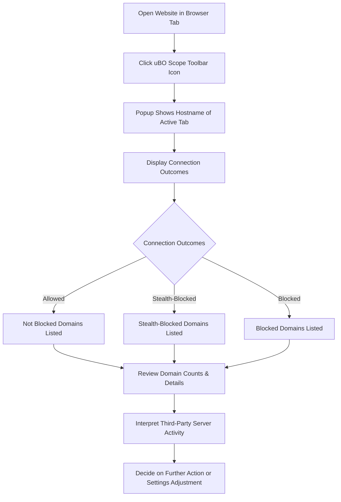

# A Typical uBO Scope Investigation Workflow

Explore a straightforward, real-world example of using the uBO Scope popup to analyze active browser tab connections. This guide walks you through opening a website, assessing all third-party connection attempts the page makes, and understanding the popup’s categories to identify which external servers are engaged.

---

## Workflow Overview

### Task Description
Learn how to open the uBO Scope popup for an active browser tab, analyze the detailed connection outcomes displayed, and use this insight to determine the presence and behavior of third-party servers on visited websites.

### Prerequisites
- uBO Scope extension installed and enabled in your browser.
- A supported browser (Chromium-based, Firefox, or Safari) with appropriate permissions granted.
- A live website opened in an active browser tab (preferably one with external resources).

### Expected Outcome
You will be able to:
- Open the uBO Scope popup and view connection data for the active tab.
- Identify and differentiate among allowed, stealth-blocked, and blocked third-party connections.
- Understand the significance of the domain counts and badge number on the toolbar.

### Time Estimate
Approximately 5 to 10 minutes.

### Difficulty Level
Beginner

---

## Step-by-Step Instructions

<Steps>
<Step title="Open the Target Website in Your Browser">
Browse to a website known for loading external content (e.g., news sites, social media platforms).

**Expected Result:** The site loads normally in a tab where uBO Scope can monitor network traffic.
</Step>

<Step title="Click the uBO Scope Toolbar Icon">
Locate the uBO Scope icon adjacent to your browser’s address bar. Click it to open the popup interface.

**Expected Result:** The popup appears, showing connection data related to the current tab.
</Step>

<Step title="Examine the Hostname Display">
At the top of the popup, observe the website’s hostname. It is split into two parts: subdomain(s) and base domain.

**Example:** For "beta.example.com", the left part shows "beta.", the right shows "example.com".

**Verification:** This confirms the extension recognizes the exact origin of the tab.
</Step>

<Step title="Interpret Connection Categories">
The popup divides connections into three sections:

- **Not Blocked:** Third-party domains successfully contacted.
- **Stealth-Blocked:** Requests blocked stealthily (e.g., via redirects).
- **Blocked:** Directly blocked requests detected.

Look for domain names and the count of connection attempts beside each.

**Expected Result:** Each section lists domains with how many connection attempts occurred.
</Step>

<Step title="Analyze the Summary Count">
Just below the hostname, observe the "domains connected" summary.

This number tells you how many distinct third-party domains were contacted (not blocked).

**Interpretation:** Lower numbers indicate fewer external connections, suggesting better privacy or fewer trackers.
</Step>

<Step title="Use the Domain Details to Inform Decisions">
Review domains in each section. Recognize familiar service providers (e.g., CDN domains) as less intrusive.

If unknown or suspicious domains appear under "Not Blocked," consider whether additional blocking rules are warranted.

**Tip:** Multiple connection attempts to a domain (shown in "count") indicate frequent interaction.

**Outcome:** Use this analysis to adjust your content blocker or privacy settings if needed.
</Step>
</Steps>

---

## Examples & Real-World Scenario

Imagine visiting https://example-news.com, a site that loads scripts and ads from several third-party servers.

- In the popup, you see the allowed domain "cdn.example.com" with a count of 4.
- The "stealth-blocked" section lists "ads.tracker.net" with a count of 2.
- The "blocked" section logs "malicious.ads.com" with a count of 1.

This illustrates how uBO Scope helps you see all types of connection results clearly, enabling informed follow-up for enhanced browsing privacy.

---

## Troubleshooting & Tips

<AccordionGroup title="Common Issues and Solutions">
<Accordion title="Popup Shows 'NO DATA' or Empty Sections">
- Ensure you have an active tab selected with web traffic.
- Reload the tab to refresh connection data.
- Confirm uBO Scope has permission to access the active tab and webRequest API.
- Verify that your browser version is supported.
</Accordion>

<Accordion title="Domain Counts Are Higher Than Expected">
- Remember that uBO Scope counts distinct third-party servers, not individual blocked requests.
- Some websites use multiple legitimate third-party services (e.g., CDNs, analytics).
- Review domain names to determine if the higher counts are expected.
</Accordion>

<Accordion title="Understanding Stealth-Blocked Section">
- "Stealth-blocked" connections often mean requests were redirected or quietly blocked to avoid page breakage.
- These may not appear in traditional block lists but are tracked by uBO Scope.
</Accordion>

<Accordion title="Badge Count on Toolbar Does Not Update">
- Badge updates after tab reload and connection analysis.
- Wait a few seconds or reload the tab to refresh data.
- Confirm uBO Scope is enabled and not disabled by browser settings.
</Accordion>
</AccordionGroup>

<Tip>
For best results, repeat this workflow on multiple websites you frequent to develop a clear understanding of typical third-party connections and spot anomalies.
</Tip>

---

## Next Steps & Related Guides

- After mastering this workflow, explore the [Interpreting Connection Insights](guides/getting-started-essentials/interpreting-connection-insights) guide to deepen your understanding of categories and outcomes.
- Consult [Installing and Activating uBO Scope](guides/getting-started-essentials/installing-activating-ubo-scope) to ensure your setup is optimal.
- Review [Debunking Network Blocking Myths](guides/advanced-scenarios-best-practices/debunking-common-misconceptions) to gain clarity on common misconceptions about blocking effectiveness.
- For advanced users, the [Using uBO Scope as a Filter List Maintainer](guides/advanced-scenarios-best-practices/using-ubo-scope-for-list-maintainers) guide offers specialized workflows.

Explore related core concepts and terminology in the [Core Concepts & Terminology](overview/intro-basics/core-concepts-terminology) documentation to build foundational knowledge.

---

## Summary Diagram of Workflow

---

This workflow guides you through a simple, repeatable path to quickly understand your tab’s network activity using uBO Scope’s popup interface, empowering informed privacy decisions with minimal effort.
