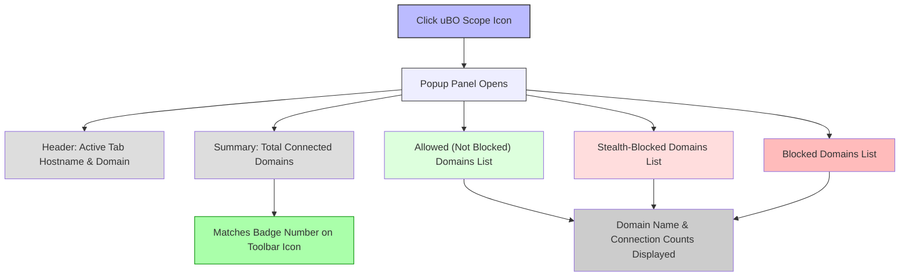

# Interpreting the Popup Panel: Connection Summaries

## Overview
The uBO Scope popup panel offers a clear, real-time summary of all network connections initiated by the currently active browser tab. This guide walks you through understanding how to review the lists of allowed, blocked, and stealth-blocked connections, how to identify third-party domains involved, and how to interpret the badge count on the toolbar icon in relation to these connection summaries.

### What This Guide Will Help You Accomplish
- Understand the structure and sections of the uBO Scope popup panel
- Learn to identify and interpret allowed, blocked, and stealth-blocked connection data
- Connect the badge count on the extension icon to the data displayed in the popup
- Gain actionable insight into third-party domains contacted by webpages

### Prerequisites
- uBO Scope extension must be installed and enabled in your browser
- Basic familiarity with the browser tab where you want to interpret connection data
- Active network activity on the tab (e.g., browsing a website that makes external connections)

### Expected Outcome
By following this guide, you will accurately read and interpret the connection summaries presented in the popup panel. You will be able to distinguish different connection outcomes, understand domain counts, and effectively apply this understanding to assess your browsing privacy.

### Time Estimate
5 to 10 minutes

### Difficulty Level
Beginner to Intermediate

---

## Understanding the Popup Panel Structure
When you click the uBO Scope toolbar icon, the popup panel opens revealing connection summary details for the active tab. The popup panel consists of several key sections:

- **Header (Tab Hostname and Domain)**: Displays the hostname and domain of the active tab's main webpage
- **Summary Section**: Shows the total number of unique third-party domains connected during the tab session
- **Outcome Sections**: Three vertical sections listing domains under "not blocked", "stealth-blocked", and "blocked" outcomes, each displaying domain names and connection counts

The domain rows show third-party domains grouped by connection outcome, alongside how many times connections to each were observed.

---

## Step-by-Step Instructions to Interpret Connection Summaries

<Steps>
<Step title="Open the Popup Panel">
Click the uBO Scope icon on the browser toolbar to open the popup panel for the active tab.
</Step>
<Step title="Identify the Active Tab's Top-Level Domain">
Look at the header at the top labeled with the main page hostname and domain. This confirms which tab's data you are viewing.
</Step>
<Step title="Check the Total Connected Domains">
View the summary section "domains connected: " to see how many unique third-party domains were contacted in this tab.
</Step>
<Step title="Review Allowed (Not Blocked) Domains">
Focus on the "not blocked" section to see which third-party domains the browser successfully connected to. Each domain has a count reflecting connection attempts.
</Step>
<Step title="Examine Stealth-Blocked Domains">
The "stealth-blocked" section lists domains for which connections were intercepted or redirected stealthily, often by content blocking or DNS.
</Step>
<Step title="Look at Blocked Domains">
The "blocked" section displays third-party domains for which connection attempts failed or were explicitly blocked.
</Step>
<Step title="Understand Domain Counts">
Note the number beside each domain to understand connection instances per domain. Higher counts indicate repeated requests.
</Step>
<Step title="Correlate with Toolbar Badge Count">
The badge number on the uBO Scope icon corresponds to the count of **allowed** unique third-party domains in the "not blocked" section.
</Step>
</Steps>

---

## Practical Examples

### Example 1: Simple Browsing Scenario
You visit `https://example.com`. The popup header shows the main domain `example.com`. The summary states "domains connected: 5". The "not blocked" section lists 5 domains such as CDN providers and analytics services with various counts. The "blocked" and "stealth-blocked" sections might be empty or have few entries reflecting filtered connections.

### Example 2: Privacy-Conscious Browsing
Browsing a site with heavy tracking, you see a large number in "blocked" or "stealth-blocked" sections, such as known ad domains, while the "not blocked" list remains smaller. This indicates uBO Scope successfully identifies and reports connections blocked by content blockers or browser privacy features.

---

## Tips and Best Practices
- Use the domain counts to differentiate between single-use connections (e.g., a one-off CDN request) and frequent requests (e.g., trackers or real-time analytics).
- Correlate the "stealth-blocked" list with your content blocking settings to evaluate their effectiveness.
- A low badge count often indicates stronger privacy protection but always verify by reviewing the popup domains.
- Refresh the popup panel after switching tabs to ensure accurate, up-to-date data.

---

## Common Pitfalls and Troubleshooting

<AccordionGroup title="Troubleshooting the Popup Panel">
<Accordion title="No Data or 'NO DATA' Displayed in Popup">
- Ensure the tab you are viewing has network activity.
- Confirm uBO Scope permissions are enabled for the site.
- Try refreshing the page or navigating to a different website.
</Accordion>
<Accordion title="Badge Count Does Not Update">
- Ensure the extension is active and the browser supports `webRequest` API.
- Wait a few seconds as updates to the tab badge occur asynchronously.
- Check for conflicts with other extensions that might interfere with webRequest.
</Accordion>
<Accordion title="Domains Appear in Unexpected Sections">
- "Stealth-blocked" represents connections intercepted or redirected silently by content blockers or DNS.
- "Blocked" refers to outright failures or explicit blocks.
- Confirm your content blockers settings and refresh the popup for accuracy.
</Accordion>
</AccordionGroup>

---

## Verification and Success Criteria
- You can open the popup panel and see the header showing the active tab's hostname/domain.
- The summary correctly displays the total connected unique third-party domains.
- You identify domains under allowed, stealth-blocked, and blocked sections.
- The toolbar badge count matches the number of allowed domains listed.

---

## Next Steps & Related Documentation

- For detailed understanding of the toolbar badge and how counts are calculated, see [Badge Counts: What They Mean and Why They Matter](https://yourdocs/understanding-badge-logic).
- To learn how connection outcomes relate to content blocking, refer to [Popup Panel and Badge Explained](https://yourdocs/popover-and-badge).
- For troubleshooting installation or operation issues, consult [Troubleshooting Setup Issues](https://yourdocs/troubleshooting-setup).

By mastering the interpretation of the popup panel, you'll leverage uBO Scope's unique insight to better understand and control the third-party connections your browser makes.

---

## Visual Summary of the Popup Panel Sections

---