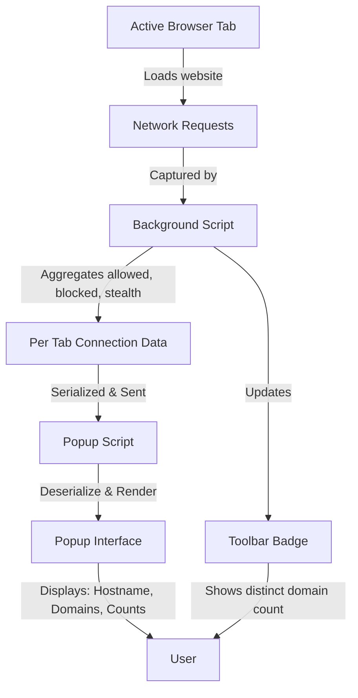

# Your First Website Analysis

## Overview
This guide provides a practical, step-by-step walkthrough to analyze network connections for a real website using the uBO Scope extension. You will learn how to interpret the connections shown in the popup interface, understand the meaning behind the toolbar badge count, and use this information to gain insight into third-party remote servers contacted by your browser.

### What You'll Achieve
- Open the uBO Scope popup and review real network connection data for the active browser tab.
- Understand the significance of "allowed," "blocked," and "stealth-blocked" connections.
- Learn how the badge count relates to the number of distinct remote third-party domains.
- Use these insights to assess privacy exposure while browsing.

### Prerequisites
- Have uBO Scope installed and enabled in your browser. Refer to the [Installing and Setting Up uBO Scope guide](https://your-docs-url/guides/getting-started-essentials/install-and-setup) if you have not completed installation.
- Visit a website you want to analyze or have one open in an active tab.
- Make sure you have access to the browser toolbar where the uBO Scope icon appears.

### Time Estimate
10 minutes to open the popup and analyze connection data for one or two websites.

### Skill Level
Beginner — No advanced setup required.

---

## Step-by-Step Instructions

<Steps>
<Step title="Locate and Open the uBO Scope Popup">

1. Find the uBO Scope extension icon in your browser toolbar. It looks like a small shield icon.
2. Click the icon to open the popup window.
3. The popup automatically loads network connection data related to the active browser tab.

**Expected Result:** You see a panel showing the hostname of the current tab and a summary of remote domains contacted.

</Step>

<Step title="Read the Hostname Header">

- At the top of the popup, observe the header displaying two parts:
  - The subdomain part (if any) of the page’s hostname.
  - The registered domain part.

For example, for "news.example.com," you might see "news" and "example.com".

**What It Means:** This clarifies exactly which domain's network activity you are analyzing.

</Step>

<Step title="Explore Connection Categories">

Within the popup, the connection attempts are grouped under three sections:

- **Not Blocked:** Domains where connections were allowed.
- **Stealth-Blocked:** Connections that were redirected or stealthily blocked by content blockers.
- **Blocked:** Connections that failed due to content blocking or errors.

1. Expand each section if collapsed.
2. For each domain listed, you will see the domain name and a count of how many network requests were made.

**Expected Result:** You gain a clear picture of all third-party remote servers your browser attempted connections with, categorized by outcome.

</Step>

<Step title="Interpret the Summary Count">

- Look at the summary count near the top labeled "domains connected." This number shows the unique third-party remote domains contacted at the domain level (not subdomains).
- The toolbar badge icon also displays this number per tab.

**Key Insight:** A lower number means fewer distinct external domains connected, which is generally better for privacy.

</Step>

<Step title="Use this Data to Assess Privacy Exposure">

- Review the list to identify any unexpected or suspicious third-party domains.
- Observe the balance between allowed and blocked domains.
- Use this insight to understand the effectiveness of your content blocking and to make more informed browsing decisions.

</Step>
</Steps>

---

## Real-World Example

Suppose you visit https://example-news-site.com and open the uBO Scope popup.

- You see the hostname "news.example-news-site" and domain "example-news-site.com" on top.
- Under "Not Blocked," you find domains like "cdn.contentdelivery.net" with a count of 15 requests.
- Under "Blocked," a few other domains with counts reflecting blocked ad servers.
- The summary count reads "3," indicating three distinct third-party domains were contacted.
- The toolbar badge reflects "3" — matching the popup.

This tells you that while some connections were blocked, your browser still connected to three major third-party services.

---

## Troubleshooting and Tips

<AccordionGroup title="Common Troubleshooting and Tips">

<Accordion title="No Data Shows in Popup">
If the popup shows "NO DATA" or empty connection lists:
- Ensure that you have visited or refreshed a website recently.
- Confirm that uBO Scope has the required permissions and is enabled.
- Try reloading the tab or restarting the browser.
- See the [Common Issues & Quick Fixes](https://your-docs-url/getting-started/validation-and-troubleshooting/troubleshooting-common-issues) for additional tips.
</Accordion>

<Accordion title="Badge Count Isn't Updating">
- The badge number updates after the extension processes network requests with a slight delay.
- Reload the active tab to trigger new network activity.
- Check if other extensions or privacy settings may interfere with network tracking.
</Accordion>

<Accordion title="Understanding Stealth-Blocked Connections">
- Stealth-blocked indicates network requests that were redirected or prevented silently.
- This may include redirects by content blockers designed to avoid breaking site function or detection.
</Accordion>

<Accordion title="Best Practices">
- Use uBO Scope alongside your preferred content blocker for maximum insight.
- Focus on the distinct domain count rather than total request counts to assess privacy exposure.
- Regularly check the popup on new or suspicious sites to monitor connections.
</Accordion>

</AccordionGroup>

---

## Next Steps & Related Documentation

- Explore the [Understanding the Toolbar Badge and Popup Data](https://your-docs-url/guides/getting-started-essentials/badge-and-status-explained) to deepen your knowledge of interpreting data.
- Read [Supported Browsers & Prerequisites](https://your-docs-url/getting-started/installing-ubo-scope/supported-browsers-and-requirements) if you encounter compatibility issues.
- For installation instructions, see [Installing and Setting Up uBO Scope](https://your-docs-url/guides/getting-started-essentials/install-and-setup).
- Troubleshoot with [Common Issues & Quick Fixes](https://your-docs-url/getting-started/validation-and-troubleshooting/troubleshooting-common-issues).

---

## Under the Hood (Optional Tech Insight)

For those curious, uBO Scope's popup data is dynamically rendered via JavaScript which:
- Queries the active tab's domain and hostname.
- Receives serialized network request outcomes (allowed, stealth, blocked) from the background script.
- Deserializes and populates the connection lists in the popup interface.

Each domain is presented with a count of requests, converted from punycode to readable Unicode for internationalized domain names.

---

*Happy analyzing! uBO Scope empowers you with real, actionable insights about third-party network connections every time you load a page.*

---

## Source References

For development and deeper understanding, uBO Scope’s source code is available here:
- [popup.js](https://github.com/gorhill/uBO-Scope/blob/main/js/popup.js)
- [background.js](https://github.com/gorhill/uBO-Scope/blob/main/js/background.js)
- [popup.html](https://github.com/gorhill/uBO-Scope/blob/main/popup.html)

These files orchestrate the data retrieval, serialization, and rendering workflow triggered on opening the popup.

---

## Diagram: Data Flow from Website to Popup

This diagram illustrates the journey from network activity to the user-facing popup and badge count, highlighting the role of each component.

---

# End of Guide

---

For more in-depth details, explore other guides in the Getting Started and Guides sections of the documentation.

