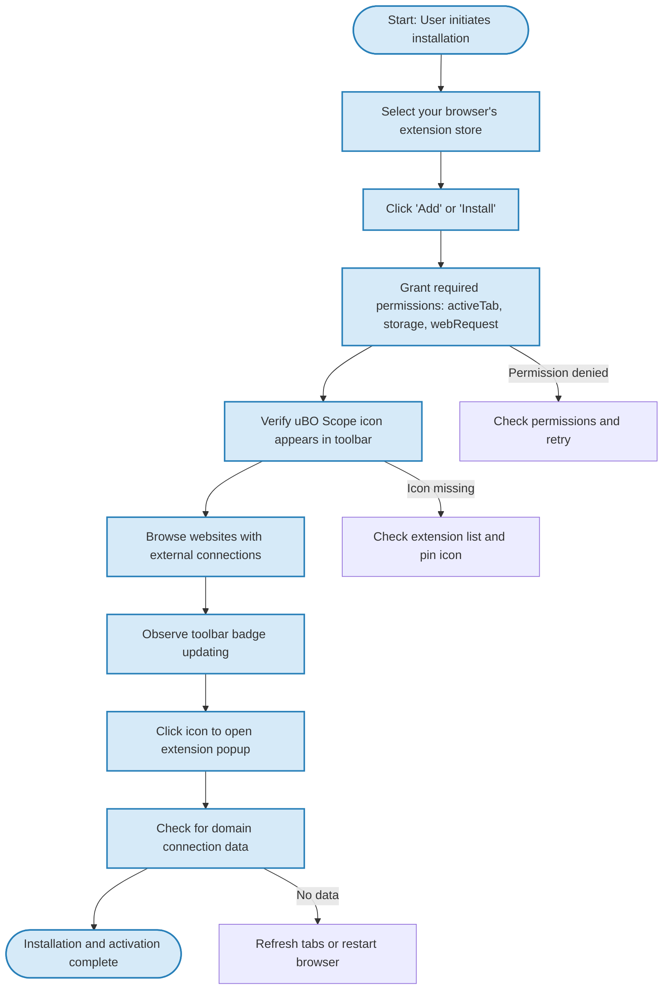

# Installing and Activating uBO Scope

Welcome to the first step in harnessing uBO Scope's powerful capabilities. This guide will walk you through installing the uBO Scope browser extension, granting the necessary permissions, and confirming that the extension is active and ready to deliver insightful network connection data. Designed for new users aiming for a swift and smooth onboarding experience, this guide ensures you start seeing real-time connection details in moments.

---

## Workflow Overview

### What You Will Achieve
- Successfully install uBO Scope from your browser’s official extension store.
- Grant essential permissions to enable full network monitoring.
- Verify the extension is active through visual cues and popup confirmation.

### Before You Begin
- Confirm you are using a supported browser: the latest versions of Chrome, Firefox, or Safari.
- Ensure your browser meets the minimum version requirements (Chrome 122+, Firefox 128+, Safari 18.5+).
- Have access to the relevant store page for your browser.

### Expected Results
- uBO Scope icon appears in your browser’s toolbar.
- Toolbar icon badge updates dynamically with your browsing session.
- Popup displays measured network connections once activated.

### Time Commitment
Approximately 5 minutes.

### Difficulty Level
Beginner-friendly.

---

## Step-by-Step Installation and Activation

Follow these steps carefully to ensure uBO Scope is installed and running correctly.

### Step 1: Choose Your Browser’s Extension Store

#### Chrome
1. Visit the [Chrome Web Store uBO Scope page](https://chromewebstore.google.com/detail/ubo-scope/bbdpgcaljkaaigfcomhidmneffjjjfgp).

#### Firefox
1. Visit the [Firefox Add-ons uBO Scope page](https://addons.mozilla.org/firefox/addon/ubo-scope/).

#### Safari
1. Access the Safari Extensions Gallery for uBO Scope or install via the App Store following official Apple instructions.

### Step 2: Install the Extension

1. Click "Add to Chrome" / "Add to Firefox" / "Install" depending on your browser.
2. When prompted, review the permissions carefully—uBO Scope requests access to monitor network requests to provide accurate connection reporting.
3. Confirm installation by selecting "Add Extension".

### Step 3: Granting Necessary Permissions

- Upon installation, the extension requires the following permissions to function properly:
  - **Active Tab**: to access data from the tab you are browsing.
  - **Storage**: to save session data that helps track network requests.
  - **webRequest**: to monitor and evaluate network activity across sites.

These permissions enable uBO Scope to observe all connections attempted by webpages and categorize their outcomes.

### Step 4: Confirm Extension Activation

1. Look for the uBO Scope icon in your browser’s toolbar. Depending on your browser and setup, it may be a small shield or logo resembling the uBO Scope icon.
2. After browsing a webpage for a few seconds, observe the icon badge. It reflects the number of distinct third-party domains connected — a number indicating uBO Scope is actively monitoring network requests.
3. Click the uBO Scope icon to open the popup:
   - You will see a summary listing domains categorized as "not blocked," "stealth-blocked," and "blocked," confirming activity.

<Tip>
If the toolbar icon is not immediately visible, check your browser’s extension menu or pin uBO Scope to the toolbar for easy access.
</Tip>

---

## Practical Tips and Best Practices

- **Keep Your Browser Updated:** Ensure your browser is on a minimum version supporting the required webRequest permissions to avoid functional limitations.
- **Allow Time for Data Collection:** The badge and popup update as you browse different sites. Give it a few seconds to accumulate data.
- **Watch Permissions Carefully:** Only install from official stores to guarantee secure, trusted permissions.

---

## Troubleshooting Common Installation Issues

<AccordionGroup title="Troubleshooting Installation and Activation">
<Accordion title="uBO Scope Icon Not Visible in Toolbar">
Ensure the extension is enabled:
- Open your browser extensions page.
- Confirm uBO Scope is installed and toggled on.
- Pin the extension icon to the toolbar if hidden.
</Accordion>
<Accordion title="Popup Shows 'NO DATA' or Blank">
- Refresh the active tab and wait a few seconds.
- Navigate to a website making external requests.
- If still blank, restart your browser.
- Verify all requested permissions are granted.
</Accordion>
<Accordion title="Permission Denied or Installation Blocked">
- Check for browser security settings blocking third-party extensions.
- Ensure no other extension conflicts or security software interrupts the installation.
- Try installing in a fresh browser profile if needed.
</Accordion>
</AccordionGroup>

<Tip>
For persistent issues, consult the official Troubleshooting Setup guide or visit the uBO Scope GitHub repository for community support.
</Tip>

---

## Visual Guide: Installation Flow

---

## Next Steps

After successfully installing and activating uBO Scope:

- Explore the [Reviewing Third-Party Connections with the Popup](../guides/getting-started-essentials/review-connections-popup) guide to understand what the domain lists mean.
- Learn how to interpret the [Toolbar Badge Count](../guides/getting-started-essentials/understanding-badge-count) for quick insights.
- If any issues arise, consult the [Troubleshooting Installation & Setup Issues](../getting-started/first-steps-and-validation/troubleshooting-setup) documentation.

These next steps will deepen your ability to leverage uBO Scope’s powerful monitoring features with confidence.

---

## Additional Resources

- [uBO Scope GitHub Repository](https://github.com/gorhill/uBO-Scope) - Source, issues, and community support.
- [Browser Support & Compatibility](../overview/product-tour/integration-compatibility) - Details on supported browsers and versions.
- [Initial Configuration and Permissions](../getting-started/first-steps-and-validation/initial-configuration) - Understand permission scopes.

<Check>
By following this guide, you are equipped to start monitoring your browser’s remote server connections immediately.
</Check>

---

Thank you for choosing uBO Scope. Welcome to smarter, clearer network visibility.
