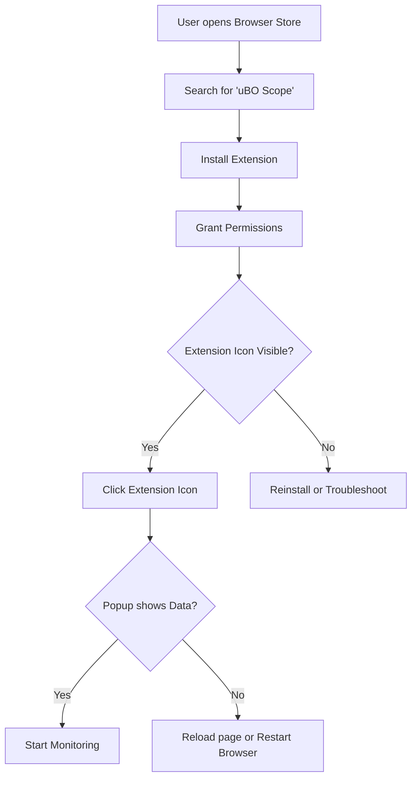

# Installing and Activating uBO Scope

Explore how to locate, install, and enable the uBO Scope extension across major browsers—Chromium, Firefox, and Safari. This guide walks you through accessing the popup interface and verifying that uBO Scope is correctly running so you can start monitoring your browser's remote server connections effortlessly.

---

## 1. Overview

uBO Scope is a lightweight browser extension designed to reveal all remote server connections your browser attempts or successfully establishes. Installing and activating it properly ensures you gain immediate visibility into your network activity.

### Prerequisites
- A supported browser: 
  - **Chromium-based browsers** (e.g., Chrome, Edge) version 122 or above
  - **Firefox** version 128 or above
  - **Safari** version 18.5 or above
- Reliable internet connection for downloading and installing the extension

### Expected Outcome
- Successfully installed uBO Scope extension in your browser
- Toolbar icon visible and interactive
- Ready-to-use popup UI displaying real-time third-party connection data when accessed

### Estimated Time
5–10 minutes depending on browser and internet speed

### Difficulty Level
Beginner – no technical skills required

---

## 2. Step-by-Step Installation and Activation Instructions

### Step 1: Find the Extension in the Official Store

- **Chromium Browsers:**
  1. Open the Chrome Web Store at [uBO Scope in Chrome Web Store](https://chromewebstore.google.com/detail/ubo-scope/bbdpgcaljkaaigfcomhidmneffjjjfgp)
  2. Search for "uBO Scope" or "uBlock Origin Scope"
- **Firefox:**
  1. Go to [uBO Scope Add-on on Mozilla Add-ons](https://addons.mozilla.org/firefox/addon/ubo-scope/)
  2. Search for "uBO Scope"
- **Safari:**
  1. Open the Mac App Store or Safari Extensions Gallery
  2. Search for "uBO Scope" or "uBlock Origin Scope"

<Tip>
Only install uBO Scope from official browser stores or the trusted repository link: https://github.com/gorhill/uBO-Scope to avoid malicious copies.
</Tip>

### Step 2: Install the Extension

- Click on the **Add to Browser** (or Install) button
- Grant required permissions when prompted:
  - Access to the current active tab
  - Permission to monitor network requests (`webRequest`)
  - Storage permissions for saving session data

> These permissions enable uBO Scope to monitor remote connections effectively.

### Step 3: Confirm the Extension is Active

- Look for the uBO Scope icon appearing in your browser’s toolbar near the address bar
- Confirm the icon’s tooltip shows 'uBO Scope' or 'uBlock Origin Scope'

### Step 4: Access the Popup UI

- Click the uBO Scope icon in the toolbar
- The popup window should open and display network connection data for the current tab

### Step 5: Verify the Extension is Monitoring Connections

- Browse to a website with multiple third-party resources (e.g., news sites or online retailers)
- Click the uBO Scope icon again to open the popup
- Observe the lists under “not blocked,” “stealth-blocked,” and “blocked” sections showing domains connected
- Check the **domains connected** summary count updates accordingly

<Check>
If the popup displays **NO DATA**, try refreshing the current browser tab or restarting the browser.
</Check>

---

## 3. Understanding the Popup UI

When activated, the popup UI categorizes third-party remote servers based on connection outcomes:

- **Not Blocked:** Domains with successful connections
- **Stealth-Blocked:** Domains where redirects happened silently
- **Blocked:** Domains for which requests were explicitly blocked

All domain names are decoded to their readable format, even for internationalized domains.

---

## 4. Troubleshooting Common Installation and Activation Issues

### Problem: Extension Icon Does Not Appear
- Verify your browser version meets the minimum requirement
- Ensure extension permissions were granted fully
- Reinstall the extension if necessary

### Problem: Popup Shows "NO DATA"
- The current tab may not have data yet; reload the page
- Ensure uBO Scope has permission to access that tab
- Restart the browser to reset extension state

### Problem: Permissions Not Granted
- Manually check extension settings in your browser and enable all required permissions
- Some browsers require approval after installation

<Tip>
Consult the [Troubleshooting Installation Issues](../getting-started/first-steps-and-validation/troubleshooting-setup) guide for detailed resolutions.
</Tip>

---

## 5. Best Practices and Tips

- Always install from official sources to ensure updates and security
- Use uBO Scope alongside content blockers for enhanced privacy insights
- Regularly check the popup UI after loading new pages to monitor network activity
- Understand that a **lower badge count is preferable**, indicating fewer distinct third-party connections

---

## 6. Next Steps

After confirming installation and activation:

- Explore [First Run: Using uBO Scope](../getting-started/first-steps-and-validation/using-the-extension) to learn how to interpret results effectively
- Review [Understanding the Toolbar Badge Count](../guides/getting-started-essentials/badge-count-explained) for insights on what the badge number represents
- Consult [Core Features & Benefits](../../overview/introduction-core-value/core-features-benefits) to deepen your understanding of the extension's capabilities

---

## 7. Additional Resources

- Official GitHub Repository: [https://github.com/gorhill/uBO-Scope](https://github.com/gorhill/uBO-Scope)
- Browser Compatibility and Requirements: see [System Requirements & Prerequisites](../getting-started/installation-and-setup/system-prerequisites)

---

## Example Scenario: Installing and Activating uBO Scope on Firefox

1. Open Firefox and go to the [Firefox Add-ons page for uBO Scope](https://addons.mozilla.org/firefox/addon/ubo-scope/).
2. Click **Add to Firefox**.
3. When prompted, allow the extension access to active tabs and network permissions.
4. Confirm the uBO Scope icon appears next to the address bar.
5. Visit any website with third-party content.
6. Click the uBO Scope icon, and the popup shows domains connected, blocked, and stealth-blocked.

You are now ready to monitor and analyze your browser's network connections in real time.

---

## Visual Quick Reference Diagram

This workflow guides you from discovery to active monitoring with uBO Scope.
