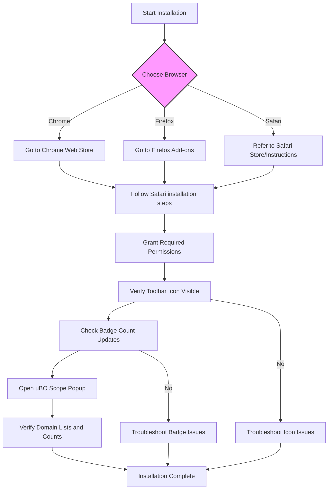

# Installing and Activating uBO Scope

## Workflow Overview

This guide provides you with a straightforward, step-by-step process to install and activate **uBO Scope** on your preferred browser. You'll learn how to obtain the extension, perform the installation, verify that it is working correctly, and understand the permissions it requires for proper operation.

**Prerequisites:**
- A supported modern browser (Chrome, Firefox, Safari) with version meeting the minimum requirements.
- Internet access to download the extension.

**Expected Outcome:**
- uBO Scope extension installed and active.
- Toolbar icon visible with its badge available.
- Permissions granted to let the extension monitor network connections.

**Time Estimate:** Approximately 5-10 minutes.

**Difficulty Level:** Beginner.

---

## Step-by-Step Installation and Activation

### 1. Choose Your Browser

uBO Scope supports the following browsers:
- **Google Chrome** (minimum version 122.0)
- **Mozilla Firefox** (minimum version 128.0)
- **Safari** (minimum version 18.5)

Make sure your browser is updated to at least the supported version to guarantee full functionality.

### 2. Access the Extension Store

Install uBO Scope from your browser’s official extension marketplace:

| Browser | Installation Link |
|---------|------------------|
| Chrome  | [Chrome Web Store](https://chromewebstore.google.com/detail/ubo-scope/bbdpgcaljkaaigfcomhidmneffjjjfgp) |
| Firefox | [Firefox Add-ons](https://addons.mozilla.org/firefox/addon/ubo-scope/) |

For Safari, installation instructions are often available through the App Store or Apple Developer resources.

### 3. Install the Extension

- Click **Add to Browser** or equivalent button to start installation.
- Review the permissions request popup carefully.

<u>uBO Scope requires the following core permissions:</u>

| Permission | Purpose |
|------------|---------|
| `activeTab` | Allows the extension to interact with your active browser tab. |
| `storage`  | Enables the extension to save session and configuration data. |
| `webRequest` | Monitors and observes network requests made by webpages. |
| Host permissions | Grants access to capture requests for HTTP, HTTPS, WebSocket protocols on all URLs (`http://*/*`, `https://*/*`, `ws://*/*`, `wss://*/*`). |

Grant these permissions to allow uBO Scope to monitor network connections accurately.

### 4. Verify Extension Activation

Once installed, confirmation that uBO Scope is active includes:

- The **uBO Scope toolbar icon** appears near your browser's address bar.
- The icon displays a **badge** number representing the count of distinct third-party remote servers contacted by web pages.

<Tip>
The badge count reflects the number of unique third-party domains connecting through your current tab. A lower number generally means fewer third-party connections, which is preferred.
</Tip>

### 5. Open the uBO Scope Popup

Click the uBO Scope toolbar icon to open its popup interface. It will display:

- The current tab’s hostname.
- A summary count of third-party domains connected.
- Lists categorizing connections into **not blocked**, **stealth-blocked**, and **blocked**.

This detailed view helps you understand the network activity happening behind the scenes.

### 6. Confirm Permissions and Data Flow

During initial activation, the extension may require a moment to gather data. Refresh your active tab or navigate to a new page to trigger network request monitoring.

Wait a few seconds and observe that:
- The badge updates with counts matching the domains listed in the popup.
- Domain lists populate under the appropriate sections.

If the toolbar icon or badge does not appear or update, permissions may not have been granted correctly or the extension may not be fully activated. Refer to troubleshooting guides for assistance.

---

## Practical Tips and Best Practices

- **Updating Browsers:** Keep your browser updated to leverage the latest APIs and security patches essential for the extension.

- **Refreshing Tabs:** After installation or permission changes, always refresh tabs to start capturing network data immediately.

- **Interpreting the Badge:** Remember the badge shows distinct third-party remote servers contacted, not request counts. Focus on understanding the quality of connections rather than the quantity.

- **Browser-Specific Differences:** Some permissions or behaviors might differ slightly between Chrome, Firefox, and Safari due to their internal extensions API variants.

---

## Common Pitfalls and Solutions

<AccordionGroup title="Common Installation Issues & How to Fix Them">
<Accordion title="Toolbar Icon Not Visible After Installation">
- **Cause:** Extension may be disabled or hidden.
- **Solution:** Ensure the extension is enabled in your browser’s extensions manager. Pin the icon to the toolbar if it’s hidden.
</Accordion>

<Accordion title="Badge Count Not Updating">
- **Cause:** Permissions not granted or background processes not running.
- **Solution:** Check that the extension has all the required permissions, refresh the active tab, and verify there are network connections occurring on that page.
</Accordion>

<Accordion title="Popup Does Not Show Data">
- **Cause:** Background script not communicating or data not yet collected.
- **Solution:** Reload the page and wait a few seconds; confirm no other extensions interfere with `webRequest` API.
</Accordion>
</AccordionGroup>

---

## Summary

You have successfully installed and activated **uBO Scope**! Your browser is now equipped to report and categorize all third-party network connections initiated by webpages.

Expand your understanding by exploring how to interpret the badge count and detailed popup data in the following guides:

- [First Use: Viewing and Interpreting Connections](/guides/getting-started-essentials/first-use)
- [Interpreting the Badge Count: What Really Matters?](/guides/privacy-insight-advanced-use/interpreting-badge-count)

For ongoing issues, consult the [Troubleshooting Common Setup Issues](/getting-started/first-steps-usage-validation/troubleshooting-common-setup-issues) guide.

---

## Advanced Installation Options (For Developers)

Developers or power users can build the extension manually:

```bash
# Clone the repository
git clone https://github.com/gorhill/uBO-Scope.git
cd uBO-Scope

# Use the included packaging script
# For Firefox
./tools/make-firefox.sh
# For Chromium
./tools/make-package.sh chromium
```

Packages compile all necessary assets and manifest files tailored for each platform, ensuring a compliant extension version.

---

## Supporting Resources

Refer to the official GitHub repository for source code, updates, and issue tracking:

- https://github.com/gorhill/uBO-Scope

---

## Diagram: Installation Flow



---

You are now ready to use uBO Scope to gain insight into web connections made by your browsing activities.


