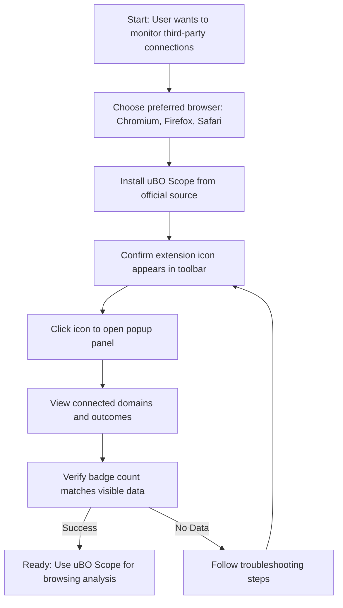

# Installation and First Look

Welcome to the essential first step with uBO Scope. This guide walks you through **installing the uBO Scope extension** on your preferred browser, **opening the extension interface**, and **getting your first clear view of the data it provides**. You'll learn how to verify a successful installation and navigate the minimalistic yet powerful popup panel so you're fully prepared for deeper exploration.

---

## What You'll Achieve

- Install uBO Scope on Chromium, Firefox, or Safari
- Locate and open the extension in your browser toolbar
- Understand the layout and information presented by the popup interface
- Verify that uBO Scope is working and ready to monitor network connections immediately

---

## Prerequisites

Before you begin:

- Confirm your browser version meets the minimum requirements: Chromium 122+, Firefox 128+, or Safari 18.5+
- Have an active internet connection for downloading the extension
- Ensure you have permissions to install browser extensions

For full browser compatibility and permissions needed, see [Prerequisites & System Compatibility](/getting-started/installation-overview/prerequisites-system-compatibility).

---

## Installation Steps

### Step 1: Choose Your Browser

uBO Scope supports three main browsers. Select your browser and proceed:

- **Chromium-based browsers (Google Chrome, Microsoft Edge, etc.)**
- **Mozilla Firefox**
- **Apple Safari**

### Step 2: Install uBO Scope

1. Navigate to the official extension source:
    - For Chromium browsers, visit the [Chrome Web Store](https://chromewebstore.google.com/detail/ubo-scope/bbdpgcaljkaaigfcomhidmneffjjjfgp)
    - For Firefox, visit the [Firefox Add-ons](https://addons.mozilla.org/firefox/addon/ubo-scope/)
    - For Safari, install via the Safari Extensions Gallery or through the App Store as per your system prompt

2. Click **Add to Browser** or **Install**.
3. Follow the browser prompts to grant necessary permissions:
   - `webRequest` — to monitor network requests
   - `activeTab` — to interact with the currently active tab
   - `storage` — to save session data

<Tip>
Granting these permissions is essential for uBO Scope to function correctly. Declining them will result in limited or no data collection.
</Tip>

### Step 3: Confirm Installation

After installation:

- Look for the uBO Scope icon in your browser’s toolbar. It appears as a circle badge with a stylized icon.
- If the icon is not visible, check your browser’s extensions menu or toolbar customization settings.

<Check>
If you cannot locate the icon, review the [Resolving Common Installation Problems](/getting-started/setup-troubleshooting/common-installation-issues) guide.
</Check>

---

## Opening uBO Scope and Exploring the Interface

### Step 1: Open the Popup Panel

Click the uBO Scope icon in the browser toolbar. This action opens the popup window.

### Step 2: Understand the Popup Layout

The popup presents a straightforward summary of third-party connections for the active tab:

- **Hostname Display**: At the top, the domain of the current tab displays, split into subdomain and main domain for clarity.
- **Domains Connected Count**: Shows the number of distinct third-party domains contacted.
- **Three Sections Representing Connection Outcomes:**
   - **Not Blocked:** Domains that were allowed and connected successfully.
   - **Stealth-Blocked:** Domains that were blocked in a stealthy manner (invisible to the webpage).
   - **Blocked:** Domains where connections were definitively blocked.

Each section lists domains with the count of resource requests made to them.

### Step 3: Verify Data Loading

Upon opening, you’ll initially see "NO DATA" or a loading state. After a moment, the extension fetches data about the current tab and populates the interface.

<Tip>
This loading time is usually under a second. If the popup shows no data after a reasonable wait, try refreshing the tab or checking your browser permissions.
</Tip>

---

## Verifying uBO Scope is Working

### Step 1: Navigate to a Website

Open any website in the active tab (for example, https://example.com).

### Step 2: Observe the Toolbar Icon Badge

The badge will display a number representing the count of distinct third-party remote servers the page contacted successfully.

### Step 3: Open the Popup Panel

Click the extension icon to confirm that domains appear under the appropriate sections, and the connected count matches the badge.

<Check>
If the badge remains empty and the popup shows no domains:

- Refresh the webpage and wait a few seconds
- Ensure the extension has the required `webRequest` permission
- Confirm no conflicting extensions are interfering
</Check>

For detailed troubleshooting, see [Resolving Common Installation Problems](/getting-started/setup-troubleshooting/common-installation-issues).

---

## Practical Tips for Your First Look

- The **lowest connected domain count means better privacy**
- The **popup updates live** as you navigate across tabs
- Domains in **stealth-blocked** indicate blocking actions can be invisible to websites
- **Blocked domains** confirm where connections were prevented

Use this understanding to quickly assess third-party activity while browsing.

---

## Summary Diagram: User Workflow Installing and Opening uBO Scope

---

## Next Steps

After completing this guide, explore these recommended pages to deepen your understanding and usage:

- [Launching & Validating Extension Activation](/getting-started/first-run-and-configuration/launch-validate-extension) — ensures uBO Scope is live and functional
- [Your First Look: Interpreting the Popup Panel](/getting-started/first-run-and-configuration/quick-start-using-popup) — learn how to read and act on popup data
- [Resolving Common Installation Problems](/getting-started/setup-troubleshooting/common-installation-issues) — for help with any issues during setup

---

<Info>
This guide focused exclusively on installation and initial interaction with uBO Scope's main interface—the popup panel. It does not cover deep configuration or advanced use cases, which are available in subsequent documentation.
</Info>

---

##### Helpful Resources

- Official GitHub repository: [https://github.com/gorhill/uBO-Scope](https://github.com/gorhill/uBO-Scope)
- Browser extension stores for installation links
- Support forums and issue trackers for community help
