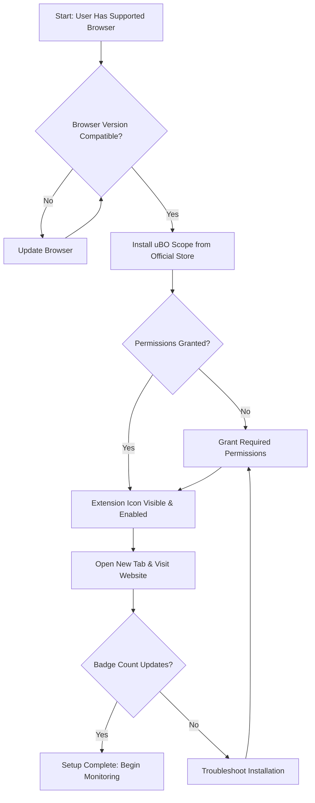

# Install and Set Up uBO Scope

## Overview
This guide walks you through installing and setting up the uBO Scope browser extension across supported browsers, enabling it to monitor your network connections effectively. With clear, actionable steps, you’ll get uBO Scope running on Chromium-based browsers, Firefox, or Safari in moments.

Whether you are privacy-conscious, a content blocker evaluator, or filter list maintainer, this setup ensures that uBO Scope reliably reports all remote server connections while integrating seamlessly into your browsing experience.

---

## What You Will Achieve
- Install uBO Scope on your browser from the official extension store.
- Ensure permissions are configured to allow network request monitoring.
- Enable the extension and confirm it is active.
- Prepare for using the popup interface to view connection insights.

---

## Prerequisites
- A supported browser: Chromium (version 122 or newer), Firefox (version 128 or newer), or Safari (version 18.5 or newer).
- An internet connection to download and install the extension.
- Basic familiarity with browser extensions and permissions.

---

## Step 1: Verify Browser Compatibility
Before installing, confirm that your browser version supports uBO Scope.

- **Chromium:** Version 122.0 or newer.
- **Firefox:** Version 128.0 or newer.
- **Safari:** Version 18.5 or newer.

If your browser is outdated, update it to the latest available version to ensure optimal performance.

> <Tip>
> You can find your browser’s version by navigating to its “About” menu, typically under Help or Settings.
> </Tip>

---

## Step 2: Install uBO Scope
Follow the specific instructions for your browser below:

### Chromium (Google Chrome, Microsoft Edge, etc.)
1. Open the Chrome Web Store uBO Scope page [here](https://chromewebstore.google.com/detail/ubo-scope/bbdpgcaljkaaigfcomhidmneffjjjfgp).
2. Click _Add to Chrome_ and confirm by selecting _Add extension_.
3. Wait for the extension icon to appear in your browser toolbar.

### Firefox
1. Visit the uBO Scope page on Mozilla Add-ons [here](https://addons.mozilla.org/firefox/addon/ubo-scope/).
2. Click _Add to Firefox_, then confirm _Add_.
3. See the uBO Scope icon appear in your toolbar.

### Safari
1. Open the Mac App Store and search for uBO Scope or use the developer's distribution.
2. Follow prompts to install and enable the extension.
3. Confirm the uBO Scope icon appears in the Safari toolbar.

> <Warning>
> Make sure you install uBO Scope from official sources to avoid unauthorized or malicious software.
> </Warning>

---

## Step 3: Confirm Permissions Are Granted
uBO Scope requires certain permissions to function fully, primarily access to the `webRequest` API and storage capabilities.

1. After installation, check if the extension requests permissions.
2. Approve permissions for:
    - Monitoring network requests (`webRequest`).
    - Access to storage for session data.
    - Access to active tabs for dynamic monitoring.

3. If permission prompts are missed or denied, re-install the extension or modify permissions via your browser's extension management page.

> <Note>
> The extension uses host permissions for URLs such as https://*/* and http://*/* to observe network requests across websites.
> </Note>

---

## Step 4: Enable and Verify uBO Scope Activation
Once installed and permissions are confirmed:

1. Ensure the uBO Scope icon is visible in your browser's toolbar.
2. Click the icon to open the popup for the first time. This initializes monitoring.
3. Open a new browser tab and visit a website with typical web activity.
4. Observe the toolbar badge count update, showing the number of distinct third-party domains connected.

> <Check>
> If the badge count appears and updates as you browse, uBO Scope is active and monitoring.
> </Check>

---

## Step 5: Handling Common Setup Issues
If uBO Scope does not appear to be working properly, consider the following:

- **No badge count on browsing:**
  - Confirm the extension is enabled in your browser’s extensions/settings.
  - Refresh or reload the tab to kickstart network observation.
  - Verify permissions are properly granted.

- **Extension icon missing:**
  - Check if the extension is hidden behind overflow menus (browser-specific).
  - Restart the browser.
  - Reinstall if necessary.

- **Conflicts with other extensions:**
  - Disable other content blockers temporarily to isolate issues.

- **Browser version compatibility:**
  - Verify browser version meets minimum requirements.
  
For detailed troubleshooting, refer to the [Troubleshooting Installation](../getting-started/installation-basics/troubleshooting-install) guide.

---

## Step 6: Prepare to Use uBO Scope Popup Interface
With uBO Scope installed and running, your next step is to explore the popup interface:

- Click the toolbar icon to see categorized network connections:
  - Allowed (not blocked) domains
  - Stealth-blocked domains
  - Blocked domains

- Use this information to audit your browsing third-party network footprint.

You can learn more about interacting with the popup interface in [Using the Popup: Viewing and Interpreting Network Connections](../guides/getting-started-essentials/understand-popup).

---

## Best Practices
- Keep your browser and uBO Scope updated to benefit from security patches and feature improvements.
- Regularly verify that uBO Scope’s badge updates during your browsing to ensure continuous monitoring.
- Use a mix of websites with varied network connections to observe more comprehensive reporting.

---

## Summary
This guide provided you with a clear path to get uBO Scope installed, enabled, and ready for use:

- Verify your browser meets version requirements.
- Install the extension from official sources.
- Confirm permissions and activation.
- Perform basic checks to validate monitoring.

Welcome to empowered, transparent network connection awareness with uBO Scope!

---

## Related Resources
- [Supported Browsers & Requirements](../getting-started/installation-basics/system-requirements)
- [Verifying Installation](../getting-started/installation-basics/verifying-installation)
- [Troubleshooting Installation](../getting-started/installation-basics/troubleshooting-install)
- [Understanding the Badge and Popup](../getting-started/first-run-experience/understanding-badge-popup)
- [Using the Popup: Viewing and Interpreting Network Connections](../guides/getting-started-essentials/understand-popup)

Explore these next to deepen your understanding and optimize your uBO Scope experience.

---

## Visual Flow of Installation & Setup

This diagram illustrates the sequential decision points users follow for installing and enabling uBO Scope effectively.
