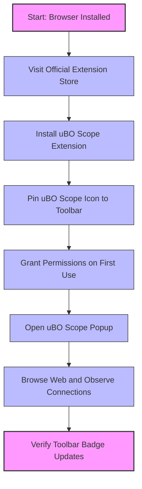

# Installing and Setting Up uBO Scope

## Overview
This guide walks you through installing uBO Scope, a powerful browser extension that reveals all network connections to third-party remote servers. You'll learn how to install the extension on major browsers—Chromium-based browsers (like Chrome), Firefox, and Safari—and how to perform the initial setup to ensure the extension is functioning correctly.

By following this guide, you will unlock unprecedented transparency into your web traffic, increase your privacy awareness, and gain tools to analyze network activity effectively.

---

## Prerequisites
- A compatible browser installed:
  - **Chromium-based browsers** (Chrome, Edge, Brave, etc.) version 122 or newer
  - **Firefox** version 128 or newer
  - **Safari** version 18.5 or newer
- An active internet connection to access the official browser extension stores
- Basic familiarity with installing browser extensions

<Check>
Before proceeding, verify your browser version supports uBO Scope by checking your browser’s "About" page or equivalent setting.
</Check>

---

## Expected Outcome
- Successfully installed uBO Scope extension on your preferred browser from an official source
- The extension icon visible and pinned in your browser toolbar
- Permissions granted to allow the extension to monitor web requests
- Confirmation that uBO Scope is actively tracking third-party connections on webpages you visit

---

## Time Estimate
Approximate time to complete this workflow: 5–10 minutes

---

## Installation Steps

### Step 1: Install uBO Scope from the Official Store

#### Chromium-based Browsers
1. Open your Chromium browser.
2. Visit the [Chrome Web Store page for uBO Scope](https://chromewebstore.google.com/detail/ubo-scope/bbdpgcaljkaaigfcomhidmneffjjjfgp).
3. Click **Add to Chrome**.
4. Confirm the installation by clicking **Add extension** in the prompt.

#### Firefox
1. Open Firefox.
2. Navigate to the [Firefox Add-ons page for uBO Scope](https://addons.mozilla.org/firefox/addon/ubo-scope/).
3. Click **Add to Firefox**.
4. Confirm by clicking **Add** when prompted.

#### Safari
1. Open Safari.
2. Access the Extension Gallery or App Store for Safari.
3. Search for "uBO Scope" and install the extension.
4. Follow on-screen instructions to enable it if required.

<Tip>
Always install uBO Scope from official stores to ensure authenticity and updates.
</Tip>

### Step 2: Pin the uBO Scope Icon to Your Browser Toolbar

After installation, pinning the icon improves accessibility:

- **Chromium-based browsers:**
  - Click the extensions puzzle icon next to the address bar.
  - Find uBO Scope and click the pin icon to keep it visible.

- **Firefox:**
  - Click the toolbar overflow menu (three horizontal lines).
  - Find and drag the uBO Scope icon to your toolbar or use “Customize” to add it.

- **Safari:**
  - Navigate to Safari Preferences > Extensions.
  - Enable the extension and ensure the toolbar icon is visible.

<Check>
The extension icon should be visible and clickable on your browser toolbar after this step.
</Check>

### Step 3: Grant Required Permissions

uBO Scope relies on browser permissions for network monitoring:

- Upon first click of the uBO Scope icon, the browser may request permission to access browsing data.
- Accept all permission requests to enable proper functionality.

<Warning>
Failure to grant permissions will prevent uBO Scope from reporting network connections correctly.
</Warning>

### Step 4: Verify Installation and Functionality

1. Click the uBO Scope toolbar icon to open the popup interface.
2. Open a new tab and navigate to a website you frequently use.
3. Return to the uBO Scope popup. It should display the hostname of the current tab and categorize connections as **not blocked**, **stealth-blocked**, or **blocked**.
4. The toolbar badge will show the number of distinct third-party domains your current tab connected to.

<Tip>
If no data appears immediately, reload the webpage or try visiting a different site.
</Tip>

---

## Troubleshooting Common Issues

<AccordionGroup title="Common Installation and Setup Issues">
<Accordion title="uBO Scope icon is missing after installation">
- Ensure you pinned the extension icon to the toolbar.
- Restart the browser to refresh extension loading.
- Confirm that your browser version meets minimum requirements.
</Accordion>

<Accordion title="Popup displays 'NO DATA' or empty lists">
- Visit a website with active network connections and refresh it.
- Check if you granted all permissions when prompted.
- Ensure no conflicting extensions are blocking the `webRequest` API.
</Accordion>

<Accordion title="Toolbar badge doesn’t update">
- Reload the current tab to trigger data collection.
- Verify that the extension is enabled and permissions are intact.
- If using privacy-focused browser settings, allow network monitoring explicitly.
</Accordion>
</AccordionGroup>

---

## Best Practices for First Use
- Favor installing from official extension stores for automatic updates and security.
- Pin the icon for quick checks.
- Grant all permissions when prompted to allow full data collection.
- Try browsing a variety of websites to observe how connections differ.

---

## Summary
Following this guide, you will have uBO Scope installed and configured to reveal third-party remote server connections efficiently. This setup is foundational for using uBO Scope to enhance your privacy understanding.

---

## Next Steps & Related Documentation
- Explore the [First Launch & Activation]( /getting-started/install-and-setup/first-launch) guide to learn about confirming ongoing operation after installation.
- Consult [Quick Validation]( /getting-started/using-and-troubleshooting/first-check) to perform an immediate check on uBO Scope’s functionality.
- For troubleshooting deeper issues, see the [Troubleshooting Installation]( /getting-started/using-and-troubleshooting/troubleshooting) documentation.
- Learn more about what uBO Scope reveals in [What is uBO Scope?]( /overview/product-introduction-and-value/what-is-ubo-scope).

---

## Additional Resources
- [uBO Scope on GitHub](https://github.com/gorhill/uBO-Scope)
- Browser extension stores:
  - [Chrome Web Store](https://chrome.google.com/webstore)
  - [Mozilla Add-ons](https://addons.mozilla.org)
  - [Safari Extensions Gallery](https://apps.apple.com/us/genre/mac-extensions/id12018)

---

## Visual Workflow Summary

---