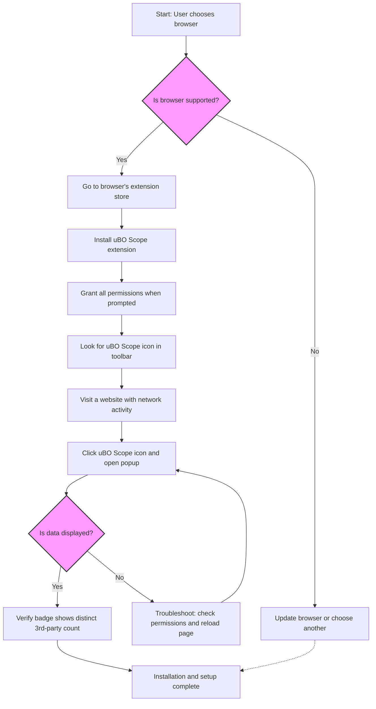

# Installing and Setting Up uBO Scope

Welcome to the definitive guide to installing, configuring, and verifying uBO Scope on your browser. Whether you're a first-time user or migrating across browsers like Chrome, Firefox, or Safari, this guide walks you through every step to get uBO Scope operational and reporting with confidence.

---

## 1. Introduction and Workflow Overview

**What this guide achieves:**

- Helps you install uBO Scope on Chrome, Firefox, and Safari
- Guides through basic configuration and permission setup
- Shows how to verify the extension is active and capturing data

**Prerequisites:**

- Supported browser installed (Chrome 122+, Firefox 128+, Safari 18.5+)
- Internet connection to download the extension
- Basic familiarity with browser extension installation

**Expected Outcome:**

- uBO Scope installed and enabled in your browser
- Permissions granted for full functionality
- Confirmation that uBO Scope is reporting remote server connections on active tabs

**Time Estimate:** ~10 minutes

**Difficulty Level:** Beginner

---

## 2. Step-by-Step Installation and Setup Instructions

### Step 1: Check Browser Compatibility

Ensure your browser version meets the minimum requirements:

- **Chrome:** Version 122 or later
- **Firefox:** Version 128 or later
- **Safari:** Version 18.5 or later

Attempting installation on unsupported versions will result in failures or limited functionality.

<Tip>
Verify your browser version in the 'About' section of your browser settings to ensure compatibility before proceeding.
</Tip>

---

### Step 2: Install uBO Scope Extension

Choose your browser below and follow the respective installation instructions:

#### Chrome

1. Navigate to the [Chrome Web Store uBO Scope page](https://chromewebstore.google.com/detail/ubo-scope/bbdpgcaljkaaigfcomhidmneffjjjfgp).
2. Click **Add to Chrome**.
3. Confirm by clicking **Add extension** when prompted.

#### Firefox

1. Open the [Firefox Add-ons uBO Scope page](https://addons.mozilla.org/firefox/addon/ubo-scope/).
2. Click **Add to Firefox**.
3. Approve permissions and confirm installation.

#### Safari

1. Access the App Store or Safari Extensions Gallery supporting Safari 18.5+.
2. Search for "uBO Scope" and install.

<Note>
Permissions required include `activeTab`, `storage`, and `webRequest` for uBO Scope to fully monitor network requests.
</Note>

---

### Step 3: Grant Required Permissions

On installation, the browser will prompt you to grant several permissions vital for uBO Scope's operation:

- **Active Tab Access:** Allows uBO Scope to monitor network requests for the active browser tab.
- **Storage:** Enables saving session and domain details locally.
- **Web Request Monitoring:** Essential for detecting all remote server connection attempts.

Grant these permissions without restrictions to ensure accurate and comprehensive reporting.

---

### Step 4: Confirm Installation and Startup

After installation, confirm uBO Scope is enabled and active:

1. Look for the uBO Scope icon in your browser toolbar — it uses a distinctive badge with the label "uBO Scope".
2. Click the toolbar icon to open the popup panel.
3. The popup should show data categorized as "not blocked," "stealth-blocked," and "blocked" domains, along with a count of connected domains.

<Check>
If you see "NO DATA" or the panel remains empty, ensure you've granted all permissions and have visited a web page with active network requests.
</Check>

---

### Step 5: Verify uBO Scope is Reporting

To validate that uBO Scope is recording remote servers correctly:

1. Open any website with multiple third-party resources, such as a news or shopping site.
2. Click the uBO Scope toolbar icon.
3. Observe the toolbar badge count increasing—this number represents distinct third-party servers connected.
4. Review the breakdown in the popup for domains labeled under "not blocked," "stealth-blocked," and "blocked."

<Info>
A lower count on the badge represents fewer distinct third-party connections, which is typically preferable for privacy.
</Info>

---

## 3. Practical Example: Installing and Testing on Chrome

1. Navigate to the [Chrome Web Store](https://chromewebstore.google.com/detail/ubo-scope/bbdpgcaljkaaigfcomhidmneffjjjfgp).
2. Click **Add to Chrome** and confirm.
3. After installation, open https://example.com.
4. Click the uBO Scope icon in the toolbar.
5. In the popup, verify you see connected domains and the badge shows a number.

This process confirms the extension works and tracks remote connections.

---

## 4. Troubleshooting Common Installation Issues

<AccordionGroup title="Troubleshooting Setup Issues">
<Accordion title="uBO Scope Icon Missing After Installation">
- Verify the extension is enabled in your browser's extensions page.
- Restart your browser to reload extension services.
- Check for browser updates.
</Accordion>

<Accordion title="Popup Shows 'NO DATA' or Empty Sections">
- Confirm you have visited active webpages with network activity.
- Reload the webpage and open the popup again.
- Ensure all requested permissions were granted.
</Accordion>

<Accordion title="Badge Count Not Updating">
- The badge displays the count of distinct third-party remote servers connected per tab.
- Switch tabs or reload pages to observe badge changes.
- Disable conflicting extensions that may block webRequest API.
</Accordion>
</AccordionGroup>

<Tip>
If issues persist, consult the detailed troubleshooting guide under Getting Started > First Use & Troubleshooting.
</Tip>

---

## 5. Best Practices and Tips

- **Keep your browser updated** to ensure compatibility.
- **Grant full permissions** at installation for accurate data.
- **Understand the badge logic:** The number reflects unique third-party domains connected, helping assess privacy exposure.
- **Use uBO Scope alongside your blocker** to validate block coverage effectively.

---

## 6. Next Steps

- Explore the [Understanding the Popup: A First Walkthrough](../basic-usage-popup-walkthrough) guide to learn how to interpret the connection data displayed.
- Visit the [Interpreting Connection and Blocked Server Data](../interpreting-connection-data) for deeper analysis techniques.
- Consult the [Troubleshooting Setup Issues](../../quickstart-verification/troubleshooting-setup) page if you encounter operational problems.

---

## 7. Additional Resources

- [What is uBO Scope?](../../product-intro-value/what-is-ubo-scope) — Core product introduction and philosophy.
- [Core Concepts & Terminology](../../concepts-architecture/core-concepts-terminology) — Definitions to better understand reported data.
- [Requirements & Supported Browsers](../../installation-basics/prerequisites) — Detailed compatibility info and system requirements.

---

## Summary Diagram: Basic Installation and Verification Workflow

