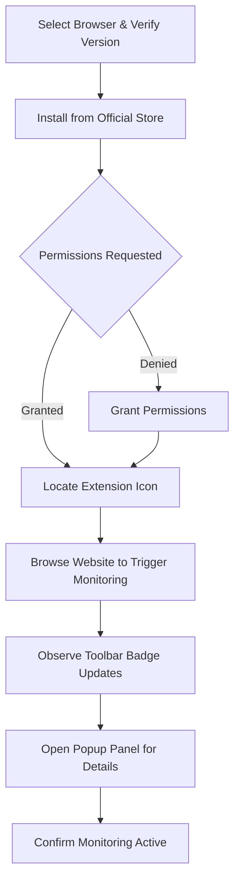

# Installing and Enabling uBO Scope

## Introduction

This guide walks you through the straightforward process of installing the uBO Scope browser extension on supported browsers—Chrome (Chromium), Firefox, and Safari—and verifying that it is enabled and actively monitoring network connections. Whether you are a first-time user or setting up the extension on a new device, this document ensures you can get uBO Scope up and running efficiently.

---

## What You Will Achieve

- Install uBO Scope safely from official browser stores
- Locate and verify the extension icon in your toolbar
- Understand the permissions uBO Scope requests and why they are essential
- Activate and confirm the toolbar badge is working, reflecting connection data

## Prerequisites

- A supported browser at or above the minimum version listed:
  - **Chrome/Chromium:** version 122.0 or later
  - **Firefox:** version 128.0 or later
  - **Safari:** version 18.5 or later
- Internet access to visit the official extension stores or GitHub repository
- Familiarity with basic browser extension management (optional but helpful)

---

## Step 1: Choose Your Browser Version

uBO Scope supports all three major browsers with some platform-specific details:

| Browser   | Minimum Version | Installation Source                             |
|-----------|-----------------|------------------------------------------------|
| Chrome    | 122.0+          | [Chrome Web Store](https://chromewebstore.google.com/detail/ubo-scope/bbdpgcaljkaaigfcomhidmneffjjjfgp) |
| Firefox   | 128.0+          | [Firefox Add-ons](https://addons.mozilla.org/firefox/addon/ubo-scope/)                                         |
| Safari    | 18.5+           | Safari Extension Gallery or manual install from GitHub repo                                                   |

> If your browser version does not meet the minimum requirements, please update your browser before proceeding.

---

## Step 2: Install uBO Scope from Official Sources

### Chrome/Chromium

1. Open the Chrome Web Store link above.
2. Click **Add to Chrome**.
3. When prompted, review the permissions, then click **Add extension**.
4. Wait for the installation confirmation.

### Firefox

1. Open the Mozilla Add-ons link above.
2. Click **Add to Firefox**.
3. Review requested permissions and click **Add**.
4. Confirm the extension is installed by the notification.

### Safari

1. If available, find uBO Scope in the Safari Extensions Gallery.
2. If manual installation is required:
   - Visit the [GitHub repository](https://github.com/gorhill/uBO-Scope).
   - Follow the manual installation steps specific to Safari (refer to README). 
   - Enable the extension in Safari’s Preferences under Extensions.

---

## Step 3: Locate the uBO Scope Icon

After installation, the uBO Scope icon should appear in your browser’s toolbar where your extensions are displayed.

- **Chrome & Firefox:** Typically, the icon appears near the address bar.
- **Safari:** Check the extensions toolbar, enable if hidden.

If you do not see the icon:

- Click your browser’s extensions menu (e.g., puzzle piece in Chrome).
- Pin or enable uBO Scope to the toolbar.

---

## Step 4: Understand Permissions and Why They Are Required

uBO Scope requests the following key permissions:

| Permission | Purpose                                                   |
|------------|-----------------------------------------------------------|
| `activeTab`| Access the currently active tab to monitor its network activity|
| `storage`  | Save session data and settings across browser sessions    |
| `webRequest` | Listen to network requests to collect connection info    |
| `host_permissions` | Monitor all http/https and websocket connections, critical for accurate reporting|

These permissions are essential to capture comprehensive and accurate connection data, enabling uBO Scope to:

- Track all outgoing network requests
- Differentiate between allowed, blocked, and stealth-blocked connections
- Update the toolbar badge to display the count of unique third-party domains connected

<Tip>
Granting these permissions ensures uBO Scope fully operates, providing precise insights into your browser's remote server connections.
</Tip>

---

## Step 5: Activate and Verify the Toolbar Badge

Once installed and permissions are granted, uBO Scope starts monitoring network connections automatically. The **toolbar badge** on the extension icon summarizes the number of distinct third-party domains from which resources were successfully loaded.

### How to verify if uBO Scope is active:

1. Browse to any commonly visited website.
2. Look at the uBO Scope icon in your browser toolbar.
3. The badge should display a number indicating connected third-party domains.
4. Click the icon to open the popup panel for detailed connection outcomes:
    - **Not Blocked:** Domains successfully connected
    - **Stealth-Blocked:** Domains blocked via stealth (not visible to the site)
    - **Blocked:** Domains explicitly blocked

### What to expect:

- A **non-zero number** on the badge represents active monitoring
- A **zero or empty badge** means no third-party connections detected or extension not functioning

<Check>
If the badge remains empty, try refreshing your current web page or opening a new tab to trigger network activity.
</Check>

---

## Step 6: Permissions Locations by Browser

| Browser | Where to Review Extension Permissions                               |
|---------|---------------------------------------------------------------------|
| Chrome  | `chrome://extensions/` > uBO Scope > Details                         |
| Firefox | `about:addons` > uBO Scope > Preferences or More > Permissions       |
| Safari  | `Safari > Preferences > Extensions` > uBO Scope                     |

Here you can confirm permissions and enable or disable the extension.

---

## Troubleshooting Setup

If uBO Scope does not seem to function correctly after installation:

- Confirm your browser version is supported.
- Verify the extension is enabled in the browser’s extension management page.
- Refresh tabs or restart the browser.
- Check for conflicting extensions that aggressively block network requests.
- See the [Troubleshooting Setup Issues](../getting-started/setup-support/troubleshooting-setup) guide for detailed help.

---

## Best Practices

- Always install uBO Scope from official browser stores or the trusted GitHub repository.
- Keep your browser updated to meet minimum version requirements.
- Allow the needed permissions for comprehensive monitoring.
- Regularly check the toolbar badge to stay informed about third-party connections.

---

## Verification Example

1. Install uBO Scope in Chrome via the Web Store.
2. Open your favorite news website.
3. Observe a badge number on uBO Scope's toolbar icon.
4. Click the icon to open the popup panel showing connected domains.

You have successfully installed and enabled uBO Scope.

---

## Additional Resources

- [What is uBO Scope?](/overview/introduction-and-value/what-is-ubo-scope) - Understand the product’s value
- [Popup Panel and Badge Explained](/overview/feature-overview-usage/popover-and-badge) - Learn to interpret UI elements
- [Supported Browsers & Compatibility](/overview/feature-overview-usage/supported-browsers) - Confirm browser support details
- [Troubleshooting Setup Issues](../getting-started/setup-support/troubleshooting-setup) - Solve common problems
- [Official GitHub Repository](https://github.com/gorhill/uBO-Scope) - Source code and manual installation instructions

---

## Summary

Installing and enabling uBO Scope is a simple yet critical first step to gaining valuable insights into your browser’s network interactions. By following this guide, you ensure the extension is correctly installed, granted necessary permissions, and actively reporting connection data via the toolbar badge.

Make your privacy visible — start with a clean and properly installed uBO Scope extension.

---

---

### Optional Quick Reference Diagram: Installation Workflow

---

