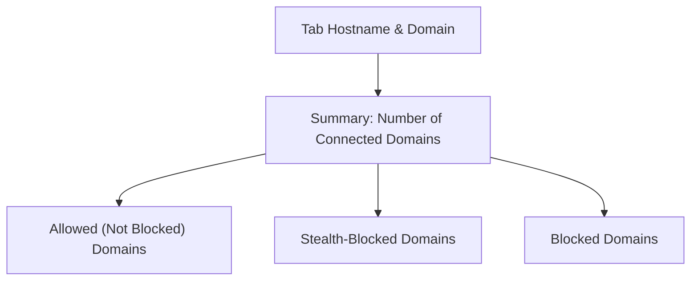

# Interpreting the Toolbar Badge and Popup

## Overview
This guide helps you understand how to read the number displayed on the uBO Scope toolbar badge and how to use the popup interface effectively. As you navigate the web, uBO Scope monitors network requests and classifies remote server connections associated with the active tab. The badge and popup give you real-time insight into these connections, empowering you to spot potential risks or unwanted third-party activity.

---

## What the Toolbar Badge Number Represents

- The badge number shown on the extension's toolbar icon indicates the **count of distinct third-party remote domains** from which resources have been successfully fetched on the current active tab.
- A **lower badge count means fewer distinct third-party connections**, which is generally preferable for privacy and security.
- This count excludes first-party domains (the main site you are visiting) and focuses only on third-party remote servers encountered.

### Why This Matters

Understanding how many third-party domains your browser contacts during page loads helps you gauge exposure to external trackers, content delivery networks (CDNs), and other potentially undesirable connections. The badge number is a **simple, immediate privacy indicator**.


## Opening and Using the Popup

The popup opens when you click the uBO Scope icon on your browser toolbar. It provides a detailed snapshot of remote domains interacting with the current tab, classified into three categories:

1. **Allowed (Not Blocked)**
2. **Stealth-Blocked**
3. **Blocked**

### How to Open the Popup

1. Ensure uBO Scope is installed and enabled in your browser (Chrome, Firefox, Safari supported).
2. Click the uBO Scope icon on the toolbar.
3. The popup panel will appear showing data related to the active tab.

### Popup Structure
The popup displays:

- **Hostname of the active tab:** Shows the full hostname and its base domain.
- **Total count of connected domains:** Summarizes the number of distinct third-party domains contacted.
- **Three domain categories:** Each with a heading and list of domains.

### Example Section Layout
```
-----------------------------------
| <Hostname>          > NO DATA    |
|---------------------------------|
| domains connected: <number>     |
|---------------------------------|
| not blocked                    | <- Allowed
|   domain1.com       12         |
|   domain2.net        3         |
|---------------------------------|
| stealth-blocked               | <- Stealth-Blocked
|   domain3.org        5         |
|---------------------------------|
| blocked                      | <- Blocked
|   domain4.io         8         |
-----------------------------------
```

## Understanding Each Category

### 1. Allowed (Not Blocked)
- These are third-party domains from which the browser successfully fetched resources.
- Typically includes trusted CDNs or necessary external services beneficial to the site functionality.
- **Implication:** These connections are live and active; keeping this list small reduces external exposure.

### 2. Stealth-Blocked
- Domains where network requests were redirected or modified by content blockers to prevent tracking but without outright blocking.
- Often used by privacy tools to silently intercept unwanted requests without breaking website functionality.
- **Implication:** These connections are controlled and hidden from the webpage.

### 3. Blocked
- Domains with requests that failed due to being blocked by content filtering rules or failed network conditions.
- Includes hosts explicitly prevented from loading resources.
- **Implication:** These represent actively prevented connections, contributing to privacy protection.


## Interpreting Domain Entries and Counts

- Each domain entry shows the domain name and the count of network requests associated with it during page load.
- Higher counts indicate a domain involved in multiple resource requests (e.g., images, scripts).
- Domains are sorted alphabetically for easy scanning.

### Real-World Scenario
If you open an e-commerce site and see many domains in the **Allowed** section, consider whether these third-party connections are necessary or desirable, such as payment processors or analytics services. Domains in **Blocked** might be known ad trackers or malicious content hosts.

## Practical Tips for Using the Badge and Popup

- **Use the badge count as a quick privacy snapshot:** A sudden increase in the number may indicate new or suspicious third parties.
- **Open the popup to investigate:** Quickly spot which domains are connecting and in what status.
- **Look for surprises:** Unknown or unexpected third-party domains could be a sign of tracking or malware.
- **Check stealth-blocked entries:** These may indicate silent blocking that protects your privacy.

<Tip>
Remember, not all third-party servers are harmful; many are essential for legitimate site functionality. Focus on anomalous or unexplained entries to assess privacy risks.
</Tip>

## Troubleshooting Common Issues

<AccordionGroup title="Troubleshooting Badge and Popup Issues">
<Accordion title="The badge number is not updating or shows zero constantly">
- Verify the extension has necessary permissions and is enabled.
- Reload the active tab to trigger network monitoring.
- Confirm you are browsing sites with third-party connections.
- Restart your browser if issues persist.
</Accordion>
<Accordion title="Popup shows 'NO DATA' or is empty">
- Ensure you opened the popup on an active tab that has completed loading.
- Some pages (e.g., internal browser pages) may not report network data due to browser limitations.
- Disable other conflicting extensions that may interfere with webRequest API.
</Accordion>
<Accordion title="Domain counts seem too high or inconsistent">
- Remember this counts distinct third-party domains per tab, not individual requests.
- Complex sites may legitimately connect to many domains.
- Compare counts over time and across sites to identify unusual patterns.
</Accordion>
</AccordionGroup>

## Summary
uBO Scope’s toolbar badge and popup are your primary tools for instant visibility into third-party domain connections on any webpage. Mastering interpretation of these indicators helps you maintain better control over online tracking and external resource loading.

---

## Next Steps & Additional Resources
- For a deeper understanding of terms like allowed, stealth-blocked, and blocked, visit the [Core Concepts & Terminology](../overview/core-concepts-and-architecture/core-concepts-and-terminology) page.
- To learn how to perform detailed domain analysis workflows, see the [Performing a Basic Domain Analysis](./basic-analysis-workflow) guide.
- For installation and activation help, consult the [Installing and Setting Up uBO Scope](./install-and-setup) guide.


---

## Appendix: Quick Recap of Badge and Popup Workflow

<Steps>
<Step title="Check Badge Count">
Click the toolbar icon and note the displayed number indicating distinct third-party domains connected.
</Step>
<Step title="Open and Review Popup">
Click the icon again if popup didn’t appear, or to refresh data. Observe the hostname, domain counts, and domain categories.
</Step>
<Step title="Analyze Allowed Domains">
Review the trustworthy list of third-party domains; consider if it aligns with your browsing expectations.
</Step>
<Step title="Identify Stealth-Blocked & Blocked Domains">
Spot domains silently blocked or actively blocked to evaluate content blocking effectiveness.
</Step>
<Step title="Make Privacy Decisions">
If suspicious domains appear frequently in allowed, consider adjusting your content blocker settings or researching the domains further.
</Step>
</Steps>

---

## Visual Reference: Popup Panel Sections




## Additional Notes
- Network requests monitored by uBO Scope include HTTP, HTTPS, WebSocket (where supported).
- Browser compatibility influences the extent of monitored data; check the [Feature Preview & Supported Browsers](../overview/core-concepts-and-architecture/feature-preview-and-supported-browsers) page for details.


---

## Support & Feedback
For questions, issues, or feature requests related to interpreting badge and popup information, visit the [uBO Scope GitHub repository](https://github.com/gorhill/uBO-Scope).

---

_By mastering badge and popup interpretation, you unlock uBO Scope’s value as a powerful privacy insight tool._