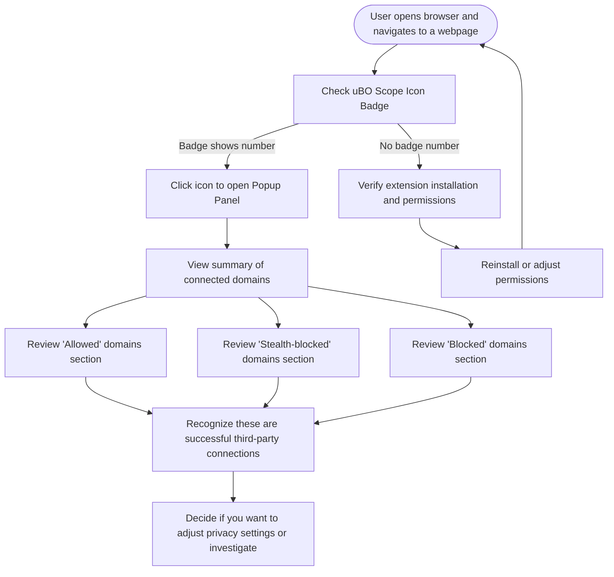

# Understanding the Badge Count & Popup Panel

## Overview
Welcome to your essential guide for interpreting the **uBO Scope** toolbar badge number and navigating the popup panel. This page empowers you to quickly grasp what the numbers mean, how uBO Scope categorizes connection outcomes, and why these insights matter more than standard ad blocker block counts.

By mastering this, you unlock clear, actionable understanding of your browser's true third-party exposure on every webpage.

---

## What This Guide Helps You Accomplish

- Understand the meaning behind the badge count displayed on the uBO Scope toolbar icon.
- Learn how to navigate and interpret the popup panel sections showing detailed domain connection counts.
- Distinguish between the three outcome categories: allowed, blocked, and stealth-blocked connections.
- Realize why the badge count reflects a more meaningful privacy indicator than typical ad blocker block counts.

---

## Prerequisites

- Have uBO Scope installed and active in your supported browser (Chrome 122+, Firefox 128+, Safari 18.5+).
- Familiarity with opening your browser's toolbar extensions and clicking on uBO Scope's icon to reveal the popup panel.

---

## Expected Outcome

After following this guide, you will:

- Read and interpret the number shown on the toolbar badge as the count of distinct third-party domains successfully connected.
- Navigate the popup panel confidently to see the breakdown of domains classified as allowed, stealth-blocked, or blocked.
- Understand how these categorizations are determined based on network request outcomes.
- Use this knowledge to better evaluate your browsing privacy exposure beyond typical block counts.

---

## Time Estimate

Reading and applying this guide will take approximately **5-10 minutes**.

---

# Step-by-Step Instructions

### 1. Recognize the Badge Count on the Toolbar Icon

- **Locate the uBO Scope icon** in your browser's toolbar.
- Observe the **badge number overlay** on the icon. 

  - This number represents the **count of distinct third-party domains** from which network connections were successfully established (allowed).
  - If no third-party connections are detected for the active tab, the badge will be empty.

<Check>
A **lower badge count means better privacy protection** because fewer third-party entities received or exchanged data.
</Check>

### 2. Open the Popup Panel for Details

- Click the uBO Scope toolbar icon to **open the popup panel**.
- The popup shows the active tab’s hostname at the top and summarizes domain connections below.

Expected popup layout:

- A **summary line** showing the total number of distinct domains connected to.
- Three outcome sections:
  - **"Not blocked"**: Allowed domains (connections not blocked).
  - **"Stealth-blocked"**: Networks that were redirected or blocked stealthily to avoid detection.
  - **"Blocked"**: Domains where connections were explicitly blocked by your content blocking setup.

### 3. Understand Each Outcome Section

- **Not Blocked (Allowed)**
  - Domains listed here are those third-party servers your browser connected to successfully.
  - These domains contribute directly to your privacy exposure.

- **Stealth-blocked**
  - Connections where blocking occurred in a way that is harder for sites to detect (e.g., via redirection/tricks).
  - These domains are prevented but may not appear in typical block counters.

- **Blocked**
  - Domains where requests were blocked outright.
  - Less privacy exposure comes from blocking these successfully.

Each section lists domains with counts indicating how many times connections occurred to that domain during the current tab session.

### 4. Interpret Domain Counts

- Domain entries show how many connection attempts were made.
- Recognize that a few legitimate third-party services (like CDN providers) may be typical and expected.

### 5. Why These Numbers Matter More Than Typical Block Counts

- Traditional ad blockers often show block counts that don't reflect true privacy exposure.
- uBO Scope’s badge counts and popup data show the **number of distinct third-party domains connected**, which better represents actual privacy risks.

<Note>
You may see fewer allowed domains but higher block counts in other blockers; this can mislead you. Always evaluate distinct third-party connections rather than simple block numbers.
</Note>

---

# Practical Tips & Best Practices

- Use the badge count as a quick privacy score for the current tab.
- Explore the popup domains list regularly to identify any surprising or unfamiliar third-party connections.
- Compare counts across tabs and sites to understand typical versus anomalous browsing behaviors.

---

# Troubleshooting Common Issues

<AccordionGroup title="Troubleshooting the Badge Count & Popup Panel">
<Accordion title="Badge Count Shows No Number or is Empty">
- Ensure uBO Scope is installed and enabled correctly.
- Verify you have navigated to a page that makes third-party requests.
- Refresh the page or open a new tab to trigger network tracking.
- Confirm uBO Scope has necessary permissions (webRequest, activeTab).
</Accordion>
<Accordion title="Popup Panel Shows 'NO DATA' or Empty Sections">
- Check that you have an active tab selected.
- Some pages with no network activity may show empty data.
- Reload the page to capture a new session of network requests.
- See also the 'Launching & Validating Extension Activation' guide if issues persist.
</Accordion>
<Accordion title="Unexpected High Number of Allowed Domains">
- Consider if the site legitimately loads many third-party resources.
- Review domain entries in the popup to spot suspicious domains.
- Confirm your content blocker settings are active and updated.
- Use the 'Comparing Content Blockers' guide for deeper analysis.
</Accordion>
</AccordionGroup>

---

# Examples

Suppose you visit a news website. The uBO Scope icon in the toolbar shows a badge number 5.

- Clicking the icon opens the popup panel.
- The summary line reads "domains connected: 5".
- The **Not Blocked** section lists:
  - example-cdn.com (3)
  - analytics.example.net (1)
  - images.example.org (4)
- The **Stealth-blocked** section lists:
  - trackersub.domain.com (2)
- The **Blocked** section lists:
  - ads.blockedexample.com (6)

Here you understand that 5 distinct domains were connected (allowed), some connections were stealth-blocked, and others were outright blocked.

---

# Next Steps & Related Documentation

- For installation and setup, see [Installing uBO Scope](/getting-started/installation-overview/installation-instructions).
- To validate the extension is active and interpreting live data, consult [Launching & Validating Extension Activation](/getting-started/first-run-and-configuration/launch-validate-extension).
- For a practical walkthrough using the popup in detail, see [Your First Look: Interpreting the Popup Panel](/getting-started/first-run-and-configuration/quick-start-using-popup).
- For troubleshooting, consult [Resolving Common Installation Problems](/getting-started/setup-troubleshooting/common-installation-issues).

---

# Summary Diagram: User Flow for Badge Count and Popup Panel Interpretation

---

# Final Notes
uBO Scope’s badge count and popup panel provide a straightforward window into your browser’s real third-party connection footprint. Use this page as your trusted reference to interpret the data it provides accurately and make informed decisions about your privacy posture.

---