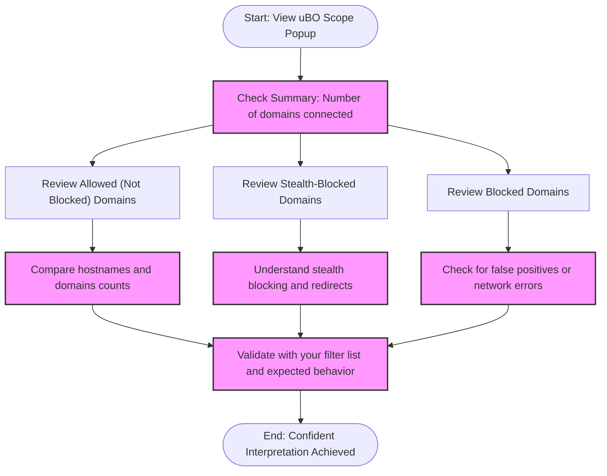

# Interpreting Connection and Blocked Server Data

Mastering the connection summary in uBO Scope empowers you to clearly understand the relationships between web pages and the various remote servers they communicate with. This guide walks you through interpreting what each connection count means, distinguishing between direct third-party connections, stealth blocks, and false positives, all through practical examples to ensure confident use.

---

## 1. Understanding the Connection Summary

### What This Page Helps You Accomplish
- Gain clarity on the meaning of each connection count category
- Learn to interpret domain and hostname statistics correctly
- Identify direct third-party connections and distinguish them from stealth blocks and false positives
- Build confidence in reading the uBO Scope data output and understanding real-world scenarios

### Prerequisites
- uBO Scope installed and active in your browser
- Basic familiarity with network requests and the uBO Scope popup interface

### Expected Outcome
After completing this guide, you will be able to:
- Confidently read and interpret the domain counts in each category (Allowed, Stealth-Blocked, Blocked)
- Understand why certain hosts appear in stealth or blocked categories
- Recognize when connection counts represent real or misleading data

### Time Estimate
5 to 10 minutes to fully digest the examples and explanations.

### Difficulty Level
Beginner to Intermediate.

---

## 2. Step-by-Step Interpretation Workflow

<u><b>Follow these sequential steps when examining connection data in the uBO Scope popup:</b></u>

### Step 1: Examine the Summary Count
- The summary at the top reports the number of distinct **third-party domains** the browser connected to on the current tab.
- **Key Insight:** A lower number here generally indicates fewer third-party connections, often implying better privacy protection.

### Step 2: Review the Allowed (Not Blocked) Section
- This area lists domains that had successful connections.
- Each entry shows the domain name and a count representing how many times hostnames under this domain appeared.
- Examples of allowed domains typically include Content Delivery Networks (CDNs) or essential third parties.

### Step 3: Interpret the Stealth-Blocked Section
- Domains here represent hosts that initiated redirect or stealth blocks—requests the browser attempted but were covertly blocked or redirected by a content blocker.
- These are not outright failed connections but represent connections that were interrupted or hidden.
- Understanding stealth blocks helps you see what happens behind the scenes beyond simple block lists.

### Step 4: Understand the Blocked Section
- This section shows domains that had failed connection attempts caught as errors.
- These represent outright blocked third-party hosts.
- Some entries here could be false positives due to network glitches or content blockers behaving conservatively.

### Step 5: Compare Hostnames to Domains
- Counts for both hostnames (e.g., `ads.example.com`) and domains (e.g., `example.com`) are aggregated.
- The domain count is primary in the badge and summary for clarity and to avoid clutter with subdomains.

### Step 6: Cross-check with Your Filter Lists and Browser Behavior
- Use domain counts and categories to verify if your filters or browser settings behave as intended.
- Watch for unexpectedly high allowed counts indicating third-party connections that you might want to block or monitor.

---

## 3. Illustrative Examples

### Example 1: Typical Third-Party Connections
```plaintext
Summary: 4 domains connected

Allowed:
- cdn.example-cdn.com (8)
- fonts.gstatic.com (3)

Stealth-Blocked:
- trackers.badtracker.com (5)

Blocked:
- ads.skeevyads.com (10)
```
**Interpretation:**
- The allowed domains are likely essential resources like CDNs and font servers.
- The stealth-blocked domain indicates requests that were redirected or blocked silently, pointing to tracking attempts.
- The blocked domain shows requests that were explicitly blocked by your filters.

### Example 2: Understanding a False Positive
```plaintext
Blocked:
- untrusted.example.com (2)
```
**Scenario:**
- If `untrusted.example.com` appears in blocked but you don't expect it to be a threat, it might be caused by network errors or filter overreach.
- Verify by temporarily disabling filters or checking network logs.

### Example 3: Distinguishing Stealth Blocks
```plaintext
Stealth-Blocked:
- redirector.ads.com (7)
```
**Scenario:**
- `redirector.ads.com` may not directly appear blocked but is stealth-blocked, meaning the extension is detecting requests followed by redirects or invisible suppression.
- This category helps understand sophisticated blocking techniques not visible otherwise.

---

## 4. Practical Tips and Best Practices

- **Focus on Domains, Not Just Hostnames:** The badge count and summaries are domain-based to keep the reporting clear and manageable.
- **Lower Counts are Desirable:** The fewer distinct allowed third-party domains, the better your overall privacy.
- **Stealth Blocks Represent Hidden Activity:** They often reflect trackers or ads that try to circumvent blocking.
- **Blocked Counts Can Include False Positives:** Some blocked domains might be benign or result from connectivity issues.
- **Use uBO Scope in Tandem With Filter Lists:** It helps validate the effectiveness and side-effects of your blocking configuration.

---

## 5. Common Pitfalls and How to Avoid Them

<div className="tip">
Always remember that the presence of connections to certain third-party domains isn't inherently malicious—consider the context such as site dependencies and legitimate services.
</div>

<div className="warning">
Interpreting the blocked or stealth-blocked counts as absolute proof of threats can mislead. Network errors or transient issues may inflate these counts.
</div>

<div className="note">
Stealth-blocked connections are a unique feature of uBO Scope providing deeper insight than traditional block counts—use them to investigate subtle tracking techniques.
</div>

---

## 6. Verification and Troubleshooting

- If your summary shows zero or no data on active sites, ensure uBO Scope is fully installed and has the necessary permissions.
- If counts seem unusually high, check if any extensions or apps interfere with network requests.
- Verify your filter lists if you observe unexpected allowed connections.
- Consult the Troubleshooting Setup Issues guide if experiencing persistent issues.

---

## 7. What’s Next?

Explore these related documentation pages to deepen your understanding and improve your workflow:

- **[Understanding the Popup: A First Walkthrough](/guides/getting-started-essentials/basic-usage-popup-walkthrough):** Learn to navigate and interpret the uBO Scope popup UI step-by-step.
- **[Analyzing Third-party Server Behaviors](/guides/advanced-scenarios-best-practices/analyzing-third-party-behavior):** Advanced insights into third-party network patterns.
- **[Debunking Ad Block Test and Block Count Myths](/guides/advanced-scenarios-best-practices/debunking-ad-block-test-myths):** Understand common misunderstandings about block counts.

---

For foundational concepts related to the terminology you will encounter here, refer to [Core Concepts & Terminology](/overview/concepts-architecture/core-concepts-terminology).


---

### Appendix: Visual Workflow of Connection Interpretation



---

# A Final Thought

By carefully interpreting each section of the connection summary, you gain unparalleled transparency into your browsing session’s network activity, empowering you with the tools to protect your privacy and verify your content blocking efficacy with confidence.


---

# References
- [Basic Usage Popup Walkthrough](/guides/getting-started-essentials/basic-usage-popup-walkthrough)
- [Core Concepts & Terminology](/overview/concepts-architecture/core-concepts-terminology)
- [Troubleshooting Setup Issues](/getting-started/quickstart-verification/troubleshooting-setup)


---

# Credits
uBO Scope is developed by Raymond Hill and the open-source community. For code and updates, visit [uBO Scope on GitHub](https://github.com/gorhill/uBO-Scope).


---

{/* End of documentation */}