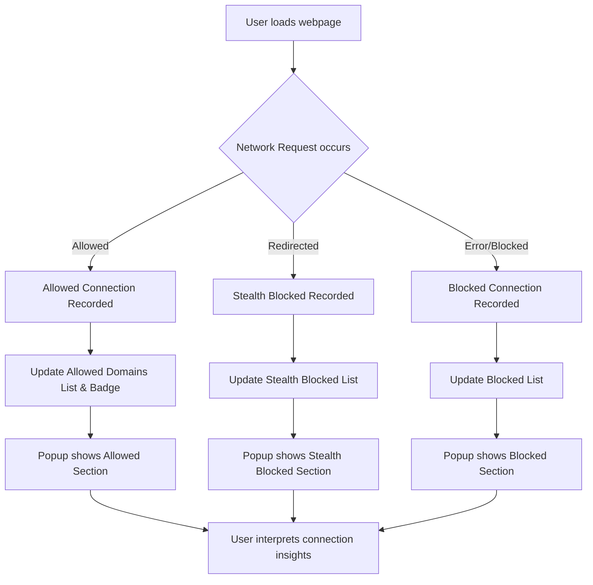

# Interpreting Connection Insights

## Overview

This guide helps you **open the uBO Scope popup** and use its interface to **reveal all third-party server connections**—both attempted and successful—for your current browsing tab. You'll learn to distinguish between **allowed**, **stealth-blocked**, and **blocked** network requests, and understand the meaning behind the badge count displayed on the extension icon. This insight supports your privacy awareness and helps you gauge website network exposure efficiently.

---

## What You Will Achieve

- Access the popup summary of distinct third-party domains connected to by the current tab.
- Understand the difference between allowed, stealth-blocked, and blocked requests.
- Interpret the toolbar badge count in the context of privacy and performance.

---

## Prerequisites

Before you begin, ensure that:

- uBO Scope is installed and active in your browser.
- You have an active tab loaded where network activity can be tracked.
- Your browser supports the `webRequest` API and necessary permissions are granted.

For installation steps and permissions, see [Installing and Activating uBO Scope](https://your-docs/guides/getting-started-essentials/installing-activating-ubo-scope).

---

## Accessing the Connection Insights Popup

1. **Click the uBO Scope toolbar icon** on your browser. This opens the popup showing third-party connection data for the active tab.

2. The popup window header displays:
   - The **full hostname** of the current tab.
   - The **root domain** or public suffix for clarity.

3. Below the header, you’ll see sections categorizing third-party connections:
   - **Not Blocked (Allowed):** Connections that were successfully allowed by your browsing setup.
   - **Stealth-Blocked:** Connections attempted but stealthily redirected or blocked by content filters.
   - **Blocked:** Connections that were explicitly blocked before any network activity succeeded.

4. Each section lists domains involved, showing:
   - The third-party domain name.
   - The count of requests made to that domain during your current browsing session.

---

## Understanding the Categories

### Allowed Connections

- These are third-party servers that the tab successfully connected to.
- Legitimate third parties (usually CDNs or essential service providers) appear here.
- The number of these allowed connections is shown as the **badge count** on the extension icon.

### Stealth-Blocked Connections

- These are network requests that were redirected or altered to avoid detection but never fully completed.
- Stealth blocking helps preserve site functionality while blocking unwanted tracking or ads.
- These won't increase the badge count since they did not result in fully allowed connections.

### Blocked Connections

- These requests were prevented from completing by content blocking mechanisms.
- They do not show on the badge count because no successful connection was made.

<Tip>
The badge count reflects the number of **distinct allowed third-party domains**. A lower number indicates fewer external connections, which generally improves privacy and site performance.
</Tip>

---

## Step-by-Step Walkthrough

<Steps>
<Step title="Open the Popup">
Click on the uBO Scope icon in your browser toolbar to open the popup window displaying connection details.
</Step>
<Step title="Identify the Tab Hostname">
At the top of the popup, read the displayed hostname and domain of the current tab to confirm you’re viewing the right webpage data.
</Step>
<Step title="Review Allowed Domains">
Scroll to the 'not blocked' section; examine the list of domains here — these are third-party servers your tab connected with successfully.
</Step>
<Step title="Check Stealth-Blocked Domains">
Visit the 'stealth-blocked' section to view redirections or filtered requests that did not fully connect. Use this to understand covert blocking.
</Step>
<Step title="Examine Blocked Domains">
Look into the 'blocked' section to see network requests stopped outright by your filters or content blockers.
</Step>
<Step title="Interpret the Badge Count">
Notice the numeric badge on the extension icon that corresponds to the number of distinct allowed third-party domains connected during this session.
</Step>
<Step title="Close the Popup">
Simply click outside the popup or the icon again to close the window.
</Step>
</Steps>

---

## Real Scenario Example

Imagine you visit a news site. The uBO Scope popup shows:

- **Not Blocked:** `cdn.news-site.com` (10 requests), `analytics.service.com` (3 requests)
- **Stealth-Blocked:** `tracker.ad-network.com` (5 attempts)
- **Blocked:** `ads.example.net` (8 attempts)

This means your browser successfully connected to the CDNs and analytics services, stealthily blocked some tracking attempts that might still load resources under the hood, and fully blocked ads from known sources.

The badge count will show '2' here, indicating two allowed distinct third-party domains.

---

## Tips & Best Practices

- **Lower badge counts usually mean better privacy** but be mindful that some third parties are necessary.
- Regularly check connection insights to detect unexpected third parties.
- Do not solely rely on block counts; focus on distinct allowed connections for a realistic privacy measure.
- Use uBO Scope alongside your main content blocker for complementary insights.

<Note>
The extension relies on browser-reported network requests; some requests made outside of browser control might not be reflected.
</Note>

---

## Troubleshooting Common Issues

<AccordionGroup title="Troubleshooting Connection Insights">
<Accordion title="Popup Shows 'NO DATA' or Empty">
- Confirm you have an active browsing tab loaded.
- Reload the tab to trigger new network requests.
- Ensure uBO Scope has the necessary permissions (refer to Configuration & Initial Setup).
- Check for extensions conflicts or browser restrictions.
</Accordion>
<Accordion title="Badge Count Does Not Update">
- Badge update depends on successful network requests; no connections mean no badge number.
- Close and reopen the tab to reset data.
- Verify content blocker settings aren’t preventing uBO Scope from monitoring.
</Accordion>
<Accordion title="Understanding Stealth vs Blocked">
- Stealth blocking means the request was intercepted transparently without breaking page functionality.
- Blocked means the request was fully prevented.
- For more about outcomes, see Core Concepts & Terminology.
</Accordion>
</AccordionGroup>

---

## Additional Resources and Next Steps

- Explore [Core Concepts & Terminology](https://your-docs/overview/intro-basics/core-concepts-terminology) to deepen understanding of terms like "third-party", "badge count", and "request outcome".
- Review the [Architecture Overview & Data Flow](https://your-docs/overview/how-it-works/architecture-overview) for insight into how uBO Scope processes requests.
- After interpreting connections, proceed to the [Typical uBO Scope Investigation Workflow](https://your-docs/guides/getting-started-essentials/core-usage-workflow) to learn practical investigative uses.
- Consult [Troubleshooting & Performance Tips](https://your-docs/guides/advanced-scenarios-best-practices/troubleshooting-and-tips) if you encounter issues.

---

## Reference Diagram: Network Request Outcome Flow

---

## Source Code Reference

To explore the implementation details:

- Background script handling network requests and badge updates: [background.js](https://github.com/gorhill/uBO-Scope/blob/main/js/background.js)
- Popup rendering logic for connection insights: [popup.js](https://github.com/gorhill/uBO-Scope/blob/main/js/popup.js)
- Popup HTML and styles: [popup.html](https://github.com/gorhill/uBO-Scope/blob/main/popup.html) and [popup.css](https://github.com/gorhill/uBO-Scope/blob/main/css/popup.css)

---

By following this guide, you will confidently interpret uBO Scope's connection insights, enabling you to measure and understand third-party exposure on every webpage you visit.