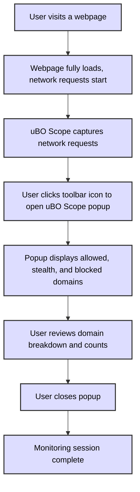

# Monitoring Remote Server Connections with uBO Scope

## Workflow Overview

This guide walks you through the typical workflow of using uBO Scope to monitor remote server connections generated by browsing activity. You will learn how to visit a website, open the extension popup, and analyze which third-party servers were contacted or blocked, providing insight into your online privacy and network activity.

### Prerequisites

- uBO Scope extension must be installed and enabled in your browser (Chromium, Firefox, Safari).
- The extension should have necessary permissions (`webRequest`, `activeTab`, `storage`).
- Ensure you have an active internet connection and the target webpage is fully loaded.

### Expected Outcome

- Successfully observe a summary of distinct remote servers contacted by the active tab.
- Understand the breakdown of allowed, stealth-blocked, and blocked domains.
- Gain actionable visibility into third-party network requests initiated by webpages you visit.

### Time Estimate

- Approximately 5 minutes to complete a basic monitoring session.

### Difficulty Level

- Beginner to Intermediate: This guide requires no advanced technical knowledge but assumes familiarity with browser extensions.

---

## Step-by-Step Instructions

### Step 1: Browse to a Website

1. Open your browser where uBO Scope is installed.
2. Navigate to a webpage you want to analyze (e.g., your favorite news site, social media platform).
3. Allow the page to load completely, so all network requests are initiated.

_Expected Result_: The extension begins tracking network requests made by the webpage.

### Step 2: Open the uBO Scope Popup Interface

1. Click the uBO Scope icon in your browser’s toolbar.
2. The popup interface will open, displaying information about remote server connections related to the active tab.

_Expected Result_: Popup shows the hostname of the current tab at the top, with domain counts and categorized lists below.

### Step 3: Interpret the Displayed Data

The popup categorizes remote servers into three groups:

- **Not Blocked (Allowed)**: Domains successfully connected.
- **Stealth-Blocked**: Requests blocked silently, without breaking the webpage.
- **Blocked**: Requests that were explicitly blocked.

Look at the summary section for the total count of distinct domains contacted.

_Expected Result_: You see a full list of domains contacted by the webpage, categorized by outcome, along with counts.

### Step 4: Analyze Domain Counts and Patterns

1. Review the "not blocked" domains to identify third-party services actively connected.
2. Examine "stealth-blocked" domains to understand what is being silently blocked by your setup.
3. Check "blocked" domains for openly blocked requests.

_Decision Point_: If the number of third-party connections seems unexpectedly high, you may consider further privacy tools or blocking strategies.

### Step 5: Use Cases

- **Privacy Check**: See how many and which third-party domains popular websites connect to.
- **Troubleshooting**: Detect unexpected network activity originating from a webpage.
- **Filter List Maintainers**: Identify additional domains involved in network requests to fine-tune blocking filters.

### Step 6: Close the Popup

Simply click outside the popup or click the extension icon again to close it when done.

---

## Practical Tips and Best Practices

- **Reload the Webpage** before opening uBO Scope to ensure all connections are captured.
- **Regularly Monitor** frequently visited sites to notice changes in their network behavior.
- Remember, **a lower count of distinct third-party servers is better** for privacy.
- Use the domain breakdown to **identify content delivery networks (CDNs)** vs. potentially undesired trackers.
- If using multiple blockers, note that uBO Scope reports connections independent of blocking, helping debunk myths about block counts alone.

---

## Troubleshooting

<AccordionGroup title="Common Issues and Solutions">
<Accordion title="No Data or 'NO DATA' Display in Popup">
- Verify that the extension is enabled and your browser supports Manifest V3 and `webRequest` API.
- Refresh the browser tab and then open the popup again.
- Check browser permissions: uBO Scope requires access to activeTab and host permissions.
- Restart the browser to clear transient glitches.
</Accordion>
<Accordion title="Toolbar Badge Does Not Update">
- Confirm uBO Scope is actively running and not blocked by other extensions.
- Reload the page and give time for network requests to be processed.
- If still no update, try disabling and re-enabling the extension.
</Accordion>
<Accordion title="Unexpectedly High Number of Third-Party Domains">
- Understand many legitimate services use CDNs or analytics that increase domain count.
- Cross-reference domains with known trackers and CDNs.
- Use privacy tools to minimize exposure if desired.
</Accordion>
</AccordionGroup>

---

## Additional Information

- The popup interface utilizes the Public Suffix List to accurately derive base domains from hostnames.
- The extension captures network events including redirects, successful connections, and errors to build its domain list.

---

## Visual: Typical User Flow

---

## Next Steps & Related Content

- After mastering monitoring connections, explore [Understanding the Popup UI](/getting-started/first-run-usage-validation/understanding-the-popup-ui) for detailed interface usage.
- Consult [Launching uBO Scope for the First Time](/getting-started/first-run-usage-validation/launching-ubo-scope) if you are new to installation and activation.
- For troubleshooting, see [What To Do If the Extension Isn’t Working](/getting-started/troubleshooting-setup/extension-not-working).
- Consider the [Core Concepts & Terminology](/overview/architecture-and-core-concepts/core-concepts-terminology) page to deepen understanding of network request outcomes.

---

## Summary

The "Monitoring Remote Server Connections" page is your practical guide to running uBO Scope as you browse. It helps you identify all third-party remote servers your active browser tab interacts with, allowing you to evaluate your privacy exposure and network behavior immediately.

