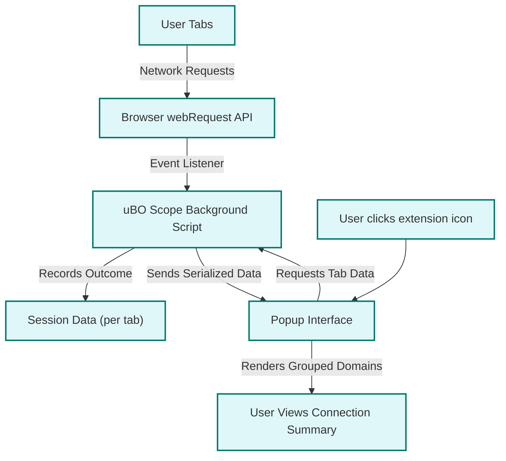

# Understanding the Popup: Interpreting Connection Summaries

## Overview
This guide provides a hands-on walkthrough to help you interpret the uBO Scope popup interface. You will learn what the toolbar badge numbers indicate, how to recognize allowed, blocked, and stealth-blocked network connections per domain, and how to use this UI to gain detailed insight into third-party content loaded by webpages.

By mastering these techniques, you will become equipped to understand the true network activity behind any webpage you visit, empowering you to assess privacy exposure and blocker effectiveness.

---

## 1. Popup Interface Overview

The uBO Scope popup instantly shows a summary of distinct third-party remote servers your current tab has contacted during browsing.

### Key Areas of the Popup

- **Hostname Header**: Shows the current webpage's hostname and registered domain 
- **Domain Connection Summary**: Displays the total count of distinct domains connected
- **Categorized Outcomes Sections**: Three groups list domains by outcome
  - **Not Blocked** (Allowed Connections)
  - **Stealth-Blocked** (Requests blocked in subtle ways, e.g. redirects)
  - **Blocked** (Network requests prevented entirely)

### Explanation
The color-coded sections and counts provide a clear visual of how the browser handled third-party network requests, reflecting true connections made or blocked regardless of other content blockers present.

---

## 2. What the Badge Number Means

The small numeric badge on the extension toolbar icon indicates:

- The number of **distinct third-party domains** contacted by the active tab so far.
- It **does not** count every request or connection attempt, but unique 3rd-party domains successfully reached.
- A **lower badge number** reflects fewer remote servers contacted—generally the desired state from a privacy perspective.


> Remember: The badge exclusively measures allowed connections, not blocked ones or total requests.

---

## 3. Understanding Connection Outcomes

The connections shown in the popup are grouped by their **network request outcome**:

| Outcome        | Description                                                  | Indicator Color |
|----------------|--------------------------------------------------------------|-----------------
| Not Blocked    | Requests that were allowed and connected successfully         | Green           |
| Stealth-Blocked| Requests that were blocked or altered in non-obvious ways, e.g., redirects or silent drops | Yellow          |
| Blocked        | Requests fully blocked by content blockers or other mechanisms| Red             |

---

## 4. Interpreting Domain Rows

Each domain listed under the outcome sections shows:

- The **domain name** of the connected third-party server
- A **count badge** indicating how many individual requests to that domain were made in the current tab session

### Practical Example
If you see under "not blocked":

```
example-cdn.com [ 5 ]
```

This means the current webpage successfully loaded 5 network requests from `example-cdn.com`.

If the same domain appeared under "blocked" with a count, those requests failed to load.

---

## 5. How Domains and Hostnames are Determined

uBO Scope distinguishes between hostnames and the higher-level registered domains (using the Public Suffix List). For the popup UI, it aggregates requests and counts by domain, giving a clearer picture of third-party entities contacted.

### Relationship Example
- Hostnames like `cdn1.example-cdn.com` and `cdn2.example-cdn.com` both count toward the domain `example-cdn.com`.

This aggregation helps avoid inflated or misleading counts due to subdomain fragmentation.

---

## 6. Using the Popup Effectively

1. **Open the popup** by clicking the uBO Scope extension icon while on a website.
2. **Review the badge count** at the top to quickly assess how many unique third-party domains the page contacted.
3. **Scan each section (Allowed, Stealth-Blocked, Blocked)**:
    - Check which domains are allowed – legitimate or unexpected third parties.
    - Look for stealth-blocked domains that may represent redirects or filtered requests.
    - Identify blocked domains revealing your content blockers' effect.
4. **Use domain counts** to spot heavy third-party reliance by a page or unexpected network connections.
5. **Consider the hostname and domain displays** to understand the originating websites and their external dependencies.

---

## 7. Common Scenarios and What to Expect

### Scenario A: Fresh Page Load
- The popup shows the tab's main hostname and registered domain.
- The "domains connected" count matches distinct allowed third-party domains.
- All three outcome sections may populate depending on which requests succeeded, were blocked stealthily, or fully blocked.

### Scenario B: Navigation Between Pages
- Counts reset or update as you navigate, reflecting new page activity.
- The badge updates dynamically to represent current tab connections.

### Scenario C: No Data or Empty Sections
- If no network activity is detected, the popup indicates "NO DATA".
- This might happen on internal browser pages or pages with no external network activity.

---

## 8. Troubleshooting Popup Display Issues

If the popup seems empty or does not update:

- **Ensure proper extension permissions** are granted (see Installation docs).
- Try **refreshing the tab** to force data collection.
- Verify the **browser supports the webRequest API completely** (uBO Scope requires it).
- Check for **conflicts with other privacy extensions** or browser settings that may block uBO Scope.

Refer to the [Troubleshooting Common Issues](https://example.com/getting-started/first-use-and-troubleshooting/troubleshooting) guide for detailed fixes.

---

## 9. Best Practices

- Use the popup during normal browsing sessions to monitor genuine third-party connections.
- Don’t rely solely on blocked counts; focus on allowed third parties for privacy insights.
- Combine popup analysis with other uBO Scope guides like [Understanding Key Terms](https://example.com/overview/core-concepts/core-terms) to deepen interpretation.
- Regularly clear session data if you want fresh results.

---

## 10. Summary Diagram of Data Flow



---

## 11. Next Steps

- Explore the [Installing and Launching uBO Scope](https://example.com/guides/getting-started-essentials/install-launch) guide to understand setup.
- Learn how to [Debunk Badge Myths](https://example.com/guides/advanced-insights-patterns/debunking-badge-myths) for a more nuanced view.
- Check out [Post-Installation Configuration](https://example.com/getting-started/installation-and-setup/configuring-ubo-scope) for deeper customization.

---

## References
- [uBO Scope GitHub Repository](https://github.com/gorhill/uBO-Scope)
- [Public Suffix List](https://publicsuffix.org/)

---

## Callout
<Tip>
Use the popup regularly as a lightweight but powerful diagnostic tool to instantly visualize your real browsing connections and verify how effective your privacy tools are in action.
</Tip>


