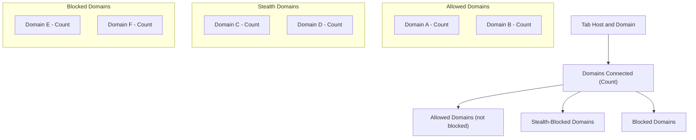

# Understanding the Badge Count and Popup Panel

## Overview
This guide explains how to interpret the badge count displayed on the uBO Scope toolbar icon and how to read and understand the detailed domain connection information presented in the popup panel (`popup.html`). It will help you understand what the badge number represents, the meaning of allowed, stealth, and blocked domains, and how the popup UI organizes this data to provide actionable insights on your browser's network connections.

---

## What the Badge Count Represents

- The badge count shows the number of distinct third-party remote domains that your browser has connected to on the active tab.
- Only domains that were **allowed** (i.e., where connections were successfully established) contribute to this count.
- A lower badge count generally indicates fewer third-party connections, which is often more desirable for privacy-focused browsing.
- The badge **does not** count blocked or stealth-blocked domains.

### Key Points About the Badge Count

- It counts **distinct third-party domains** — not individual requests or hostnames.
- The count updates dynamically as network requests complete.
- The badge helps you quickly gauge the extent of third-party network activity related to the current tab.

<Check>
The badge count is a concise privacy metric summarizing distinct remote servers contacted, not raw number of requests or blocked connections.
</Check>

---

## Understanding the Popup Panel

The popup panel opens when you click the uBO Scope toolbar icon. It gives you a comprehensive breakdown of the third-party remote servers that your current tab connected to, categorized by network request outcomes:

### 1. Tab Hostname and Domain Header

- The large header shows the current page's hostname and domain.
- The hostname label shows the fully qualified hostname from the active tab.
- The domain (top-level) is displayed alongside or beneath it for clarity.

### 2. Summary Section

- Displays the total count of **distinct domains connected** (equivalent to the badge count).
- This summarizes all allowed connections.

### 3. Outcome Sections

The popup groups remote domains into three outcome categories, visible as separate sections:

| Outcome          | Description                                                                                      | What it Shows                |
|------------------|------------------------------------------------------------------------------------------------|-----------------------------|
| **Not Blocked**  | Domains where connections were successful and allowed by the network or content blocker         | Allowed third-party domains  |
| **Stealth-Blocked** | Domains where connection attempts were stealthily blocked, often hidden from the webpage        | Stealth-blocked domains      |
| **Blocked**      | Domains explicitly blocked by content blockers or network errors preventing connection          | Blocked third-party domains  |

Each section lists remote domains along with a count of related network requests.

### 4. Domain Rows

- Each domain is shown with its count (number of distinct hostnames/connections).
- Domains listed include all variants allowed, stealth-blocked, or blocked under each category.

### Interaction Example

| Section         | What You Learn                                                  |
|-----------------|----------------------------------------------------------------|
| Allowed         | See all third-party domains your browser fetched resources from |
| Stealth-Blocked | See domains where connections were intercepted quietly          |
| Blocked         | Know which domains were prevented from connecting               |

<Note>
In many cases, stealth-blocked domains are not visible to the visited website, explaining discrepancies between what you see and what websites detect.
</Note>

---

## Step-by-Step: Reading the Badge Count and Popup Panel

<Steps>
<Step title="Open the Popup Panel">
Click the uBO Scope icon in the browser toolbar to open the popup panel for the active tab.
</Step>
<Step title="Identify the Tab Hostname and Domain">
Look at the header showing the tab's hostname and domain for context about which webpage is being analyzed.
</Step>
<Step title="Check the Summary Domain Count">
Note the number next to 'domains connected' summarizing distinct allowed domains.
</Step>
<Step title="Review Allowed Domains">
Examine the 'not blocked' section listing third-party domains successfully connected to.
</Step>
<Step title="Inspect Stealth-Blocked Domains">
Review the 'stealth-blocked' section to see domains where connections were stealthily blocked, often without the webpage noticing.
</Step>
<Step title="Inspect Blocked Domains">
Review the 'blocked' section showing domains where connections were explicitly blocked by extensions or network settings.
</Step>
</Steps>

<Check>
Each domain listed is paired with the count of distinct hostnames or resources from that domain that had connections attempted or completed.
</Check>

---

## Practical Tips and Best Practices

- **Use the Badge Count to Quickly Judge Privacy Exposure:** A rising number may signal increased third-party tracking or resources.
- **Look Closely at Stealth-Blocked Domains:** These represent connections your content blocker hiddenly prevented, which might not appear in standard block lists visible to web pages.
- **Correlate Blocked Domains with Content Blocker Rules:** The blocked domains section helps verify that your blocker is actively denying requests.
- **Reload Tabs to Refresh Data:** Extension data is live but best refreshed by reloading the page to capture new requests.

---

## Common Questions

<AccordionGroup title="Frequently Asked Questions about Badge and Popup Panel">
<Accordion title="Why does my badge count not match all blocked domains?">
The badge count reflects only **allowed** domains (those with successful connections). Blocked or stealth-blocked domains do not increment the badge count, even if many requests to them were prevented.
</Accordion>
<Accordion title="What does stealth-blocked mean?">
Stealth-blocked domains are those for which connection attempts were quietly blocked—often by your content blocker operating stealthily—so the webpage has no indication that blocking occurred.
</Accordion>
<Accordion title="Why are some domains listed as allowed even though I have a content blocker?">
Not all third-party domains are undesirable or blocked; many used by websites legitimately, such as CDNs, will be allowed. The badge count and popup reflect exact connection outcomes regardless of blockers.
</Accordion>
<Accordion title="How often does the badge update?">
Badge updates occur as network requests are processed and recorded, typically within a second after activity for the tab.
</Accordion>
</AccordionGroup>

---

## Troubleshooting

- **Badge Not Updating:**
  - Confirm the extension has the necessary permissions (`webRequest`, access to sites).
  - Reload the page to trigger new network requests.
  - Make sure your browser supports the required APIs.

- **Popup Shows 'NO DATA' or Empty Sections:**
  - This indicates no recorded network activity for the current tab yet.
  - Reload the page and try again.
  - Verify that content blockers or privacy settings don’t interfere with data collection.

- **Unexpectedly High Badge Count:**
  - Consider whether legitimate third-party services or CDNs are inflating the count.
  - Check the allowed domains section to identify which domains contribute most.

---

## Visual Reference: Popup Panel Layout

---

## Next Steps

- Explore the [Performing Your First Network Connection Analysis](https://example.com/guides/getting-started-essentials/first-analysis) guide to learn how to use uBO Scope for deeper network insights.
- Consult [Debunking Blocking Myths with uBO Scope](https://example.com/guides/use-cases-patterns/debunking-blocking-myths) to understand common misconceptions.
- Visit the [First Successful Run](https://example.com/getting-started/first-steps-and-troubleshooting/first-successful-run) guide for validation exercises.

---

## References

- The [source code for background.js](https://github.com/gorhill/uBO-Scope/blob/main/js/background.js) details how network requests are recorded and badge counts are calculated.
- The [popup.js](https://github.com/gorhill/uBO-Scope/blob/main/js/popup.js) shows how the popup UI renders domain information.
- Review the detailed information about third-party domains and badge in the [Key Concepts and Terminology](https://example.com/overview/core-concepts-architecture/key-concepts-terminology) page for broader context.

## Summary Table for Badge & Popup Elements

| UI Element          | Meaning                              | User Action / Insight           |
|---------------------|------------------------------------|-------------------------------|
| Toolbar Badge       | Number of distinct allowed domains | Quick privacy gauge            |
| Tab Hostname Header | Current tab’s hostname and domain  | Context on active site         |
| Summary Count       | Total allowed connected domains    | Verify badge number consistency|
| Allowed Section     | Domains with successful connections| Identify legitimate third parties|
| Stealth-Blocked     | Domains quietly blocked             | Detect stealthy content blocking|
| Blocked Section     | Domains explicitly blocked          | Confirm block effectiveness   |

# End of Guide
