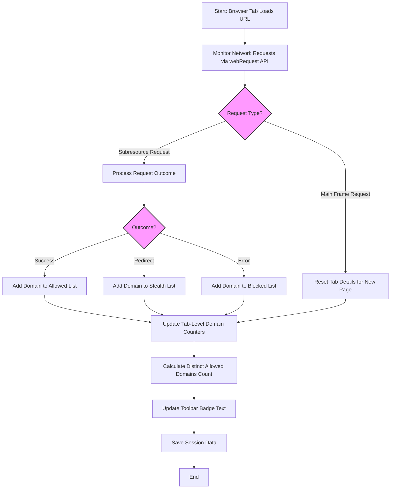

# Understanding and Interpreting the Toolbar Badge Count

## Overview
The toolbar badge of uBO Scope displays a concise numeric indicator reflecting your current browser tab's exposure to third-party network connections. This count represents the **number of distinct third-party remote servers** contacted successfully during the browsing session of the active tab.

By understanding this badge, you gain immediate insight into the privacy landscape of the websites you visit, helping you assess the effectiveness of content blockers and the extent of third-party resource loading.

---

## What the Badge Number Means

- The badge shows the **count of unique third-party domains** for which network requests completed successfully (i.e., not blocked).
- A **lower number is better**, indicating fewer external servers your browser talks to and therefore a reduced privacy footprint.
- The count **excludes** third-party domains whose requests are blocked or stealth-blocked (hidden from detection).

### Example Scenario
Imagine you visit a news website. The main page's domain is first-party and does not count towards the badge.

- If the page loads scripts from 3 CDNs and an analytics service, and all succeed, the badge will show "4".
- If one CDN script is blocked by your content blocker, but the others succeed, the badge might still show "3".
- The badge does not count blocked domains to avoid misleading you into thinking more trackers are active when they are prevented.

## Why the Badge Focuses on Distinct Third-Party Domains

Understanding third-party connections by domains (not just requests) helps:

- Reveal how many separate entities your data crosses.
- Avoid inflated counts from multiple requests to the same domain.
- Provide a realistic measure of **privacy exposure** rather than raw request volume.

This precision ensures the badge is a practical, actionable metric rather than a confusing or easily gamed statistic.

## How the Badge Number is Calculated

1. **Network request monitoring:** uBO Scope uses browser `webRequest` listeners to detect network activity initiated by webpages.
2. **Domain extraction:** Each request's hostname is resolved to its base domain using the Public Suffix List.
3. **Request Classification:** Requests are categorized as:
   - Allowed (successful connections)
   - Stealth-blocked (requests blocked invisibly by mechanisms not reported as outright failure)
   - Blocked (failed or outright denied requests)
4. **Tab-specific aggregation:** Only connections from the currently active tab are counted.
5. **Counting unique allowed domains:** The badge reflects the number of unique allowed third-party domains.

## Interpreting the Badge in Practice

- **Low count:** Indicates strong privacy posture or minimal third-party content.
- **High count:** Suggests many third-party services loaded, increasing privacy risk.

<Tip>
A higher badge number does _not_ mean your content blocker is ineffective. It means more unique servers were contacted successfully, which is the true privacy exposure.
</Tip>

---

## Common Misconceptions

### "More blocked means better blocking"
Blocked request counts do not appear on the badge. A blocker that shows a higher block count may still allow more third-party connections. The badge focuses on allowed connections, giving you a clearer picture of actual exposure.

### "Ad blocker test pages reflect real privacy"
These test pages simulate uncommon or fabricated request patterns. They do not reveal what happens on real websites. The badge count on normal browsing is a better metric for privacy exposure.

---

## Best Practices for Using the Badge

- Use the badge as a quick gauge of third-party connection activity per tab.
- Combine it with the detailed popup panel to see which domains are contacting your browser.
- If the badge number suddenly increases dramatically on trusted sites, investigate why.
- Remember the badge only counts distinct domains per tab — switching tabs updates the count.

---

## Troubleshooting Badge Count Issues

| Issue | Cause | Solution |
|---|---|---|
| Badge shows zero or no count on known active sites | Extension permissions missing or network monitoring restricted | Verify extension permissions for webRequest and host access; reinstall if needed |
| Badge count does not update on tab change | Browser or extension bug | Refresh the tab; restart the browser if persistent |
| Badge number seems inconsistent with popup data | Timing delay or network request journal processing delay | Allow a few seconds for badge update after loading pages |

---

## Additional Details

### How third-party domains are determined
uBO Scope uses the [Public Suffix List](https://publicsuffix.org/) to parse hostnames into their parent domains. For example:

- `tracker.analytics.example.com` → `example.com`
- `cdn.example.co.uk` → `example.co.uk`

### What counts as third-party
Any allowed domain that is different from the first-party domain of the current tab.

---

## Summary
The uBO Scope toolbar badge number is a carefully calculated metric that shows the count of unique third-party domains with successful network connections from the active tab. It helps you effortlessly track your browsing privacy exposure without being misled by block counts or raw request numbers.

Leverage it daily to spot privacy changes and combine with the detailed popup UI for deeper insights.

---

## See Also
- [Reviewing Third-Party Connections with the Popup](/guides/getting-started-essentials/review-connections-popup) — Learn how to explore detailed allowed, stealth-blocked, and blocked domain lists.
- [Installing and Activating uBO Scope](/guides/getting-started-essentials/install-activate-extension) — Ensure correct installation and permissions to enable accurate badge updates.
- [Mythbusting Content Blocking Metrics](/guides/advanced-analysis-best-practices/mythbusting-content-blocking) — Understand common misunderstandings around content blockers and metrics.

---

## Visual Workflow of Badge Update Process

---

# Practical Tip
Use the badge as your first glance insight: if you need to dig deeper, open the popup panel to see all communicating domains, categorized clearly as Not Blocked, Stealth Blocked, or Blocked.

This combination of quick quantitative insight plus detailed qualitative data empowers you to understand and control your browsing privacy thoroughly.
