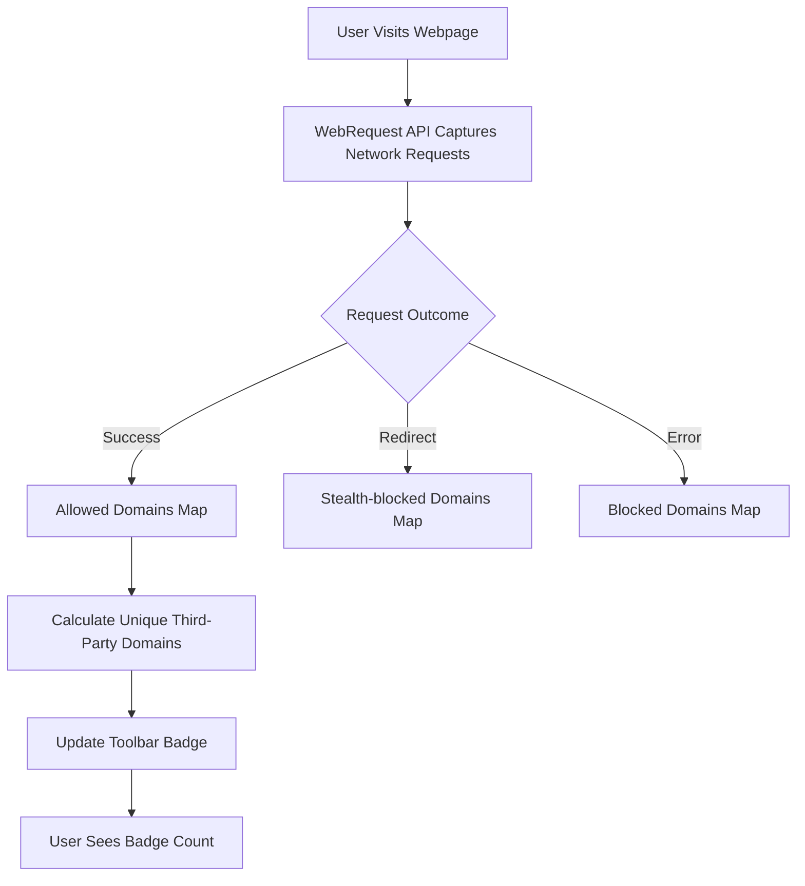

# Badge Counts: What They Mean and Why They Matter

## Understanding the Badge Count Logic

The badge count on the uBO Scope toolbar icon is your window into the true scope of third-party network connections initiated by a webpage. Unlike traditional ad blockers that often display metrics based on blocked requests, uBO Scope focuses specifically on **the number of distinct third-party remote servers for which there was a connection**, providing a more accurate and privacy-meaningful metric.

### Why Lower Numbers Are Better

A lower badge count means fewer third-party servers are contacted when you visit a page. This is a key indicator of better privacy protection because:

- Fewer third parties mean less potential tracking and data sharing.
- Legitimate websites typically rely on a small number of trusted third-party servers (usually content delivery networks).
- Excessive third-party connections often indicate unwanted or hidden tracking, advertising, or other third-party content.

Thus, **aiming for a lower badge count helps ensure your browsing session exposes you to fewer external parties.**

### How the Distinct Server Count Is Calculated

uBO Scope tracks active browsing tabs and monitors every network request made. Here's how it computes the badge count:

1. **Domains and Public Suffixes:** The extension extracts the *domain* from each hostname using the Public Suffix List. This means subdomains under the same parent domain are grouped together.

2. **Allowed Connections:** Only connections that were successful and not blocked contribute to the count.

3. **Unique Counting:** The count reflects unique third-party domains contacted by the currently active tab, ignoring multiple hits to the same domain.

4. **Excluding First-Party Domains:** Connections to your current page's primary domain are not included in the count, focusing the badge on third-party exposure.

### Comparison with Traditional Ad Blockers

Traditional ad blockers often display the number of blocked requests or the count of all detected trackers. However, these numbers can be misleading:

- **High Block Count ≠ Better Privacy:** A high block count could mean many requests get blocked, but the browser still connects to a large variety of third-party servers to fetch resources.

- **Counting Requests vs. Distinct Domains:** Ad blockers count requests, but many requests to the *same domain* inflate their blocks count without reflecting more unique third parties.

- **Stealth Blocking Unobserved by Pages:** Some blockers stealthily block or redirect requests, which can hide real network requests from typical tests and webpages.

uBO Scope sidesteps these pitfalls by measuring real third-party network connections, regardless of which content blocker you use or the nature of blocking.

## Practical Tips for Interpreting Badge Counts

- **Don’t obsess over the exact number.** Instead, aim to *reduce* the badge count over time as you tighten your privacy setup.
- **Check for sudden spikes.** A high count on certain pages may indicate aggressive third-party tracking or content loading.
- **Use with Content Blockers.** uBO Scope works alongside your existing blocker to reveal actual connections rather than depending on block lists.
- **Consult the Popup Panel.** Click the badge to open detailed connection summaries—breaking down allowed, stealth-blocked, and blocked domains for deeper insight.

## How uBO Scope Counts Domains: Behind the Scenes User Flow

This explains the journey from a network request to the badge count you see:

1. When you navigate to a web page, uBO Scope begins tracking outgoing network requests triggered by the page.
2. Each request’s URL is parsed to determine the hostname and domain, applying the Public Suffix List to correctly identify the registered domain.
3. Requests are categorized based on outcome: 
    - **Allowed** (successful connections)
    - **Stealth-blocked** (redirected or silently blocked)
    - **Blocked** (explicitly failed or denied)
4. For the badge, uBO Scope counts **only the unique allowed third-party domains** contacted by the active tab.
5. The badge number updates dynamically and is cleared when no allowed third-party connections exist.

## Step-by-Step: Check Your Badge Count and Verify Its Meaning

<Steps>
<Step title="Open uBO Scope">Locate and click the uBO Scope icon in your browser toolbar.</Step>
<Step title="Observe the Badge Text">The number displayed reflects unique third-party domains successfully connected.</Step>
<Step title="Click the Badge">Open the popup panel to see the breakdown of allowed, stealth-blocked, and blocked domains.</Step>
<Step title="Review the Allowed Domains">See which third-party servers are contacted and how many requests were made to each.</Step>
<Step title="Assess Privacy Exposure">Use the count as a measure of your browsing privacy; fewer allowed domains mean better control.</Step>
</Steps>

## Common Scenarios: What Badge Counts Reveal

| Scenario | Badge Count Explanation | Meaning for Privacy |
|---|---|---|
| New tab with no browsing | No badge (empty) | No third-party connections yet |
| Standard website with CDN | Low count (1-3) | Minimal third-party exposure |
| Content-heavy site with ads | High count (10+) | High exposure, possibly unwanted tracking |
| After applying stricter filters | Count reduces | Your privacy improves |

## Troubleshooting Badge Count Issues

- **Badge does not update or shows no count:** Ensure you have the latest supported browser version and that uBO Scope is enabled. See [Troubleshooting Setup Issues](/getting-started/setup-support/troubleshooting-setup) for guidance.

- **Unexpected high badge count:** Check the popup panel to identify which domains cause the spike. Some third-party domains might be necessary or benign (e.g., content delivery) while others could be trackers.

- **Badge count differs from your ad blocker’s block count:** Remember, uBO Scope counts allowed third-party domains contacted, not blocked requests. They measure different things.

## Best Practices to Use Badge Counts Effectively

- Regularly monitor badge counts on sites you visit often.
- Use the popup panel to understand which third parties are active.
- Combine badge info with filter list management to fine-tune blocking rules.
- Avoid relying solely on block counts from other tools; use uBO Scope's badge count as a clearer baseline.

## Next Steps & Related Documentation

- Learn about interpreting the popup panel in [Popup Panel and Badge Explained](/overview/feature-overview-usage/popover-and-badge).
- Understand the foundational terms in [Key Concepts and Terminology](/overview/architecture-and-concepts/core-terminology).
- See installation instructions in [Installing and Enabling uBO Scope](/guides/getting-started-essentials/installation-workflow).
- Explore real-world scenarios in [Mythbusting: Block Counts vs. Real Protection](/guides/advanced-insight-analysis/mythbusting-block-counts).

---

## Summary

The badge count in uBO Scope is a real-time indicator of how many unique third-party domains your browser connects to when loading a webpage. It reflects the actual exposure rather than just blocked requests or tracker detections, making it a crucial metric for assessing privacy.

By focusing on distinct allowed domains, users gain insights into the true breadth of third-party contact and can make informed decisions about their browsing privacy strategy.

Make the badge count your privacy compass and combine it with other uBO Scope features for complete visibility.

---

## Glossary & Important Terms

| Term          | Definition |
|---------------|-------------|
| Badge Count   | Number of unique third-party domains successfully contacted in the active tab.
| Allowed Domains | Third-party domains from which network connections were allowed.
| Stealth-blocked | Domains for which requests were silently redirected or blocked without explicit failure.
| Blocked Domains | Domains from which requests were denied or failed to connect.
| Public Suffix List | A catalog used to correctly identify base domains vs subdomains.

## Visual Diagram: How Badge Counts Are Derived

This flow shows the path from network traffic monitoring to the final badge display.

## Example: Reading Your Badge Count

Suppose you visit `example.com`. Your badge shows **5**. Clicking the badge popup reveals:

- Allowed domains: **cdn.example.net (12 requests), analytics.tracker.com (3 requests), fontprovider.com (1 request), ads.adnetwork.org (4 requests), api.example.com (5 requests)**

This tells you your browser successfully connected to 5 unique third-party domains.

If you tighten filters to block tracking, you might see that `analytics.tracker.com` and `ads.adnetwork.org` move to blocked, reducing the badge to 3. This direct feedback verifies improved privacy.

<Tip>
Remember, the badge count reflects **third-party connections allowed**, not total requests nor blocked requests. Use it as a reliable metric for your actual exposure to external servers.
</Tip>

<Note>
The chance of false positives or negatives in badge counts is minimized by using the Public Suffix List to identify domains and categorizing outcomes using browser network events accurately.
</Note>

<Warning>
Do not interpret a high block count from other blockers as automatic privacy superiority—it may mean the extension is missing stealth or allowed third-party connections.
</Warning>

---

You now have the insight needed to confidently use and interpret uBO Scope's badge counts to understand your true browsing privacy exposure and fine-tune your content blocking stance.