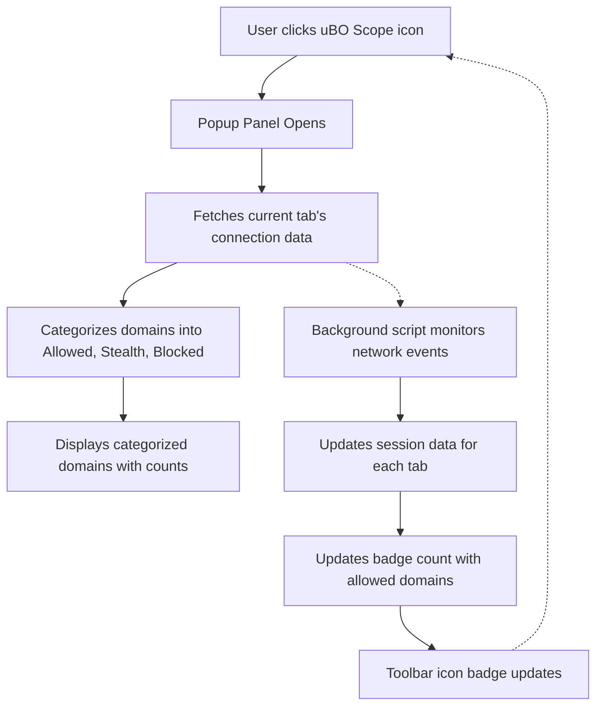

# Understanding the Popup Panel and Toolbar Badge

## Overview
This guide explains how to use uBO Scope's popup panel and interpret the toolbar badge count. You will learn what the different domain categories represent (allowed, stealth-blocked, and blocked), understand how the badge updates in real time, and discover how to gain useful insights at a glance about third-party connections on the active webpage.

---

## 1. What You’ll Achieve
- Understand how the popup panel organizes domain connection data.
- Learn what the toolbar badge number means and how it reflects network activity.
- Use visual cues from the extension to analyze third-party connections on any webpage.

### Prerequisites
- uBO Scope extension installed and enabled in your browser.
- Access to the browser toolbar where the extension icon and badge appear.
- Have visited a website so that network requests have been made.

### Time Estimate
Approximately 5-10 minutes to become proficient with reading the popup and badge.

### Difficulty Level
Beginner — no prior technical expertise required.

---

## 2. Understanding the Popup Panel

The popup panel opens when you click the uBO Scope icon in your browser toolbar. It reveals detailed network connection information for the current tab.

### Key Elements

- **Hostname and Domain Display**: At the top, the current webpage's hostname and domain are shown. 
  - Domains with Internationalized Domain Names (IDNs) appear in their Unicode form, making them easy to read.

- **Summary Section**: Displays the total number of distinct third-party domains connected.

- **Three Domain Categories**:
  1. **Not Blocked (Allowed)**
     - Lists all domains to which the webpage successfully connected.
     - These are network requests that were permitted by any existing content blockers.
  2. **Stealth-Blocked**
     - Shows domains where network connections were redirected in a stealthy way.
     - This often indicates the use of in-browser techniques to suppress requests invisibly.
  3. **Blocked**
     - Contains domains for which connection attempts failed or were explicitly blocked.

### Interpreting Domain Data
- Each category lists individual domains with a count indicating how many connection attempts were made toward that domain.
- Domains are sorted to make scanning easier.
- Counts help assess the volume of connections per third-party server.

### Example
If visiting example.com, you might see:

| Category       | Domains Counted                                         |
|----------------|--------------------------------------------------------|
| Not Blocked    | cdn.example.net (10), analytics.partner.org (5)        |
| Stealth-Blocked| tracker.hiddentracker.com (3)                           |
| Blocked        | ads.malicious.com (7)                                   |

This means example.com successfully loaded resources from 2 third-party domains, had 3 stealth redirects, and blocked requests to one suspicious domain.

---

## 3. Reading the Toolbar Badge

### What the Number Means
- The badge number on the toolbar icon represents the **count of unique third-party domains for which connections were made and allowed** (i.e., the "not blocked" category).
- It does **not** count stealth or blocked connections.

### How It Updates
- The count updates dynamically as you navigate or as network events occur in the active tab.
- A badge with no number means no third-party domains have been connected (count is zero).

### Why It Matters
- A **lower badge count** generally indicates fewer third-party connections and a tighter network footprint.
- A **higher badge count** reveals more third-party servers are being accessed by the page.

### Important Notes
- Keep in mind that not all third-party connections are harmful; many belong to legitimate services such as CDNs.
- The badge count gives you an at-a-glance measure of your current exposure to third-party networks.

---

## 4. How to Use This Information in Practice

### Step 1: Open the Popup Panel
Click the uBO Scope icon in your browser toolbar to open the popup.

### Step 2: Review the Hostname and Domain
Check the hostname at the top to confirm you are viewing data for the active tab.

### Step 3: Understand the Total Connected Domains
Look at the summary to get the total number of distinct third-party domains connected.

### Step 4: Analyze Each Domain Category
- **Allowed**: Confirm which domains successfully transmitted data.
- **Stealth**: Take note of stealth redirects that may hide connections.
- **Blocked**: Identify blocked third-parties — often undesirable connections.

### Step 5: Cross-Reference With Badge Count
Ensure the badge number matches the count of allowed third-party domains.

### Step 6: Use This to Inform Browsing Decisions
- If the badge count seems unusually high or blocked domains raise concerns, consider reviewing filter settings or investigating suspicious domains.

---

## 5. Tips and Best Practices

- The popup panel is most informative immediately after page load; refresh it if data seems outdated.
- Internationalized Domain Names display as Unicode for clarity.
- If you see a blank popup or zero badge count on active pages, verify extension permissions and that the page made network requests.
- Remember the badge does not count blocked or stealth-blocked domains — this reduces clutter but may hide some info.
- Use the counts to compare different sites’ third-party footprints quickly.

---

## 6. Common Pitfalls and Troubleshooting

<AccordionGroup title="Troubleshooting Common Issues">
<Accordion title="Popup Panel Shows 'NO DATA' or is Blank">
Check that the current tab is fully loaded and network requests have occurred.
Verify that uBO Scope has appropriate permissions to access active tabs.
Reload the page and reopen the popup.
</Accordion>
<Accordion title="Badge Count Does Not Update">
Ensure the extension is enabled and running.
Check for browser-specific permission warnings or security settings blocking webRequest API access.
Restart the browser if needed.
</Accordion>
<Accordion title="Domain Counts Seem Inconsistent">
The badge shows only allowed domains, whereas the popup lists domains in three categories.
Use the popup details to understand why counts differ.
</Accordion>
</AccordionGroup>

---

## 7. Conceptual Diagram: How Popup Panel and Badge Work Together

This diagram shows the user interaction flow with the popup panel and how the background script updates the badge count asynchronously based on observed network events.

---

## 8. Next Steps

- To see uBO Scope in action, follow the guide: [Your First Website Analysis: Step-by-Step](/guides/getting-started-essentials/first-analysis-walkthrough).
- For deeper understanding of domain categories and network request outcomes, see [Core Concepts & Terminology](/overview/introduction/core-concepts-and-terms).
- If you experience setup issues, consult [Resolving Common Installation & Activation Issues](/getting-started/troubleshooting/common-issues).

---

## References
- uBO Scope GitHub Repository: [https://github.com/gorhill/uBO-Scope](https://github.com/gorhill/uBO-Scope)
- Public Suffix List theory: [http://publicsuffix.org/list/](http://publicsuffix.org/list/)

---

#### For more practical usage insights, see the related guide:
- [Comparing Content Blockers: What the Numbers Really Mean](/guides/practical-usage-patterns/compare-content-blockers)

---

If you want to deepen your understanding of how uBO Scope monitors web requests and manages data behind the scenes, explore the architecture overview: [How uBO Scope Works: Architecture Overview](/overview/architecture/high-level-architecture).

---

Thank you for choosing uBO Scope. Use this guide anytime to confidently interpret the popup panel and badge, empowering your browsing privacy awareness.
