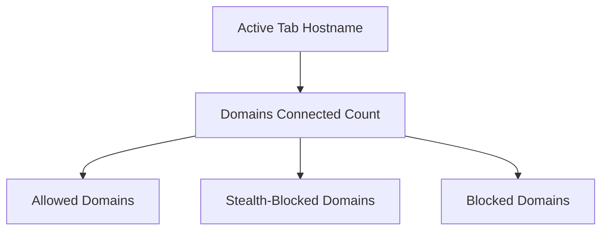
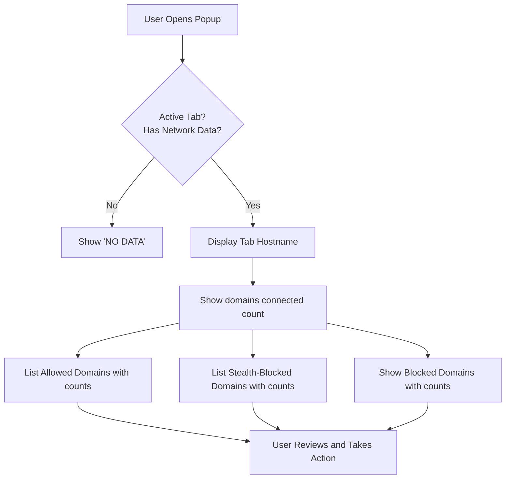

# Understanding the Popup Interface

## Overview
The uBO Scope popup interface is your direct window into the network connections your browser attempts or successfully establishes while viewing a webpage. This guide walks you through how to interpret the key sections of the popup window, understand the categories of connections shown (allowed, stealth-blocked, blocked), and grasp the meaning behind the badge count displayed in your toolbar.

By mastering this interface, you will be empowered to assess your privacy exposure and the behavior of content blockers with clarity and confidence.

---

## 1. What the Popup Interface Shows

The popup displays live data about remote server connections from the currently active browser tab. Its components are arranged to help you quickly understand the scope and outcomes of these network requests.

### Key Sections in the Popup

- **Hostname Display:** Shows the currently active tab's full hostname at the top.
- **Summary Count:** Displays the number of distinct third-party domains contacted in the active tab.
- **Domain Lists by Outcome:** Three distinct categories list domains based on the network request result:
  - **Not Blocked (Allowed):** Domains contacted successfully without being blocked.
  - **Stealth-Blocked:** Domains where requests were stealthily blocked through redirects or other means.
  - **Blocked:** Domains from which requests were outright blocked or failed to connect.

### Visual Layout

This structure helps you drill down from a quick summary to precise domain-level detail.

---

## 2. Understanding Each Section

### a. Hostname Display

- The top-left text shows the full hostname of the active webpage, split between its subdomain and main domain parts.
- Example: For the tab hostname `news.example.co.uk`, the subdomain `news.` and the main domain `example.co.uk` are shown distinctly.
- This gives you context about which site’s network activity you’re viewing.

### b. Domains Connected Summary

- Shows a count representing the number of unique third-party domains your browser communicated with from the active tab.
- This is the same number reflected by the badge on the browser extension icon.
- A low number generally indicates fewer distinct third-party connections, which is better for privacy.

### c. Allowed (Not Blocked) Domains

- Lists all third-party domains that were contacted successfully by the active tab without any blocking.
- Each domain entry includes the number of individual connections made to that domain.
- This section highlights external services actively communicating and loading resources on the page.

### d. Stealth-Blocked Domains

- These domains had requests that were not outright blocked but blocked indirectly via stealth techniques such as redirects.
- Stealth-blocking happens silently without the page necessarily detecting it, preserving functionality while blocking tracking.
- The domain list here shows the count of stealth-blocked requests.

### e. Blocked Domains

- Contains domains where network requests failed or were explicitly blocked.
- This list includes domains your content blocker or browser prevented from loading.
- Each domain entry shows the count of blocked requests associated with it.

---

## 3. Practical Example

Imagine you're visiting `https://example.com` and open the uBO Scope popup:

- At the top: The hostname `example.com` is shown.
- Summary shows: `15 domains connected`.
- Allowed section lists domains like `cdn.examplecdn.com (8)`, `analytics.tracker.net (2)` indicating active connections.
- Stealth-blocked might show `ads.sneakytracker.com (4)` representing requests silently neutralized.
- Blocked could list `badads.malicious.net (5)` where your content blocker stopped requests.

This detailed breakdown gives you immediate insight into what third parties your browser talks to and how effectively blocking is working.

---

## 4. How to Use This Information

- Use the **domain counts** to gauge the volume and diversity of third-party connections.
- Investigate unexpected or unknown domains in the **allowed** list to identify potential privacy risks.
- Check the **stealth-blocked** section to observe hidden blocking activity that may otherwise go unnoticed.
- Review the **blocked** list to confirm that your content blocker is actively preventing unwanted connections.

By monitoring changes as you browse, you can discern the impact of browsing habits or installed blockers.

---

## 5. Tips & Best Practices

- **Refresh the popup with each tab change** to see live network results for the active page.
- **Look periodically at the allowed domains** to detect unexpected third-party trackers.
- Understand that a **lower badge count and fewer allowed domains typically mean better privacy**.
- Use the **stealth-blocked category as a reassurance** that some blockers are working silently without page breakage.
- Combine popup insights with your content blocker’s own UI for a complete picture.

---

## 6. Common Pitfalls & Troubleshooting

<Tip>
If the popup shows 'NO DATA' or empty lists despite active browsing:
- Verify that uBO Scope is correctly installed and enabled.
- Reload the active tab to reset the data capture.
- Check permissions granted to the extension to allow webRequest monitoring.
</Tip>

<Tip>
The badge count might briefly lag behind actual network activity. Open the popup to get the most accurate, up-to-date information.
</Tip>

<Warning>
Not all network requests are visible to the extension due to browser or network limitations; some connections like those made by WebSockets or native apps may not show up.
</Warning>

---

## 7. Summary Diagram of Popup Interaction Flow

---

## 8. Next Steps

After mastering the popup interface, consider exploring:

- **Monitoring Third-Party Connections: A Basic Workflow** — to practice interpreting popup data in context.
- **Key Concepts & Terminology** — for deeper understanding of connection outcomes.
- **Installation, Setup, and Troubleshooting** — to ensure your extension operates flawlessly.

For developers or advanced users, consult the [Architecture Overview](../overview/architecture-concepts/system-architecture-diagram) to see how the popup integrates with network monitoring.

---

## Related Documentation

- [Opening and Using the uBO Scope Popup](../../getting-started/first-steps-usage/open-and-use-popup)
- [Key Concepts & Terminology](../../overview/architecture-concepts/core-concepts-terminology)
- [Installation & Setup Guides](../../getting-started/installation-setup/install-extension)
- [Advanced Analysis & Use Cases](../../guides/advanced-analysis-patterns/debunking-block-count-myths)

---

## Additional Resources

- Official GitHub Repository: [https://github.com/gorhill/uBO-Scope](https://github.com/gorhill/uBO-Scope)
- Public Suffix List Explanation: [https://publicsuffix.org/list/](https://publicsuffix.org/list/)

---