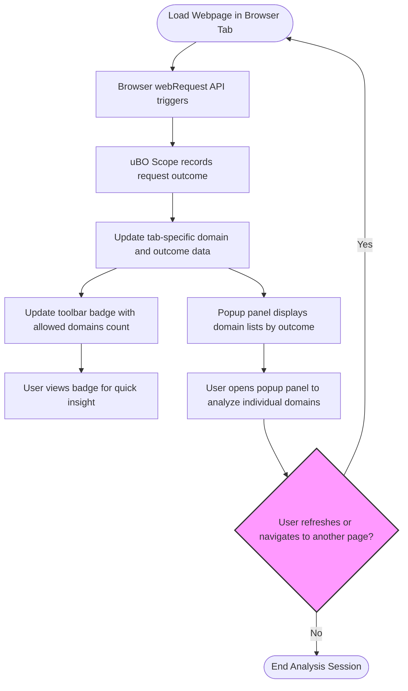

# Basic Workflow: Analyzing Third-Party Connections

Understand how to leverage uBO Scope to examine a webpage’s outgoing connections to third-party servers. This guide walks you through a practical scenario from loading a website to interpreting the network requests shown by uBO Scope’s popup panel, helping you identify connections that may affect your privacy.

---

## 1. Workflow Overview

### What This Guide Helps You Accomplish
This guide enables you to:
- Analyze all network connections initiated by a webpage in real-time.
- Distinguish between allowed, stealth-blocked, and blocked third-party connections.
- Identify benign versus potentially privacy-invasive third-party domains.
- Use uBO Scope as an impartial observer to better understand filtering outcomes independent of any particular content blocker.

### Prerequisites
- uBO Scope extension installed on a supported browser (Chromium 122+, Firefox 128+, Safari 18.5+).
- Permissions granted, especially access to `webRequest` for network monitoring.
- Basic familiarity with browsing a website whose connections you want to analyze.

### Expected Outcome
After completing this guide, you will confidently use uBO Scope’s popup interface to audit third-party connections and gain actionable insights into which external domains a webpage reaches and how the browser and blockers handle requests.

### Time Commitment
Approximately 5–10 minutes.

### Difficulty Level
Beginner to Intermediate.

---

## 2. Step-by-Step Instructions

### Step 1: Open uBO Scope on the Active Tab
- Click the uBO Scope extension icon in your browser toolbar.
- The popup panel will appear, showing the hostname of the current webpage and domains connected.

### Step 2: Understand the Badge Count
- Observe the numeric badge on the toolbar icon; it represents the number of distinct third-party domains that have made allowed connections from the active tab.
- Note: A **lower** count generally indicates fewer third-party servers accessed — often more desirable for privacy.

### Step 3: Review the Domain Groups in the Popup
The popup panel categorizes domains into three groups:
- **Not Blocked:** Domains for which network requests were allowed.
- **Stealth-Blocked:** Domains whose connections were stealthily blocked (e.g., redirects intercepted), often invisible to the webpage.
- **Blocked:** Domains whose connections were explicitly blocked (e.g., via content blockers or DNS blocking).

Each group lists the domains and the count of network requests made to each domain.

### Step 4: Analyze Individual Domains
- Examine the domain names to identify familiar, benign third parties (e.g., well-known CDNs) versus unknown or suspicious trackers.
- Use the counts to see the frequency of connections to each domain — higher counts may indicate heavier interaction.

### Step 5: Refresh or Navigate to Another Page to Compare
- Reload the current tab or navigate to a different site.
- Reopen uBO Scope and compare the different sets of third-party connections.
- Notice how content blockers or DNS filtering affect the counts and categories.

### Step 6: Interpret Network Connection Outcomes
- Remember that uBO Scope reports connections regardless of which content blocker is active, giving a neutral view.
- Use this insight to assess if unwanted third parties are still allowed despite blockers.

### Step 7: Close Tabs and Observe Session Persistence
- Upon closing a tab, uBO Scope clears its stored connection data for that tab automatically.
- This keeps analyses tab-specific and current.

---

## 3. Practical Example

Imagine visiting `https://example.com` where:
- The popup shows 5 allowed third-party domains, including `cdn.examplecdn.com` and `ads.adnetwork.com`.
- 2 stealth-blocked domains are present, such as `tracker.stealthblock.com`.
- 3 blocked domains appear, including `ads.blocked.com`.

This indicates the page communicates with multiple third parties, some allowed (CDNs), some stealth-blocked, and others blocked.

You might decide to investigate if any stealth-blocked domains require additional filter tuning to ensure privacy.

---

## 4. Best Practices and Tips

- **Check Badge Counts Frequently:** Use the badge as a quick privacy health indicator for each site.
- **Spot Suspicious Connections:** Look out for unexpected third-party domains, especially those unrelated to site content.
- **Understand Stealth Blocking:** Stealth-blocked domains indicate requests that were redirected or intercepted invisibly—these often show hidden trackers.
- **Consider Legitimate Third Parties:** Not all third-party connections are malicious — many sites use CDNs or analytics platforms that are essential or benign.
- **Use Domain Names Wisely:** Public suffix list processing groups related hostnames under domains to simplify analysis.

---

## 5. Troubleshooting Common Issues

### Popup Shows 'NO DATA' or Empty Lists
- Ensure the tab is active and fully loaded.
- Confirm uBO Scope has necessary permissions (`webRequest`, activeTab).
- Verify the browser version meets minimum requirements.
- Reload the page and check the popup again.

### Badge Does Not Update
- uBO Scope updates badges asynchronously; wait a few seconds after page load.
- Check that no conflicting extensions override or block uBO Scope.
- Restart the browser if badges remain stale.

### Connections Do Not Match Expectations
- Understand that uBO Scope tracks requests visible to the browser's `webRequest` API. Some network activity outside this scope will not be reported.
- Be aware of browser-specific limitations, for example, Safari limited WebSocket request reporting.

---

## 6. Next Steps & Further Reading

- Deepen your knowledge by exploring [Reading the Popup Panel: Interpreting Connection Data](/guides/getting-started-essentials/understanding-the-popup).
- Learn more about [Understanding Allowed, Blocked, and Stealth Outcomes](/guides/interpreting-advanced-insights/understanding-outcomes).
- If you encounter setup issues, visit [Troubleshooting Installation and Startup Issues](/getting-started/first-use-and-setup/troubleshooting-startup).
- For filter list maintainers or advanced users, see [How Filter List Maintainers Use uBO Scope](/guides/interpreting-advanced-insights/use-case-filter-list-maintainers).

---

## 7. How uBO Scope Works (High-Level Summary)

uBO Scope uses the browser's `webRequest` API to intercept requests made by each browser tab. It records the domains contacted and categorizes connection outcomes as follows:

- **Allowed:** Requests completed successfully.
- **Stealth:** Redirects and stealthily blocked requests invisible to the page.
- **Blocked:** Failed or blocked requests explicitly denied by blockers.

It maintains data tab-wise and updates the toolbar badge to reflect the count of allowed third-party domains, providing a clear, real-time view into third-party interactions.

For the architecture and data flow in detail, see the [Architecture & Data Flow](/overview/core-concepts-and-architecture/architecture-and-data-flow) documentation.

---

## 8. Visual Workflow Diagram

---