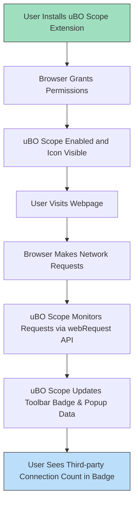

# Install and Set Up uBO Scope

This guide walks you through installing the uBO Scope browser extension on your preferred browser—Chrome, Firefox, or Safari—enabling it, and confirming that the initial setup is complete. You'll also learn about the toolbar badge that provides a quick summary of network activity.

---

## 1. Workflow Overview

### What This Guide Helps You Accomplish
- Install the uBO Scope extension from official sources or manually.
- Enable and configure uBO Scope in your browser.
- Verify the extension is functioning correctly through visible indicators.
- Understand the toolbar badge and what it represents.

### Prerequisites
- A supported browser installed:
  - Chrome 122.0 or later
  - Firefox 128.0 or later
  - Safari 18.5 or later
- Internet connectivity to access the browser's extension store or download manually.

### Expected Outcome
Once you complete this guide, uBO Scope will be installed, enabled, and actively monitoring all remote network connections your browser makes, showing the count of distinct third-party servers on its toolbar badge.

### Estimated Time
5–10 minutes, depending on your browser and familiarity with installing extensions.

### Difficulty Level
Beginner

---

## 2. Step-by-Step Installation and Setup

<Steps>
<Step title="Choose Your Browser and Access the Extension Store">
Open your browser's official extension/add-ons store:
- Chrome: [Chrome Web Store](https://chromewebstore.google.com/detail/ubo-scope/bbdpgcaljkaaigfcomhidmneffjjjfgp)
- Firefox: [Firefox Add-ons](https://addons.mozilla.org/firefox/addon/ubo-scope/)
- Safari: Use the Safari Extensions menu on macOS 13.1 or later (via App Store)

Access the store to find uBO Scope by searching for 'uBO Scope' or 'uBlock Origin Scope'.

Expected result: uBO Scope extension page is displayed.
</Step>

<Step title="Install uBO Scope">
Click the install or add button on the extension page.

Depending on your browser, you may need to confirm permissions requested (see permission details below).

Expected result: uBO Scope is installed and its icon appears in your browser toolbar.

<Tip>
uBO Scope requires permissions to access network requests (`webRequest`) and storage for its functionality. These are essential and cannot be skipped.
</Tip>
</Step>

<Step title="Pin the uBO Scope Icon to Toolbar (Recommended)">
After installation, pin the uBO Scope icon to your browser's toolbar for quick access:
- In Chrome and Firefox: Click the extensions puzzle icon near the address bar and pin uBO Scope.
- In Safari: It appears automatically or can be added via the Extensions menu.

Expected result: The uBO Scope icon is visible on your toolbar.
</Step>

<Step title="Verify Permissions and Settings">
Make sure uBO Scope has all required permissions enabled:
- Access to page tabs (`activeTab`)
- Access to network requests (`webRequest`)
- Storage permissions

To verify:
- Go to your browser's extensions page (e.g., chrome://extensions, about:addons).
- Find uBO Scope and check its allowed permissions.

Expected result: All required permissions are granted.

<Warning>
Missing `webRequest` permission means uBO Scope cannot monitor network connections.
</Warning>
</Step>

<Step title="Test uBO Scope is Monitoring">
Visit any website that loads external content (e.g., news site, social media, or content-rich site).

Click the uBO Scope toolbar icon to open the popup panel.

You should see:
- The hostname of the visited tab.
- A summary count of connected distinct third-party domains.
- Lists of domains under the headers: 'not blocked', 'stealth-blocked', and 'blocked'.

Expected result: Data shows the active network connections happening on the page.

<Check>
If no data appears or count stays empty:
- Try refreshing the tab.
- Confirm network activity is generated.
- Check permissions again.
</Check>
</Step>

</Steps>

---

## 3. Understanding the Toolbar Badge

The uBO Scope icon displays a numeric badge representing the **number of distinct third-party remote servers** your browser connected to on the current tab.

- **Lower numbers indicate fewer third-party connections, which generally implies better privacy and less tracking.**
- Third-party domains include CDNs, ad servers, analytics providers, and other external resources.

### Important Notes:
- The badge count **does not represent blocked requests**; it counts allowed distinct connections.
- It updates dynamically as the page loads more resources.

<Tip>
Use the badge as a quick privacy indicator for each site you visit.
</Tip>

---

## 4. Troubleshooting Common Issues

<AccordionGroup title="Troubleshooting Setup">
<Accordion title="Toolbar Icon Missing After Installation">
- Make sure the extension is enabled in your browser's extension manager.
- Refresh the browser window or restart the browser if needed.
- Pin the icon manually via the extensions menu if hidden.
</Accordion>

<Accordion title="Badge Count Not Updating or Empty">
- Confirm you have granted the `webRequest` permission.
- Visit websites with active third-party content to generate network requests.
- Refresh the tab and open the popup panel to check if data appears.
- Restart the browser in case of any cache or state issues.
</Accordion>

<Accordion title="No Network Data in Popup Panel">
- Disable conflicting extensions that might interfere with network monitoring.
- Ensure your browser version meets or exceeds the minimum requirements.
- Clear browser cache or reload extension.
- Check the browser console logs for errors related to uBO Scope.
</Accordion>

<Accordion title="Safari Specific Notes">
- Safari requires version 18.5 or later.
- Some `webRequest` features may be limited; verify extension permissions are allowed in Safari preferences.
</Accordion>

</AccordionGroup>

<Tip>
If problems persist, reinstall uBO Scope or consult the full troubleshooting guide "Troubleshooting Your Setup" for comprehensive support.
</Tip>

---

## 5. Best Practices and Tips

- Install uBO Scope alongside your favorite content blocker to gain unbiased transparency on network connections.
- Use the extension during routine browsing or while testing filter lists.
- Regularly check the popup panel to understand the third-party domains loading on the pages you visit.
- Remember that some third-party connections are necessary for site functionality, like CDNs or embedded services.

---

## 6. Next Steps & Related Documentation

- After installation, proceed to the guide [Initial Extension Setup](https://docs.example.com/getting-started/installation-configuration/extension-setup) to configure basic usage.
- Use [Validate uBO Scope Is Working](https://docs.example.com/getting-started/first-use-validation/validate-extension-operation) to confirm real-time operation and understand badge counts.
- Refer to [Troubleshooting Your Setup](https://docs.example.com/getting-started/first-use-validation/troubleshooting-setup) for resolving common problems.
- Learn to interpret the popup's domain data in [Understanding the Popup: Reading Domain Data](https://docs.example.com/guides/getting-started-guides/first-look-at-popup).
- Explore core concepts in [Core Concepts & Terminology](https://docs.example.com/overview/core-concepts-and-architecture/fundamental-concepts) for deeper understanding.

---

## Appendix: Permissions Overview from Manifest Files

| Permission   | Purpose                                                           |
|--------------|-------------------------------------------------------------------|
| `activeTab`  | Allows the extension to interact with the currently active tab.  |
| `storage`    | Enables saving session data and preferences locally.             |
| `webRequest` | Grants access to monitor all network requests made by the browser. |

---

## Visual Summary

---

For more details, visit the [uBO Scope GitHub repository](https://github.com/gorhill/uBO-Scope) and explore the extensive guides in this documentation set.