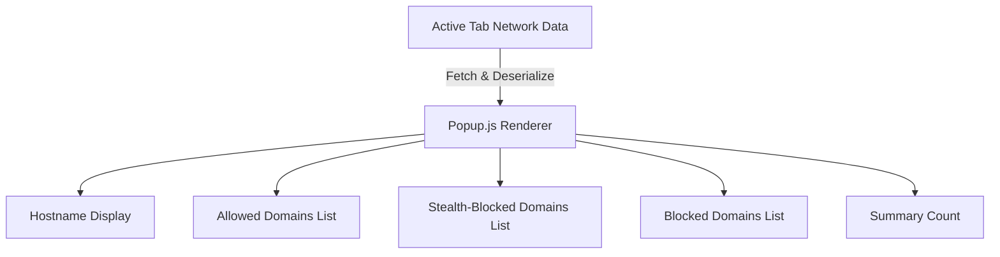

# Exploring the Popup UI

## Introduction
The **uBO Scope popup interface** provides a real-time, clear view of network connections initiated by the web page you are currently browsing. This guide helps you decode the interface, understand the key concepts behind connection statuses, domains categorization, and badge counts. By mastering the popup UI, you can quickly identify which third-party connections are allowed, stealth-blocked, or fully blocked, empowering you with insights into your browsing footprint.

---

## What You Will Learn
- The layout and sections of the popup
- Meaning of "Allowed", "Stealth-Blocked", and "Blocked" domains
- How to interpret the connection status counts and badge numbers
- How to spot what truly matters on any web page

---

## Prerequisites
Ensure you have:
- Successfully installed uBO Scope on a supported browser (Chromium 122+, Firefox 128+, or Safari 18.5+).
- Opened the popup on a currently active tab with network activity.
- Basic familiarity with web domains and network requests (helpful but not required).

---

## Popup Interface Overview
The popup UI is designed to be intuitive and informative. It immediately surfaces connection data into three categorized sections:

### 1. Hostname Header
- Displays the current active tab's hostname and domain.
- The **hostname** is typically the full domain with possible subdomains.
- The **domain** is extracted using the public suffix list, showing the main registered domain.

### 2. Summary Section
- Shows the total count of distinct domains connected to by the page.
- This number reflects how many unique third-party domains your page is actually communicating with.

### 3. Connection Outcome Sections
The main body is divided into three distinct outcome categories, each listing domains and the count of connections:

- **Not Blocked (Allowed)**
  - Domains from which connections successfully occurred.
  - These are fully permitted domains your browser talked to.
- **Stealth-Blocked**
  - Domains where connection attempts were silently blocked or redirected.
  - These did not fully load but their presence was detected.
- **Blocked**
  - Domains where connection requests were actively blocked by content blockers or network errors.
  - These connections were prevented from going through.

Each section lists the domains in alphabetical order and the count of the distinct connection attempts.

---

## Using the Popup UI Step-by-Step

<Steps>
<Step title="Open the Popup">
Click the uBO Scope extension icon in your browser toolbar to open the popup for the active tab.
</Step>

<Step title="Read the Hostname Header">
Observe the hostname at the top. This tells you what site you are monitoring. For example, ‘news.example.com’ displays at the top with the domain ‘example.com’ highlighted.
</Step>

<Step title="Check the Summary Count">
Look at the summary number below the header; it indicates how many unique domains the page connected to.
</Step>

<Step title="Review Not Blocked Domains">
This first category lists all domains from which connections were successfully allowed. Use this to identify which third parties are actively used.
</Step>

<Step title="Understand Stealth-Blocked Domains">
Domains here had requests that were intercepted stealthily (e.g., redirected or silently blocked) but were still detected. These could affect page behavior subtly.
</Step>

<Step title="Examine Fully Blocked Domains">
This section shows domains where connections failed outright due to blocking rules or network errors.
</Step>

<Step title="Interpret Domain Counts">
Each domain shows a count badge. This represents the number of unique hostnames used within that domain for network requests. Higher counts mean more individual subdomains or endpoints were contacted.
</Step>
</Steps>

---

## Practical Tips and Best Practices
- **Refresh the popup** when navigating to a new page to capture fresh data.
- **Focus on high-count allowed domains** to understand which third-parties have the biggest footprint.
- **Investigate stealth-blocked and blocked domains** to detect tracking attempts or unwanted connections.
- Use this information alongside your content blocker to fine-tune filters and improve privacy.
- **Don’t confuse the badge number on the extension icon with block counts.** The badge reflects the count of allowed third-party domains, not blocked ones.

---

## Common Pitfalls
- Seeing no data may indicate the page has no active network connections, or the extension lacks permissions.
- The popup only shows data for the active tab; make sure you have the correct tab active.
- Network requests outside browser control (e.g., apps or plugins) are not tracked.

---

## Troubleshooting

<AccordionGroup title="Troubleshooting Popup Issues">
<Accordion title="POPUP Shows 'NO DATA' or Empty">
Verify that the page has made network connections.
Check that the extension has necessary permissions (webRequest, activeTab).
Try refreshing the page and reopening the popup.

If the problem persists, consult the 'Troubleshooting Common Setup Issues' guide.
</Accordion>

<Accordion title="Counts Appear Incorrect or Unexpected">
Remember counts are unique domains, not total request counts.
Ensure the page is fully loaded and network activity is present.
Some redirects or errors may cause domains to appear in stealth or blocked lists.
</Accordion>
</AccordionGroup>

---

## Example Scenario
Imagine visiting a news website. You open the popup and see:

- Hostname: `news.example.com` (domain: `example.com`)
- Summary: 25 domains connected
- Not Blocked section lists content delivery networks, ad servers, and analytics domains.
- Stealth-Blocked shows a couple of tracking domains that were silently redirected.
- Blocked includes ad domains that your blocker has stopped.

This clear segregation helps you quickly understand the network activity and privacy footprint of this single page.

---

## Interface Components Reference

| UI Component       | What it Shows                                  | User Value                                                      |
|--------------------|-----------------------------------------------|----------------------------------------------------------------|
| Hostname Header    | Current page hostname and domain              | Know exactly which page's connections you are viewing           |
| Summary Count     | Number of distinct connected domains          | Quick snapshot of third-party footprint                          |
| Not Blocked List  | Allowed domains with connection counts        | Identify trusted or allowed third-parties                       |
| Stealth-Blocked List | Stealth-blocked domains with counts          | Spot hidden or redirected connection attempts                   |
| Blocked List      | Blocked domains with counts                    | See what connections are actively prevented                     |

---

## Additional Resources
- [What is uBO Scope?](https://github.com/gorhill/uBO-Scope/blob/main/docs/overview/introduction-value/what-is-ubo-scope.md) — Understand the purpose of uBO Scope.
- [Core Concepts & Terminology](https://github.com/gorhill/uBO-Scope/blob/main/docs/overview/core-concepts-system/core-terminology.md) — Learn the definitions behind connection outcomes.
- [First Launch and Quick Validation](https://github.com/gorhill/uBO-Scope/blob/main/docs/getting-started/essentials/first-run.md) — Walk-through of the first use.
- [Troubleshooting Common Setup Issues](https://github.com/gorhill/uBO-Scope/blob/main/docs/getting-started/setup-and-troubleshooting/troubleshooting.md) — Resolve issues about missing or incorrect popup data.

---

<u>With this knowledge, you’re ready to interpret the uBO Scope popup with confidence, unlocking transparent understanding of your web traffic exposure.</u>

---

## Source Code Reference

The popup’s content is rendered dynamically by `popup.js` which:
- Fetches connection data for the current active tab
- Converts domain names to Unicode for display
- Sorts and populates domains within the allowed, stealth-blocked, and blocked categories
- Updates the total domain count displayed in the summary

For technical insight, review [`js/popup.js`](https://github.com/gorhill/uBO-Scope/blob/main/js/popup.js).

---

## Summary Diagram: Popup Data Flow

---

**By following this guide, you quickly grasp how to read and interpret uBO Scope's popup UI, making your browsing privacy more transparent and understandable.**
