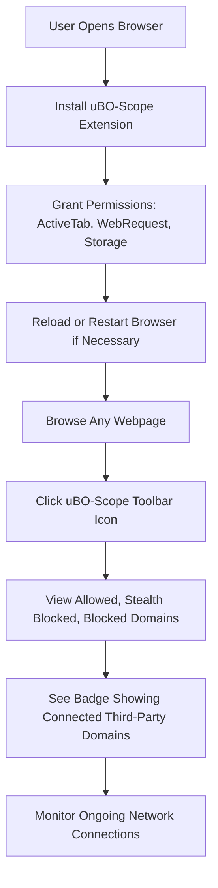

# Installing and Setting Up uBO-Scope

## Introduction
This guide walks you through the practical steps to install, enable, and confirm that uBO-Scope is functioning correctly on your preferred web browser. uBO-Scope is a lightweight browser extension designed to independently track and report all remote server connections initiated by your browser tabs, offering invaluable insight into your online network exposure.

---

## 1. Workflow Overview

### Task Description
Install the uBO-Scope extension on Chromium-based browsers (Chrome, Edge), Firefox, or Safari. Then enable the extension and verify it is actively monitoring network requests.

### Prerequisites
- A compatible browser:
  - Chromium-based browsers (Chrome 122+ recommended)
  - Firefox 128+
  - Safari 18.5+
- Basic familiarity with installing browser extensions
- Internet access to download the extension

### Expected Outcome
- uBO-Scope successfully installed and visible in the browser toolbar
- The extension’s badge displaying the count of third-party connections when you visit webpages
- The popup interface accurately showing allowed, stealth-blocked, and blocked network connections

### Time Estimate
Approximately 5-10 minutes

### Difficulty Level
Beginner

---

## 2. Step-by-Step Instructions

### A. Installation By Browser

#### Chromium (Chrome, Edge, etc.)
1. Open your Chromium browser.
2. Navigate to the [Chrome Web Store uBO-Scope page](https://chromewebstore.google.com/detail/ubo-scope/bbdpgcaljkaaigfcomhidmneffjjjfgp).
3. Click **Add to Chrome** or **Add to Browser**.
4. Confirm any prompts about permissions, which include:
   - Active Tab access
   - Storage
   - Network webRequest monitoring
5. Wait for the extension to download and install.
6. You should see the uBO-Scope icon appear in your browser toolbar.

#### Firefox
1. Launch Firefox.
2. Visit the [uBO-Scope page on Firefox Add-ons](https://addons.mozilla.org/firefox/addon/ubo-scope/).
3. Click **Add to Firefox**.
4. Approve permissions for:
   - Access to active tab
   - Storage
   - Monitoring web requests
5. Wait for Firefox to install the extension.
6. The uBO-Scope icon will appear near the address bar.

#### Safari
1. Open Safari (version 18.5 or higher).
2. Access the Safari Extensions Gallery or the [uBO-Scope GitHub releases](https://github.com/gorhill/uBO-Scope) for the Safari build.
3. Follow Apple’s standard procedure for installing browser extensions.
4. Enable uBO-Scope in Safari’s Extensions Preferences pane if it’s not enabled automatically.
5. The uBO-Scope icon will display in the Safari toolbar.

### B. Enabling and Granting Permissions

- Most browsers prompt you upon installation to grant required permissions. Ensure you allow these so the extension can monitor network requests.
- If permissions are restricted later, uBO-Scope cannot track connections reliably.
- You can verify and adjust permissions from your browser’s extensions settings page.

### C. Verifying Successful Installation and Core Functionality

1. Open any webpage.
2. Click the uBO-Scope toolbar icon (the badge shows a number).
3. The popup will display three categories:
   - **Not Blocked:** Domains fully allowed.
   - **Stealth-Blocked:** Domains requests that were redirected or stealthily blocked.
   - **Blocked:** Domains where requests were outright blocked.
4. Confirm you see domain lists populating in these categories.
5. The **domains connected** count at the top summarizes the total distinct third-party domains encountered.

### Success Criteria
- The badge count updates dynamically per active tab.
- The popup lists domains under correct outcome categories.
- No error messages or empty states immediately after browsing.

---

## 3. Practical Tips & Best Practices

- **Refresh the page** if you install uBO-Scope after browsing a tab to see accurate counts.
- Install updates periodically, but expect infrequent releases due to the extension’s focused feature set.
- Access the popup frequently to monitor network connections, especially when visiting privacy-sensitive sites.
- Understand that a lower badge count generally indicates stronger privacy by limiting third-party connections.

---

## 4. Troubleshooting Common Issues

<AccordionGroup title="Troubleshooting Installation and Setup">
<Accordion title="uBO-Scope Icon Does Not Appear After Installation">
- Confirm the extension installed successfully via your browser’s extensions management page.
- Restart the browser to reload extensions.
- Check for browser compatibility (minimum version requirements).
</Accordion>
<Accordion title="Badge Count Remains Empty or Stuck at Zero">
- Ensure the browser allows the extension to access network requests (check permissions).
- Visit a site known to load third-party resources (e.g., example.com).
- Refresh the webpage after installation.
</Accordion>
<Accordion title="Popup Shows No Data or Displays 'NO DATA'">
- The extension needs an active tab with network activity logged.
- Confirm you clicked the extension while viewing a loaded webpage (not blank/new tab).
- Try closing and reopening the browser.
</Accordion>
<Accordion title="Browser Warns About Permissions or Restricts Access">
- uBO-Scope requires permission to monitor network requests (webRequest API).
- Review browser security settings and explicitly allow required permissions.
- Some browsers may require re-enabling extensions after updates.
</Accordion>
</AccordionGroup>

---

## 5. Next Steps & Additional Resources

- Explore more advanced features in the [Using the Popup: Viewing and Interpreting Results](https://docs.uboscope/guides/getting-started-ubo-scope/popup-ui-overview) guide.
- Learn how to interpret the badge count in [Understanding Third-Party Connections and Badge Counts](https://docs.uboscope/guides/getting-started-ubo-scope/core-concepts-connections).
- If issues persist, visit [Resolving Common Installation and Usage Issues](https://docs.uboscope/getting-started/troubleshooting/common-issues) for detailed troubleshooting.

---

## Appendix: Summary of Permissions in Extension Manifest

uBO-Scope requires these permissions to operate effectively:
- **activeTab**: To access current tab information.
- **storage**: To save session data and the loaded public suffix list.
- **webRequest**: To listen to network requests for capturing connection outcomes.

Specific host permissions include access to all http, https, ws, and wss URLs.

---

## Visual Overview of Setup Flow

