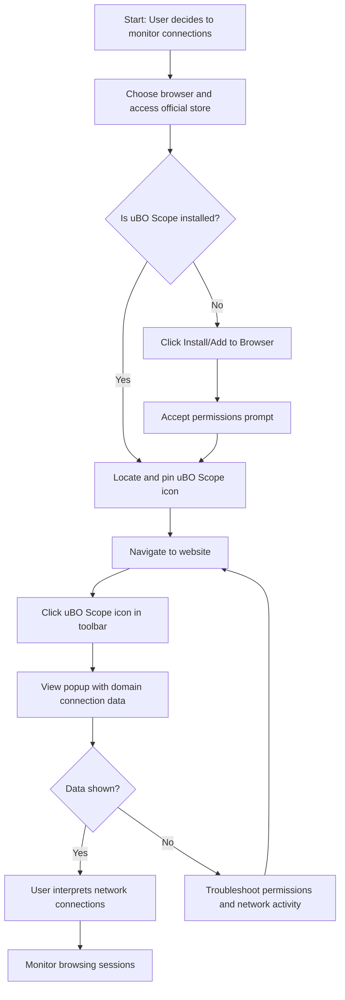

# Installing and Setting Up uBO Scope

## Overview
This guide walks you through installing uBO Scope on supported browsers, configuring the extension for the first time, and understanding the core interface elements. By following this step-by-step walkthrough, you will have uBO Scope running reliably, ready to monitor all network connections your browser attempts or makes.

---

## What You Will Achieve
- Install uBO Scope safely from trusted sources or via manual setup
- Configure browser permissions and extension settings for optimal operation
- Understand and navigate the core popup interface showing connection data
- Troubleshoot common installation or setup issues to get started quickly

---

## Prerequisites
- A supported browser: Chrome 122+, Firefox 128+, or Safari 18.5+
- Internet connection to download the extension
- Basic familiarity with installing browser extensions

---

## Time Estimate
About 10-15 minutes from installation to first successful run.

---

## Step-by-Step Installation and Setup

### 1. Choose Your Installation Method

#### Official Browser Store Installation
1. Go to the appropriate store for your browser:
   - **Chrome:** [Chrome Web Store - uBO Scope](https://chromewebstore.google.com/detail/ubo-scope/bbdpgcaljkaaigfcomhidmneffjjjfgp)
   - **Firefox:** [Firefox Add-ons - uBO Scope](https://addons.mozilla.org/firefox/addon/ubo-scope/)
   - **Safari:** Use Safari Extensions on macOS 13+ or later; search directly in the App Store.
2. Click **Add to Browser** or **Install Extension**.
3. Confirm any prompts to grant necessary permissions.

#### Manual Developer Installation (Advanced Users)
- Clone or download the source from the official GitHub repo: https://github.com/gorhill/uBO-Scope
- Follow browser-specific developer extension install instructions.
- This method is typically for developers or troubleshooting only.

---

### 2. Verify Permissions

uBO Scope requires permissions to monitor network requests, including `webRequest`, `storage`, and `activeTab`. Upon installation:

- When prompted by your browser, **allow these permissions** to enable full network visibility.
- If permissions dialogs do not appear or are declined, the extension will not function properly.

> Note: uBO Scope uses the browser's `webRequest` API to track all HTTP and WebSocket connections. It cannot monitor outside of this API scope.

---

### 3. Confirm Installation and Launch uBO Scope

- Locate the uBO Scope icon in your browser’s toolbar (shield icon with a badge count).
- Click the icon to open the popup interface.
- On the first launch, the popup may display NO DATA if no webpage has been loaded yet.

---

### 4. Basic Configuration and Initial Usage

- Navigate to any website in your browser.
- Click the uBO Scope icon to open the popup.
- The popup will display:
  - The hostname and domain of the current tab.
  - The count of distinct third-party domains connected.
  - Three sections categorizing remote servers:
    - **Not Blocked:** Connections allowed.
    - **Stealth-Blocked:** Redirected or silently blocked connections.
    - **Blocked:** Explicitly blocked connections.

- The toolbar badge updates live to reflect the count of distinct allowed third-party domains.

---

### 5. Understanding the Core Interface

- **Hostname and Domain Display:** Shows the website currently analyzed.
- **Domains Connected:** The number of distinct third-party domains your browser has connected to during page load.
- **Outcome Sections:** Detail the results of network requests per domain:
  - *Not Blocked* indicates actual allowed connections.
  - *Stealth-Blocked* indicates connections that were silently redirected or blocked in a way stealthy to webpages.
  - *Blocked* lists connections explicitly blocked.

The popup is designed to be lightweight and focused on delivering immediate transparency.

---

## Troubleshooting Common Setup Issues

<AccordionGroup title="Installation and Setup Troubleshooting">
<Accordion title='Extension Does Not Appear in Toolbar'>
- Verify the extension is enabled in your browser's extension management page.
- Pin the uBO Scope icon to the toolbar if hidden.
- Restart the browser after installation.
</Accordion>
<Accordion title='Permissions Prompt Not Shown or Denied'>
- Manually check extension permissions via browser settings.
- Reinstall the extension and ensure prompts are accepted.
- Note that without `webRequest` permission, uBO Scope cannot track requests.
</Accordion>
<Accordion title='Toolbar Badge Not Updating'>
- Confirm you are visiting regular web pages (network requests must occur).
- Check if any content blocker or browser setting restricts extension functionality.
- Reload the page and try opening the popup to refresh data.
</Accordion>
<Accordion title='Popup Shows "NO DATA" Continuously'>
- This typically means uBO Scope has not yet recorded any network connections.
- Visit a site with network activity and open the popup after the page fully loads.
- Check browser console logs for any errors if feasible.
</Accordion>
</AccordionGroup>

<Tip>
Always use the latest browser version to ensure compatibility with extension APIs uBO Scope relies on.
</Tip>

---

## Best Practices for Smooth Setup

- Install uBO Scope from official browser stores whenever possible.
- Keep your browser updated to the version that supports required APIs (`webRequest`).
- Give uBO Scope time and network activity to collect connection data—some pages may load resources lazily.
- If using other content blockers, verify they do not interfere with uBO Scope’s permissions.

---

## Next Steps

- Explore the guide on [Launching and Basic Configuration](https://yourdocs/getting-started/first-steps-usage-validation/running-and-configuring) to fine-tune usage.
- Perform your [First Measurement](https://yourdocs/getting-started/first-steps-usage-validation/first-successful-run) to understand the data.
- Learn to interpret the popup and domain connection statuses in [Understanding the Popup: Domains and Connection Statuses](https://yourdocs/guides/network-insights-common-workflows/understanding-popup).

---

## Summary
By completing this guide, you will have uBO Scope installed and configured correctly across supported browsers, ready to provide you instant transparency about third-party network connections in your browsing sessions. Understanding the popup interface allows you to start analyzing your browsing exposure immediately.

---

## Additional Resources
- [uBO Scope GitHub Repository](https://github.com/gorhill/uBO-Scope)
- [System Requirements and Supported Browsers](https://yourdocs/getting-started/introduction-and-installation/system-requirements)
- [How uBO Scope Works (Architecture Overview)](https://yourdocs/overview/architecture-features/how-ubo-scope-works)

---

## Appendix: Example Installation Steps for Chrome

1. Open Chrome Web Store link: https://chromewebstore.google.com/detail/ubo-scope/bbdpgcaljkaaigfcomhidmneffjjjfgp
2. Click **Add to Chrome**.
3. Confirm by clicking **Add extension** on the dialog.
4. Wait for installation confirmation.
5. Click the uBO Scope toolbar icon to open the popup.
6. Visit https://example.com, then check the popup for connection data.

This process is similar for Firefox and Safari, adapting for their respective stores and permissions.

---

## Visual Workflow Diagram

---