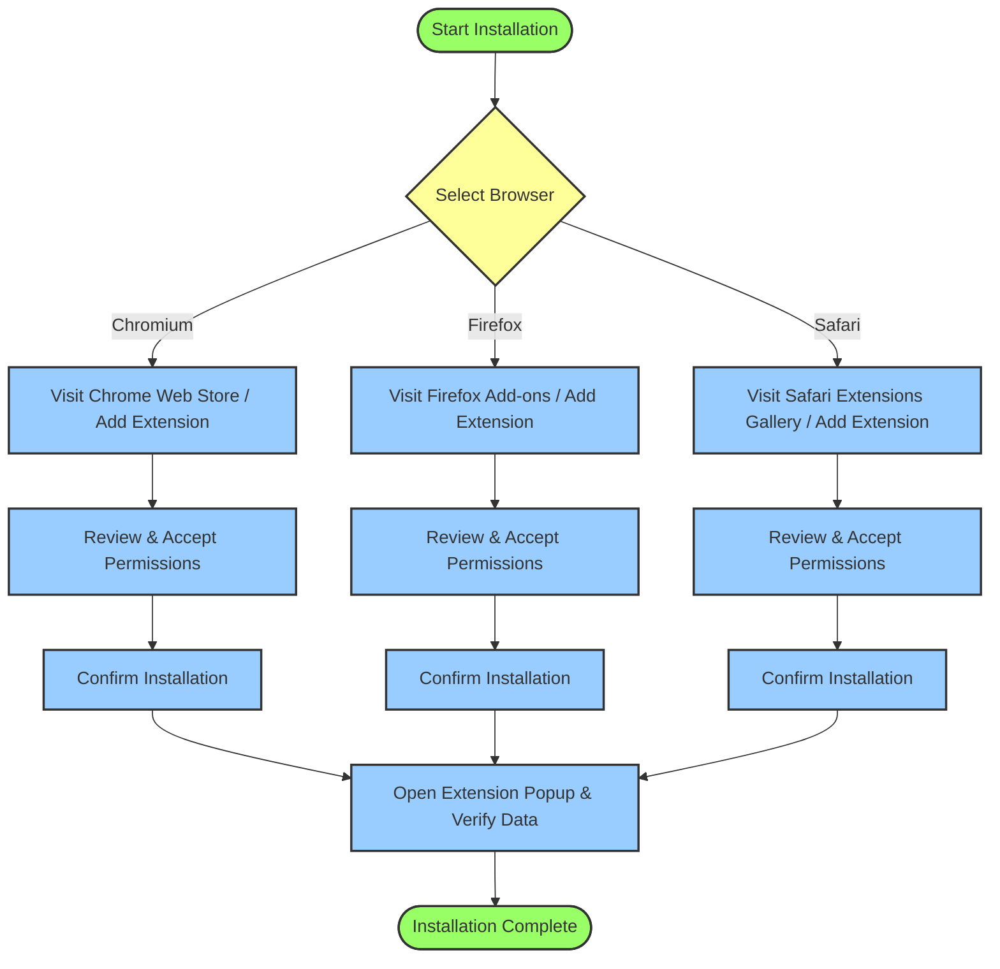

# Installing uBO Scope in Your Browser

uBO Scope is a powerful browser extension designed to reveal all remote server connections initiated by your active tab, including those blocked or stealth-blocked by content blockers. This guide walks you through the straightforward installation process on Chromium-based browsers, Firefox, and Safari, ensuring you set up uBO Scope from official sources securely.

---

## 1. Overview of Installation

### What You Will Achieve
- Add uBO Scope to your browser from an official, trusted source.
- Ensure the extension has the necessary permissions to monitor network connections.
- Confirm successful installation and readiness for immediate use.

### Supported Browsers
- **Chromium-based browsers:** Chrome v122 and above, Microsoft Edge (Chromium), Brave, etc.
- **Firefox:** Version 128 and above.
- **Safari:** Version 18.5 and above.

### Prerequisites
- A supported browser as listed above.
- Internet connection to download the extension from official stores.
- Basic familiarity with adding browser extensions.

### Time Estimate
- Approximately 5 minutes.

### Difficulty Level
- Beginner-friendly.

---

## 2. Installation Steps by Browser

### A. Installing uBO Scope on Chromium-based Browsers

1. Open your Chromium-based browser.
2. Navigate to the [Chrome Web Store page for uBO Scope](https://chrome.google.com/webstore/detail/ubo-scope/bbdpgcaljkaaigfcomhidmneffjjjfgp).
3. Click on **Add to Chrome** (or equivalent for your browser).
4. A permissions prompt will appear. Review the listed permissions carefully:
   - Access to read active tab information.
   - Access to monitor network requests.
   - Storage access.
5. Confirm the installation by clicking **Add Extension**.
6. Once installed, the uBO Scope icon will appear in your browser toolbar.

<Check>
If you do not see the extension icon, check your browser’s extension menu and ensure uBO Scope is enabled.
</Check>

### B. Installing uBO Scope on Firefox

1. Open Firefox.
2. Visit the official [uBO Scope Add-ons page on Mozilla Add-ons](https://addons.mozilla.org/firefox/addon/ubo-scope/).
3. Click **Add to Firefox**.
4. Accept the permission requests for active tab access, network monitoring, and storage.
5. Confirm installation.
6. The uBO Scope icon will display on the toolbar indicating successful installation.

<Check>
Ensure you have Firefox version 128 or higher, as earlier versions are not supported.
</Check>

### C. Installing uBO Scope on Safari

1. Open Safari and ensure it is version 18.5 or newer.
2. Open the Safari Extensions Gallery or the Mac App Store.
3. Locate uBO Scope (search for 'uBO Scope' extension).
4. Install the extension by clicking **Install**.
5. Go to Safari > Settings > Extensions and enable uBO Scope.
6. Verify that permissions for active tabs, webRequest monitoring, and storage are granted.
7. The uBO Scope icon will appear in the Safari toolbar.

<Note>
Safari’s extension installation and permission prompts are slightly different. Follow on-screen instructions closely during setup.
</Note>

---

## 3. Verifying Installation

Once installed, verify that uBO Scope is active and ready:

1. Click on the uBO Scope icon in your browser toolbar to open the popup panel.
2. You should immediately see data reflecting network connections for the active tab or a message indicating data availability.
3. The badge number on the toolbar icon will display the count of distinct third-party remote servers connected by the active tab.

<Check>
If you see "NO DATA" in the popup, try refreshing the active tab or visiting a well-known website with external content. This triggers network requests for uBO Scope to monitor.
</Check>

For a deeper dive on interpreting the popup data and badge counts, see the [Your First Run: Opening the Popup & Seeing Results](https://your-docs-domain/getting-started/setup-begin/first-launch) guide.

---

## 4. Tips for Safe and Smooth Installation

- **Always install from official web stores** to avoid counterfeit or compromised extensions.
- **Review permissions carefully.** uBO Scope requires permissions to monitor web requests and read tab info; these are essential for functionality.
- **Ensure your browser is updated** to supported versions to avoid compatibility issues.
- **Pin the extension icon to your toolbar** for quick access.

---

## 5. Troubleshooting Common Installation Issues

| Issue                     | Cause                                                      | Resolution                                                     |
|---------------------------|------------------------------------------------------------|----------------------------------------------------------------|
| Extension icon missing    | Installation incomplete or extension disabled               | Check extensions management page; enable extension              |
| No data shown on first use | Extension not monitoring active tab correctly               | Refresh active tab; try revisiting a site with network requests  |
| Permissions prompt blocked | User denied permissions or browser restrictions             | Reinstall extension and grant permissions when prompted         |
| Unsupported browser       | Browser version too old or unsupported browser entirely     | Upgrade browser to supported version                            |

For detailed troubleshooting guidance, refer to the [Troubleshooting Common Installation Issues](https://your-docs-domain/getting-started/troubleshoot-validate/troubleshooting-install) page.

---

## 6. What’s Next?

- After installation, proceed to [Using the Popup: Viewing Domain Connections](https://your-docs-domain/guides/getting-started-ubo-scope/using-the-popup) to learn how to interpret real-time connection data.
- Validate your installation and explore real-world network monitoring with [Quick Test: Is uBO Scope Working?](https://your-docs-domain/getting-started/troubleshoot-validate/validation-steps).

---

## Additional Resources

- [Overview of uBO Scope’s Architecture and Features](https://your-docs-domain/overview/architecture-and-core-concepts/feature-overview)
- [Understanding Badge Counts and Network Request Outcomes](https://your-docs-domain/guides/real-world-usage-analysis/interpreting-badge-and-panel)

---

<Info>
The extension’s badge number reflects the count of distinct third-party domains for which a network connection was made, serving as a quick privacy indicator.
</Info>

---

## Summary Diagram of Installation Flow

---
