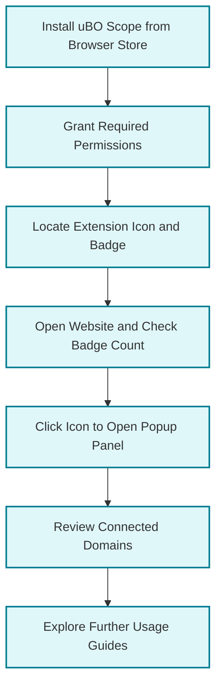

# Installing and Setting Up uBO Scope

Discover how to install uBO Scope on your preferred browser, understand the necessary permissions, navigate the extension badge basics, and verify a successful installation with a straightforward test. This guide ensures a smooth start with uBO Scope so you can begin monitoring remote server connections effectively.

---

## 1. Overview

### What This Guide Helps You Achieve
This guide walks you through installing uBO Scope in Chromium-based browsers, Firefox, and Safari and helps you:

- Complete a successful installation
- Understand required permissions
- Familiarize yourself with extension interface elements
- Verify that uBO Scope is working with a simple test scenario

### Prerequisites
- Use one of the supported browsers:
  - Chromium-based browsers (Chrome, Edge, Brave) version 122 or later
  - Firefox version 128 or later
  - Safari 18.5 or later
- Internet connection to download the extension

### Expected Outcome
- uBO Scope installed and enabled in your browser
- Permissions granted for network monitoring
- Toolbar icon badge visible and responsive
- Confirmation that the extension tracks network requests through a test

### Time Estimate
Approximately 5-10 minutes depending on installation method and browser

### Difficulty Level
Beginner-friendly installation and setup

---

## 2. Step-by-Step Installation and Setup

### Step 1: Choose Your Browser and Installation Method

**Recommended:** Install uBO Scope from your browser’s official extension/add-on store for ease and security.

| Browser Type         | Installation Source                                    |
|---------------------|-------------------------------------------------------|
| Chromium (Chrome, Edge, etc.) | [Chrome Web Store](https://chromewebstore.google.com/detail/ubo-scope/bbdpgcaljkaaigfcomhidmneffjjjfgp) |
| Firefox             | [Firefox Add-ons](https://addons.mozilla.org/firefox/addon/ubo-scope/) |
| Safari              | Safari Extensions Gallery or manual installation for Safari 18.5+ |

**Alternative:** For advanced users, you can build or load the extension manually by cloning from the GitHub repository and following platform-specific packaging scripts.

### Step 2: Install the Extension

1. Open your browser’s extension/add-on store.
2. Search for "uBO Scope".
3. Click ‘Add to [Browser]’ or ‘Install’. Confirm prompts to proceed.
4. Wait for installation to complete.

<Tip>
Installing from official stores is safest and automatically grants the necessary permissions.
</Tip>

### Step 3: Review and Grant Permissions

uBO Scope requires the following permissions to operate correctly:

- `activeTab`: To interact with the current browser tab.
- `storage`: To store session data, like network request information.
- `webRequest`: To listen to network traffic and report connection outcomes.
- Host permissions for all HTTP/HTTPS and WebSocket URLs (`http://*/*`, `https://*/*`, `ws://*/*`, `wss://*/*`).

When prompted during installation, accept these permissions. If no prompt appears, verify permissions have been granted via your browser’s extension management page.

<Check>
If permissions are denied or limited, uBO Scope won't capture network data accurately.
</Check>

### Step 4: Confirm Installation and Locate the Extension Badge

- After installation, look for the uBO Scope icon in your browser's toolbar.
- The icon badge is an indicator showing the count of distinct third-party domains with successful network connections.

### Step 5: Perform a Simple Test to Verify Functionality

1. Open any website (ideally one known to involve multiple connections, such as a news or social media site).
2. Observe the uBO Scope badge count. It reflects how many distinct third-party domains the page connected to.
3. Click the uBO Scope icon to open the popup panel.
4. Review the displayed lists under "not blocked", "stealth-blocked", and "blocked" categories.

You should see the domains connected displayed dynamically, reflecting network request outcomes.

<Tip>
Refresh the page if the badge remains empty after loading a website. Some network requests track after page load.
</Tip>

### Step 6: Understand the Badge Number

- The number on the badge counts **distinct third-party remote servers with connections** made by the page.
- A **lower number indicates fewer third-party connections** — generally desirable for privacy.
- The badge does NOT count blocked requests but successful (allowed) third-party connections.

<Info>
Remember that some legitimate services may appear as third parties (e.g., content delivery networks).
</Info>

---

## 3. Practical Tips and Best Practices

- **Keep uBO Scope enabled** to continuously monitor your browsing activity.
- **Regularly refresh pages** to update domain counts.
- Use the popup panel to **understand which domains are allowed, stealth-blocked, or blocked**.
- Combine usage with content blockers for improved privacy insights.

---

## 4. Troubleshooting Common Issues

<AccordionGroup title="Troubleshooting Installation and Setup">
<Accordion title="No Icon or Badge Visible After Installation">
1. Check your browser's extension toolbar area; it may be hidden or collapsed.
2. Ensure uBO Scope is enabled in the extensions settings.
3. Restart your browser to complete the installation.
4. Make sure the browser version meets minimum requirements (Chromium 122+, Firefox 128+, Safari 18.5+).
</Accordion>
<Accordion title="Badge Number is Always Zero">
1. Confirm that you have allowed all permissions for the extension.
2. Verify you visited a webpage that makes external network calls.
3. Refresh the page.
4. Disable other conflicting extensions temporarily to isolate interference.
</Accordion>
<Accordion title="Popup Shows No Data or 'NO DATA' Message">
1. The extension may not have received data for the active tab yet; reload the page.
2. Check internet connectivity.
3. If problem persists, disable and re-enable the extension.
</Accordion>
<Accordion title="Permissions Prompt Not Appearing">
1. Manually check extension permissions in your browser’s extension management page.
2. Remove and reinstall the extension.
3. Consult browser-specific documentation for managing permissions.
</Accordion>
</AccordionGroup>

---

## 5. Next Steps & Additional Resources

- After installation, explore the guide [Exploring the Popup: Allowed, Blocked, and Stealth Domains](guides/getting-started-usage/understanding-popup) to deepen your understanding of data presented.
- Learn about interpreting the badge count in [What the Badge Number Means (and Doesn't)](guides/getting-started-usage/interpreting-badge-count).
- For detailed permissions and configuration, see [First-Time Setup & Permissions](getting-started/first-use-configuration/initial-setup).
- Quickly validate the extension with [Quick Validation & Basic Troubleshooting](getting-started/first-use-configuration/quick-validation).

<div align="center">
---
</div>

# Summary Diagram: Installation to First Use Workflow



---

# Appendix: Manual Installation (Advanced Users)

For technical users interested in packaging or side-loading the extension:

1. Clone the uBO Scope repository from GitHub:  
   `git clone https://github.com/gorhill/uBO-Scope.git`
2. Use the provided packaging scripts from the `tools` directory.
3. Run the platform-specific packaging script, for example:

```bash
./tools/make-package.sh chromium
```

This creates a packaged extension ready to load manually into your browser.

<Note>
Manual installation is not recommended for casual users.
</Note>

---

# Helpful Links

- [GitHub Repository](https://github.com/gorhill/uBO-Scope)
- [Official Chrome Web Store](https://chromewebstore.google.com/detail/ubo-scope/bbdpgcaljkaaigfcomhidmneffjjjfgp)
- [Firefox Add-ons](https://addons.mozilla.org/firefox/addon/ubo-scope/)

---

# Support and Feedback

If you encounter issues beyond installation:

- Refer to the detailed troubleshooting guides in this documentation.
- Open issues or contribute feedback at the [GitHub issue tracker](https://github.com/gorhill/uBO-Scope/issues).

Your feedback helps make uBO Scope better for everyone.

---