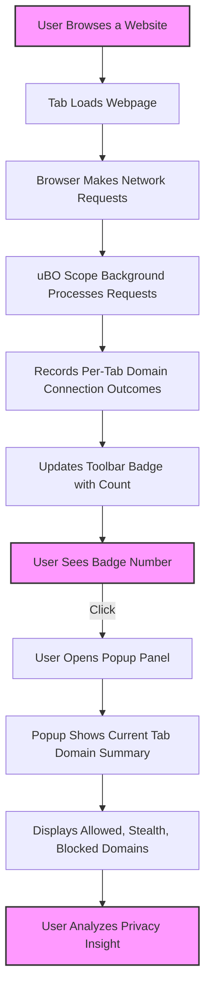

# Interpreting the Badge and Popup Panel

## 1. Overview
This guide helps you understand how to read and interpret the uBO Scope toolbar badge and the popup panel. These UI elements provide a clear view of your browser's third-party remote connections per active tab, broken down by connection outcomes and domains. You'll learn how to use the badge as a quick privacy indicator, explore per-tab detailed reporting in the popup, and gain insights on spotting third-party servers and privacy-relevant patterns at a glance.

---

## 2. What the Toolbar Badge Number Means

- **Badge Number Purpose:** The badge number on the uBO Scope icon represents the count of _distinct third-party domains_ that your browser connected to on the active tab.
- **Third-Party Domain Explanation:** These domains are considered "third-party" because they differ from the main website's registered domain you're currently visiting.
- **Counting Logic:** Only unique domains with at least one allowed (non-blocked) connection are counted.

### Practical Example:
Imagine visiting `example.com`: if uBO Scope detects connections to `cdn.example.com` (same domain), and distinct third-party domains like `tracker.com` and `ads.net`, the badge will show `2` reflecting the two distinct third-party domains.

### Success Indicator:
A lower badge count is better, implying fewer distinct third-party connections occurred unless you intentionally expect external resources (like large CDN providers).

<Check>
If the badge is empty or zero, it means no distinct third-party connections were detected for the active tab.
</Check>

---

## 3. Understanding Per-Tab Reporting

uBO Scope performs connection tracking _per active browser tab_, providing isolated network request data for each tab to help you analyze connections on a site-by-site basis.

- The badge updates as you switch tabs, showing distinct third-party connection counts relevant to the current page.
- The popup panel shows detailed breakdowns for the active tab only — helping you correlate counts with actual domains.

<Info>
This approach prevents mixing data from multiple sites or tabs, giving you accuracy and clarity for your privacy audits.
</Info>

---

## 4. Using the Popup Panel

The popup offers a comprehensive view of domains contacted by the current tab, divided by their connection outcome categories:

### 4.1 Panel Structure

- **Header with Hostname and Domain:** Displays the main hostname and the base registered domain of the current tab.
- **Summary:** Shows the total number of distinct domains connected.
- **Outcome Sections:** Three distinct groupings:

  - **Not Blocked (Allowed):** Domains for which connections were successful and permitted.
  - **Stealth-Blocked:** Domains with connections redirected stealthily (e.g., silently redirected without notifying the site).
  - **Blocked:** Domains where connection requests failed due to blocking.

  Each section lists domains contacted in that category with a count badge representing how many times connections were observed.

### 4.2 How to Read the Panel

- Examine the **Allowed** domain list to see which third-parties successfully received your requests.
- Look at **Stealth-Blocked** to identify domains silently redirected or masked, signaling subtle privacy protections.
- Check **Blocked** to see domains explicitly blocked by content blockers or network policies.

<Note>
If a section has no domains, it will be hidden automatically to keep the panel clean.
</Note>

---

## 5. Identifying Third-Party Remote Servers

### What Counts as a Third-Party Remote Server?

- Any domain that is different from the main tab's base domain (determined by public suffix analysis) is treated as third-party.
- uBO Scope uses the Public Suffix List algorithm to accurately extract base domains and distinguish subdomains.
- Example: On `news.example.co.uk`, connections to `cdn.example.co.uk` are first-party (same base domain), but connections to `ads.tracker.com` are third-party.

<Warning>
Do not mistake subdomains of the main domain for third-party connections; only distinct registered domains are counted.
</Warning>

---

## 6. Privacy Insights at a Glance

- **Badge Color and Count:** A visible number immediately signals the presence of third-party connections.
- **Domain Counts in Popup:** Quickly assess if connections are mostly allowed, stealth-blocked, or blocked, helping you understand the effectiveness of your content blockers.
- **Domain Frequency:** Higher counts next to a domain indicate repeated connections, potentially pointing to trackers or aggressive third parties.

<Info>
Tracking how many distinct domains connect during browsing is more insightful for privacy than raw block counts, especially since stealth blocking and redirects can silently protect you.
</Info>

### Best Practices

- Regularly monitor the badge when visiting sensitive sites to ensure minimum third-party exposure.
- Use the popup breakdown to identify unexpected domains and adjust filters or browser settings accordingly.

---

## 7. Step-by-Step: Interpreting Your Badge and Popup

<Steps>
  <Step title="Step 1: Observe the Toolbar Badge">
    Look at the uBO Scope icon while browsing. A number here tells how many unique, third-party domains were contacted on the current tab.
  </Step>
  <Step title="Step 2: Open the Popup">
    Click the uBO Scope icon to open the popup panel and view a detailed breakdown.
  </Step>
  <Step title="Step 3: Identify the Current Tab’s Hostname and Domain">
    At the top of the popup, check the displayed hostname and base domain, confirming which site’s connections are analyzed.
  </Step>
  <Step title="Step 4: Review the Summary">
    See how many unique domains were contacted overall under "domains connected".
  </Step>
  <Step title="Step 5: Explore Connection Outcomes">
    Check the Allowed (not blocked), Stealth-Blocked, and Blocked sections. Use the domain lists and counts to focus on potentially privacy-impacting third parties.
  </Step>
  <Step title="Step 6: Use Insights for Action">
    Based on the observed domains, consider tightening filters or resetting browser/privacy settings if unexpected or numerous third-party connections appear.
  </Step>
</Steps>

---

## 8. Troubleshooting Common Issues

<AccordionGroup title="Troubleshooting Badge and Popup Interpretation">
  <Accordion title='Badge Number is Always Empty or Missing'>
    - Ensure you have active tabs with network activity. Pages that do not load external resources may show zero.
    - Confirm that uBO Scope has proper permissions and is enabled.
    - Try reloading the tab or restarting the browser.
  </Accordion>
  <Accordion title='Popup Shows "NO DATA" or Empty Lists'>
    - The tab may not have any recorded network connections yet.
    - Network requests may not be captured if the website or browser uses non-standard connections.
    - Check that uBO Scope is not disabled or blocked by other extensions.
  </Accordion>
  <Accordion title="Confusing Domain Names or Unicode Issues">
    - uBO Scope converts domain names to Unicode for readability. If a domain appears unfamiliar, it may be an internationalized domain name (IDN).
    - Refer to browser developer tools or online CDN/domain lookup tools for more info.
  </Accordion>
</AccordionGroup>

---

## 9. Additional Tips and Best Practices

- **Refresh the popup after some browsing activity:** Network connections update dynamically; opening the popup too soon might show incomplete data.
- **Use consistently across different tabs:** Each tab will have unique domain connections; switching helps compare privacy exposure across sites.
- **Combine insights with your content blocker settings:** Use uBO Scope data to tune filters and whitelist or block problematic domains.

---

## 10. Next Steps & Related Guides

- Read the [Monitoring Third-Party Network Connections Guide](https://example.com/guides/getting-started-usage/monitoring-network-connections) to understand overall monitoring.
- Visit [Making Your First Run](https://example.com/getting-started/first-steps-and-validation/making-your-first-run) for onboarding help with installing and using uBO Scope initially.
- Explore [Debunking Block Count Myths](https://example.com/guides/use-cases-best-practices/debunking-block-count-myths) to understand how to interpret block counts effectively.
- For advanced users, consult [How uBO Scope Works](https://example.com/overview/core-concepts-arch/how-it-works) to dive deeper into technical concepts.

---

## 11. Reference Diagram of User Interaction with Badge and Popup

---

## 12. Sources and Further Reading
- [uBO Scope GitHub repository](https://github.com/gorhill/uBO-Scope)
- [Public Suffix List](https://publicsuffix.org/)
- uBO Scope [Getting Started Guide](https://example.com/guides/getting-started-usage/installing-activating-extension)