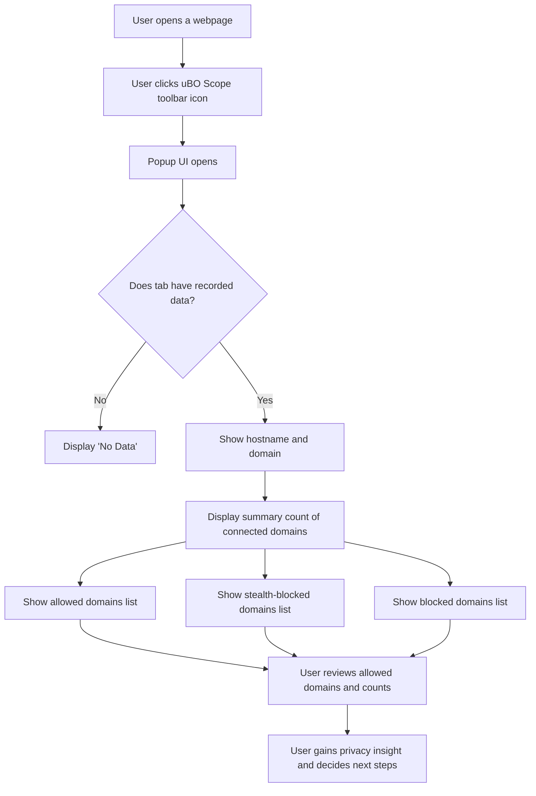

# Monitoring Network Connections on Webpages with uBO Scope

## Overview

This guide walks you through using the **uBO Scope** popup interface to monitor all network connection attempts made by the currently active browser tab. You will learn how to view detailed information about allowed, stealth-blocked, and blocked third-party domains, understand the significance of badge counts on the toolbar icon, and gain practical insights to assess your web browsing privacy exposure.

---

## 1. Understanding the Monitoring Interface

### What This Guide Helps You Accomplish

- Visualize every distinct remote domain a webpage attempts to connect to.
- Differentiate between connections that were allowed, stealth-blocked, or outright blocked.
- Interpret connection counts to make informed privacy assessments.

### Expected Outcome

After following this guide, you will be confident in interpreting the uBO Scope popup, allowing you to:

- Identify third-party domains interacting with a page.
- Understand connection outcomes and their privacy implications.
- Use the toolbar badge as a quick privacy indicator.

### Prerequisites

- Have uBO Scope installed and active in your browser.
- Be viewing a webpage in a tab where network requests occur.

### Time Commitment

Approximately 5 minutes to learn interface elements and interpret connection data.

---

## 2. Exploring the uBO Scope Popup UI

The uBO Scope popup is accessible by clicking the extension's toolbar icon. It provides a structured breakdown of all remote server connections for the current tab.

### Key Sections of the Popup

- **Tab Hostname Header**
  - Displays the full hostname and the base domain of the active tab’s webpage.
  - Example: For `sub.example.com`, the popup will show the subdomain and the domain separately.

- **Summary Section**
  - Shows the count of distinct domains the page attempted to connect with (all third-party connections).

- **Connection Outcome Categories**
  - `Not blocked`: Domains for which connections were allowed (resources successfully loaded).
  - `Stealth-blocked`: Domains where connections were redirected stealthily, minimizing network visibility.
  - `Blocked`: Domains where connection attempts were outright blocked from loading.

Each category lists domains along with a numeric badge indicating the number of connection attempts recorded.

### How Domains and Counts Are Organized

- Domains are listed in alphabetical order for clarity.
- The number next to each domain is the total count of connection attempts to that specific domain observed in the session.
- The total count in the summary reflects the number of unique allowed domains.

### Practical Example

When visiting a typical news website, the popup may show:

- **Not blocked**: `cdn.examplecdn.com`, `analytics.tracker.com`
- **Stealth-blocked**: `ads.network.com`
- **Blocked**: `malicious.site.com`

This breakdown tells you exactly which remote servers were contacted or blocked, helping you assess exposure at a glance.

---

## 3. Step-by-Step Instructions to Monitor Connections

<Steps>
<Step title="Open the Browser Tab to Monitor">
Open any webpage in your browser where you want to observe network connections.
</Step>
<Step title="Click the uBO Scope Toolbar Icon">
Locate the uBO Scope icon in your browser's toolbar and click it.
This opens the popup UI displaying connection details for the active tab.
</Step>
<Step title="View Tab Hostname and Domain">
At the top of the popup, verify the displayed hostname matches your current tab.
It shows the subdomain and primary domain separately for easy identification.
</Step>
<Step title="Analyze the Domain Counts in Each Category">
Review each section labelled 'not blocked', 'stealth-blocked', and 'blocked'.
Each domain is listed alphabetically with its connection attempt count shown in a badge.
</Step>
<Step title="Interpret the Summary Badge">
Observe the total count of unique allowed domains at the summary section.
Fewer allowed domains typically mean less third-party exposure.
</Step>
</Steps>

<Note>
The interface updates dynamically to reflect ongoing network activity as you browse. Reloading or navigating to new pages refreshes the recorded data.
</Note>

---

## 4. Tips, Best Practices, and Common Pitfalls

### Tips for Effective Use

- **Regularly check the popup while browsing** to see how different sites behave regarding third-party connections.
- Use the **count badges** to quickly identify when a site connects to many different third-party domains.
- Remember that **not all third-party connections are malicious**; many are legitimate content delivery networks or essential services.

### Best Practices

- Combine insights from this popup with your knowledge of domain reputations to evaluate site privacy.
- Use private browsing windows or browser profiles to isolate connection behavior during testing.
- When you see unexpected domains, consider further research or tightening your content blocking settings.

### Common Pitfalls

- **Misinterpreting counts**: A high count of allowed connections indicates more third-party exposure, not necessarily good or bad without context.
- **Ignoring stealth-blocked domains**: These are connections redirected or handled subtly by your content blocker, impacting your privacy differently.
- **Assuming all allowed domains are safe**: Some allowed connections may still be privacy-invasive.

---

## 5. Troubleshooting

### No Data Appears in Popup

- Confirm the extension is enabled and active in the current browser.
- Reload or navigate to a different page to trigger new network requests.
- Verify the tab is not a browser internal page (those are often not monitored).

### Badge Count Stays at Zero

- Ensure network requests are actually happening on the current tab.
- Check that there are no conflicting content blockers suppressing the extension's data.

### Domains Not Showing Up as Expected

- Some network requests may occur outside the `webRequest` API's scope and thus not be captured.
- Certain privacy or security browser settings may hide requests.

---

## 6. Additional Resources

- [What is uBO Scope?](../overview/introduction-core-value/what-is-ubo-scope) — Understand the core purpose and benefits.
- [Interpreting the Toolbar Badge & Popup Categories](./interpreting-badge-and-popup) — Dive deeper into UI meanings.
- [Public Suffix List](https://publicsuffix.org/) — Learn how domain boundaries are defined for accurate domain extraction.
- Extension Repository: [uBO Scope GitHub](https://github.com/gorhill/uBO-Scope)

---

## 7. Summary

The uBO Scope popup is your window into the network activity of the active tab, breaking down remote server connections with clarity. By exploring the allowed, stealth-blocked, and blocked domains lists and their counts, you gain actionable insights into your browsing privacy footprint. Use this data to understand and control your exposure to third-party servers while browsing.

---

<CardGroup cols={2}>
<Card title="uBO Scope Popup Anatomy">
- Tab Hostname and domain display
- Summary count of connected domains
- Sections for 'allowed', 'stealth-blocked', and 'blocked' domains
- Count badges for connection attempts
</Card>
<Card title="Privacy Insight Best Practices">
- Regular monitoring across sites
- Research unexpected domains
- Combine with content blocking controls
- Understand stealth-block implications
</Card>
</CardGroup>

---

## 8. How It Works Under the Hood (Conceptual, User-Focused)

The extension listens to your browser’s network requests and classifies connections by outcome:

- **Allowed:** Requests succeeded; content loaded from those domains.
- **Stealth-blocked:** Connection redirected silently to protect privacy.
- **Blocked:** Requests failed due to blocking.

The popup summarizes these results per tab, showing domain names distilled using the public suffix list, so you see the real controlling domain rather than subdomains.

<Info>
This knowledge empowers you to detect hidden or unexpected third-party connections, better protecting your digital privacy.
</Info>

---

## 9. Example Scenario

You visit a news site that loads content, ads, widgets, and tracking scripts. By opening the uBO Scope popup, you see:

- 4 allowed domains, mostly content CDNs.
- 2 stealth-blocked ad-serving domains.
- 1 blocked tracking domain.

This informs you that while the page appears clean, some tracking attempts are happening stealthily or blocked. You decide if further action is needed based on these facts.

---

## 10. Visual Diagram: User Interaction Flow

---

## 11. Next Steps

- Consult the guide on [Interpreting the Toolbar Badge & Popup Categories](./interpreting-badge-and-popup) for deeper analysis.
- Review [Getting Your First Results](../../getting-started/first-use-validation/getting-your-first-results) to confirm your setup.
- Explore [Troubleshooting Common Setup Issues](../../getting-started/first-use-validation/troubleshooting-common-setup-issues) to resolve any problems.

---

## 12. References

- Official uBO Scope Repository: [https://github.com/gorhill/uBO-Scope](https://github.com/gorhill/uBO-Scope)
- Public Suffix List: [https://publicsuffix.org/list/](https://publicsuffix.org/list/)
- Browser Extension APIs for Network Requests

---