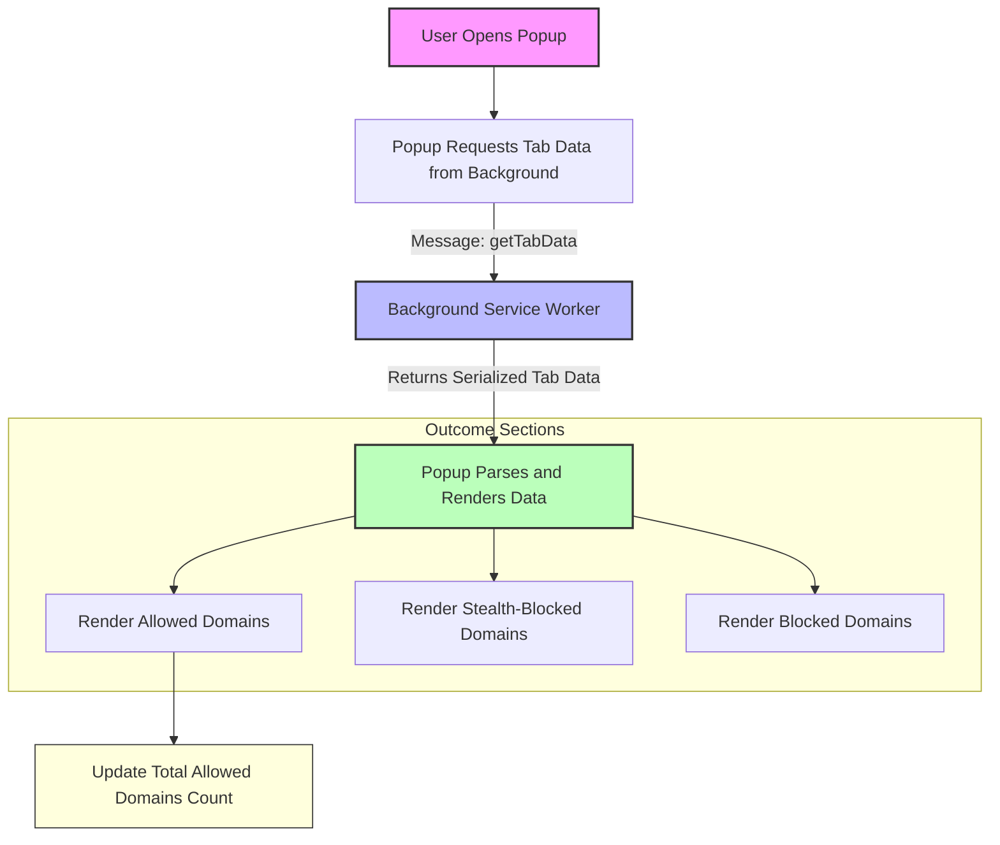

# Viewing Domain Connections with the Popup

Discover how to effectively use the uBO Scope extension's popup interface to view detailed information about the domains your browser connects to on the current tab. This guide walks you through opening the popup, understanding the breakdown of allowed, stealth-blocked, and blocked domains, and how domain data is organized for clear, actionable privacy insights.

---

## 1. What You Will Achieve

- Open the uBO Scope popup to inspect domain connection data for your active browser tab.
- Understand how domains are categorized into allowed, stealth-blocked, and blocked.
- Navigate the domain lists and interpret the counts displayed.
- Gain practical insight into your browser's network activity for enhanced privacy awareness.

---

## 2. Prerequisites

Ensure the following before you begin:

- uBO Scope is installed and enabled in your browser.
- Your browser meets the minimum version requirements (Chrome 122+, Firefox 128+, Safari 18.5+).
- The extension is actively monitoring network requests (see related quick validation guide).
- You have a web page open in an active tab with network connections to observe.

---

## 3. Opening the Popup and Understanding the Interface

### Step 1: Access the Popup

1. Click the uBO Scope toolbar icon in your browser.
2. The popup opens displaying connection information related to your current active tab.

### Step 2: Overview of the Popup Header

- The top header shows the full hostname of the main page loaded in the tab.
- If the main hostname contains a detailed subdomain, it’s visually separated for clarity.
- If no data is available (e.g., tab not monitored or no network activity yet), you'll see **NO DATA**.

### Step 3: Summary Section

- Displays the count of distinct domains your browser has connected to on this tab.
- This count reflects all allowed domains combined from the allowed outcomes section.

### Step 4: Domain Outcome Sections

The popup divides domains into three clearly labeled sections:

- **Not Blocked (Allowed):** Domains your browser successfully connected to.
- **Stealth-Blocked:** Domains detected as blocked transparently by stealth blocking techniques.
- **Blocked:** Domains where requests were explicitly blocked by your content blocker.

Each section lists domains alphabetically, with a count badge indicating how many network requests were made to each domain.

### Step 5: Reading the Domain Rows

- Each domain row shows the domain name and the badge count.
- Badge count represents the number of distinct hostnames or requests grouped under that domain.
- Domains are decoded from punycode to human-readable format where applicable.

---

## 4. Step-by-Step Walkthrough

<Steps>
<Step title="Open the uBO Scope Popup">
Click the uBO Scope icon in your browser toolbar to open the popup for the active tab.
</Step>
<Step title="Identify the Main Hostname">
Review the header at the top—this shows the exact hostname of the current page.
If it contains subdomains, the parts are visually distinguished to help you understand the domain's structure.
</Step>
<Step title="Check the Total Domains Connected">
Look below the header to the summary section.
It shows how many distinct domains your browser connected to on this tab under the 'domains connected' label.
</Step>
<Step title="Explore the Not Blocked Domains">
Browse the first outcome section titled 'not blocked'.
Here, you'll find domains your browser connected to successfully.
This is crucial as it reflects actual third-party network loads that are active.
</Step>
<Step title="Review Stealth-Blocked Domains">
Next, examine the 'stealth-blocked' section.
Domains here represent those blocked silently using stealth techniques by your content blocker.
These may not always be obvious on page behavior but affect privacy.
</Step>
<Step title="Inspect Blocked Domains">
Finally, look at the 'blocked' section.
It lists domains where network requests were explicitly blocked by your blocker.
This helps identify what third-party resources were prevented from loading.
</Step>
</Steps>

---

## 5. Practical Insights and Tips

- **Why This Matters:** Seeing the domains broken down by outcome type helps you understand which third parties are active, stealth-blocked, or fully blocked on your current page.
- **Domain Grouping:** uBO Scope aggregates requests under domains, so subdomains count together helping you assess overall third-party exposure.
- **Unicode Support:** Domains encoded with punycode are translated for easy reading.
- **Monitoring Updates:** The popup updates as network activity happens; refresh or reopen popup for the latest data.

---

## 6. Common User Scenarios

### Scenario 1: Verifying Blocker Effectiveness

Use the popup to confirm that unwanted third-party domains are appearing under blocked or stealth-blocked sections. A low number of allowed third-party domains generally indicates good privacy protection.

### Scenario 2: Detecting Unexpected Connections

If you see unknown domains under the allowed section, you might want to investigate these further to ensure they're trustworthy.

### Scenario 3: Understanding Tab-Specific Activity

Each popup view is scoped to the active tab, making it easy to compare domain connections on different sites.

---

## 7. Troubleshooting Common Issues

<AccordionGroup title="Common Popup Issues">
<Accordion title="Popup Shows No Data or NO DATA Message">
- Confirm that uBO Scope is installed and properly enabled.
- Ensure you have a webpage loaded with network activity.
- Reload the tab or open the popup after browsing a fresh page to trigger monitoring.
- Check for any extension permission issues or conflicts.
</Accordion>
<Accordion title="Domain Lists Are Empty Despite Network Activity">
- Verify if the extension has permissions to access the active tab and webRequest data.
- The popup only shows data for the active tab; switch tabs if needed.
- Allow a few seconds for the extension to process connection data before reopening popup.
</Accordion>
<Accordion title="Counts Appear Incorrect or Not Updating">
- The popup refreshes on opening; you must open it anew to get latest data.
- Network requests might not be observable if blocked before reaching webRequest API.
- If using private browsing or certain browsers, some network events may be limited.
</Accordion>
</AccordionGroup>

---

## 8. Next Steps & Related Guides

- Visit the [uBO Scope Popup Overview](/overview/quickstart-feature-tour/popup-overview) for a deeper understanding of UI elements.
- Learn to interpret badge counts in the [Interpreting the Toolbar Badge Count](/overview/quickstart-feature-tour/interpreting-badge-count) guide.
- Explore [Analyzing Stealth and Blocked Domains](/guides/advanced-use-analysis/analyzing-stealth-and-blocked-domains) to master advanced privacy analysis.
- If you encounter issues, consult [Troubleshooting Common Setup Issues](/getting-started/usage-validation/common-issues-troubleshooting).

---

## Appendix: Example Popup Layout

The popup visually organizes data as follows:

```
+--------------------------------------------------+
| [Subdomain part] [Main domain]                    |
|                                                  |
| domains connected: <number>                       |
|                                                  |
| not blocked                                       |
|  - domain1.com   [count]                          |
|  - domain2.net   [count]                          |
|                                                  |
| stealth-blocked                                  |
|  - domain3.org   [count]                          |
|                                                  |
| blocked                                          |
|  - domain4.co   [count]                           |
+--------------------------------------------------+
```

Every section lists domains with a badge showing how many requests or hostnames were seen.

---

# Summary

Viewing Domain Connections with the Popup empowers users to see exactly which remote domains their browser connects to on a per-tab basis, classified by connection outcome. This knowledge supports stronger privacy decisions and troubleshooting network activity.

---

## Sources

- The popup interface is implemented in `popup.html` and powered by `popup.js`.
- Data structure and domain classification logic derive from `background.js` using the Public Suffix List to group hostnames.
- Domains are rendered with human readability in mind, leveraging punycode decoding.


---

## Additional Resources

- [Popup Overview](https://example.com/overview/quickstart-feature-tour/popup-overview)
- [Badge Count Interpretation](https://example.com/overview/quickstart-feature-tour/interpreting-badge-count)
- [Analyzing Stealth and Blocked Domains](https://example.com/guides/advanced-use-analysis/analyzing-stealth-and-blocked-domains)
- [Troubleshooting Setup Issues](https://example.com/getting-started/usage-validation/common-issues-troubleshooting)


---

# Visual Diagram of Popup Data Flow



This diagram shows the key actions when opening the popup: messaging the background to get the tab's domain connection data, then rendering the categorized lists along with the summary count.

---