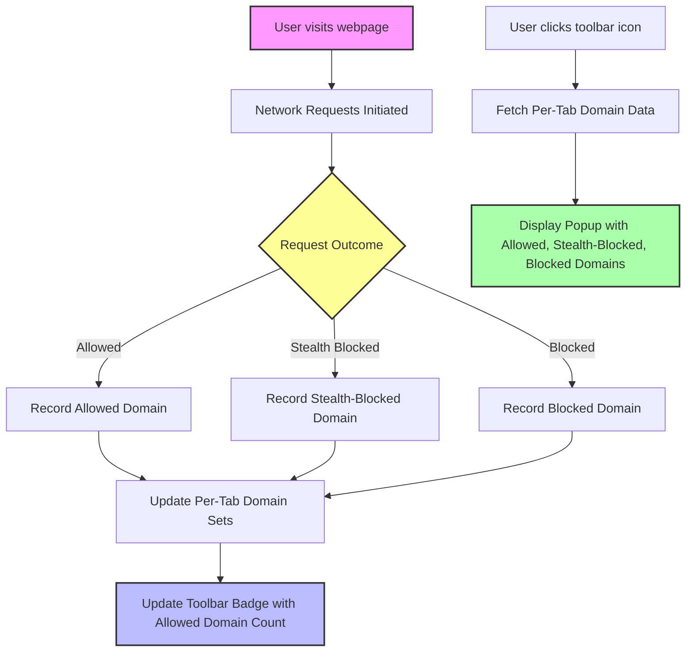

# Understanding the Toolbar Badge & Popup

## Overview
This guide walks you through how uBO Scope’s toolbar badge and popup communicate the number and categorization of third-party remote server connections initiated by the webpage open in your current browser tab. You'll learn to interpret the badge count, distinguish between allowed, stealth-blocked, and blocked servers, and understand what each statistic means for your browsing privacy.

---

## What You Will Achieve
- Understand how the badge count on uBO Scope's toolbar icon reflects unique third-party connections.
- Interpret the detailed statistics displayed in the extension popup for the active tab.
- Confidently differentiate allowed, stealth-blocked, and blocked third-party domains.

---

## How the Toolbar Badge Works

The badge number you see on uBO Scope’s toolbar icon represents the count of unique third-party domains from which network connections have been **allowed** in the current browser tab. This is a count of *distinct domains* — meaning no matter how many requests are made to the same domain, it increments the count only once.

### Why This Count Matters
This count measures your browsing exposure to third-party servers. A **lower badge count indicates fewer third-party connections, which generally equates to better privacy.**

> **Important:** Not all third-party connections are undesirable — some, such as common Content Delivery Networks (CDNs), may be essential and legitimate.

<u>Example Scenario:</u>
- You load a website.
- The badge shows `5`.
- This means five distinct third-party domains had allowed connections.

### Updating the Badge
The extension continuously monitors network activity in real time. As new allowed connections to distinct third-party domains occur, the badge count updates automatically for your active tab.

---

## Interpreting the Popup Data

Clicking the uBO Scope toolbar icon opens the popup panel providing a detailed breakdown of third-party domains involved in the current tab's network activity.

### Popup Sections
The popup divides domains into three categories, each in its own section:

1. **Not Blocked (Allowed)**
2. **Stealth-Blocked**
3. **Blocked**

Each section lists domains with a count showing how many requests were made to them.

### Understanding the Categories
- **Not Blocked (Allowed):** These domains allowed outbound connections successfully. The badge count corresponds directly with the number of such distinct domains.
- **Stealth-Blocked:** Domains for which connection attempts were redirected behind the scenes, without explicit blocking errors. These requests do not show as blocked, but subtly prevented.
- **Blocked:** Domains where connection attempts failed with explicit errors—typically blocked by content blockers or network rules.

### Popup View Example
```plaintext
[origins.example.com]

Domains connected: 7

Not Blocked
----------------
cdn.trusted.com       3
analytics.good.com    2

Stealth-Blocked
----------------
adserver.sneaky.com   1

Blocked
----------------
adtracker.evil.com    4
```

This layout allows easy visual assessment to see which third-party domains your browsing session is interacting with and their connection outcomes.

### Domain & Hostname Details
The popup shows domains extracted using the Public Suffix List, stripping down hostnames to their most significant sites for clarity. This enables you to see distinct third-party entities instead of every subdomain.

---

## Step-by-Step: Using the Badge and Popup

<Steps>
<Step title="Locate the uBO Scope Toolbar Icon">
Find the uBO Scope icon in your browser toolbar. It displays a badge number if there are allowed third-party connections in the active tab.
</Step>
<Step title="Interpret the Badge Number">
Understand the badge number as the count of distinct allowed third-party domains connected to by the page.
- No badge number means zero allowed third-party connections detected.
</Step>
<Step title="Open the Popup for Details">
Click the toolbar icon to open the popup.
- The popup shows detailed statistics and domains grouped by connection outcome.
</Step>
<Step title="Review the 'Not Blocked' Section">
This section lists domains with allowed connections, along with how many requests were made to each.
</Step>
<Step title="Check the 'Stealth-Blocked' and 'Blocked' Sections">
See which domains had requests stealth-blocked or explicitly blocked. These entries explain hidden or failed network attempts.
</Step>
</Steps>

<Check>
Verify that the badge number matches the count of distinct domains in the "Not Blocked" section. Discrepancies indicate either stale data or network activity in progress.
</Check>

---

## Practical Tips & Best Practices

- **Understand the badge as your privacy barometer.** A higher allowed count increases your exposure to third parties.
- **Use the popup to investigate suspicious domains.** Stealth-blocked or blocked domains might indicate trackers or unwanted connections.
- **Remember that subdomains are grouped under their main domain.** This simplifies analysis and avoids double counting.
- **Refresh the tab or navigate to a new page** to reset and accurately observe connection changes.

---

## Common Pitfalls & Troubleshooting

<AccordionGroup title="Troubleshooting Badge and Popup Issues">
<Accordion title="Badge Does Not Show a Number">
Possible causes:
- There are no allowed third-party connections in the current tab.
- Extension permissions are not correctly granted or are restricted.

Resolution:
- Ensure uBO Scope is enabled and has necessary permissions.
- Reload the tab or open a different tab and check again.
- Consult installation and troubleshooting guides if the issue persists.
</Accordion>
<Accordion title="Popup Shows 'NO DATA' or Empty Sections">
Possible causes:
- The page has not triggered connections yet.
- The extension failed to gather tab-specific data.

Resolution:
- Wait a few seconds for data to populate.
- Reload the tab to trigger new requests.
- Close and reopen the popup.
- If persistent, check extension logs or consult troubleshooting documentation.
</Accordion>
<Accordion title="Mismatch Between Badge and Popup Numbers">
If badge count and popup displayed allowed domains differ:
- The badge reflects only allowed domains while the popup shows all categories.
- Network activity might be still processing.

Resolution:
- Reload or switch tabs to refresh data.
- Confirm network activity is occurring.
</Accordion>
</AccordionGroup>

---

## Related Documentation & Next Steps

- For installation and setup, see [Installing uBO Scope](../../getting-started/installation-and-setup/installation).
- To understand the connection monitoring workflow, read [How uBO Scope Monitors Connections](../../getting-started/first-steps-usage-validation/how-it-works).
- For quick usage validation, check [Quick Validation: Is It Working?](../../getting-started/first-steps-usage-validation/quick-verification).
- Explore deeper insights with [Investigating Third-Party Requests in Real Time](../../guides/exploring-network-insight-workflows/investigating-third-party-requests).

---

## Summary
By understanding the badge and popup, you gain precise and practical insights into the third-party network connections your browser tab initiates. This empowers you to monitor your exposure to external domains, verify blocking effectiveness, and make informed privacy decisions.

<Info>
Remember, the toolbar badge represents the unique count of allowed third-party domains only, while the popup displays a full breakdown including stealth-blocked and blocked domains.
</Info>

---

## Visual Workflow of Badge Update and Popup Display



This flow illustrates how network events are processed, the badge updates with the allowed domain count, and the popup presents the detailed breakdown when opened.

---

## Additional Resources

- [uBO Scope README](https://github.com/gorhill/uBO-Scope#readme) for overall purpose and usage
- [Core Concepts and Terminology](/overview/intro-core-concepts/core-terminology) to deepen understanding of terms like "third-party server" and "stealth blocking"
- [Troubleshooting Installation & First Run Issues](/getting-started/first-steps-usage-validation/troubleshooting) for resolving common UI or data issues

---

This guide bridges your first understanding to expert use, putting the power of network connection transparency right at your fingertips.