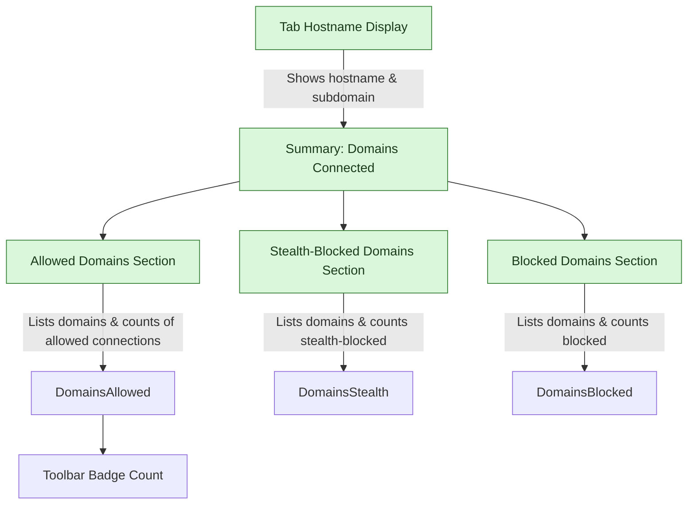

# Navigating the Popup Interface

## Workflow Overview

### Task Description
This guide helps you understand how to use the uBO Scope popup interface. You'll learn how to interpret the information summarizing domain connections for the active browser tab, understand badge meanings, and gain insights into allowed, blocked, and stealth connections.

### Prerequisites
- uBO Scope extension installed and active in your browser (supported versions: Chromium 122+, Firefox 128+, Safari 18.5+).
- Active tab loaded with a webpage where network connections are tracked.
- Basic understanding of network requests and domains (refer to the [Core Concepts and Terminology](https://example.com/overview/introduction-core-concepts/core-concepts-terminology) page for details).

### Expected Outcome
You will confidently navigate the popup panel, interpret domain connection data by outcome categories, and understand the significance of the toolbar badge count.

### Time Estimate
5-10 minutes

### Difficulty Level
Beginner

---

## Step-by-Step Instructions

### Step 1: Open the Popup Panel
- Click the uBO Scope extension icon near your browser’s address bar.
- The popup panel will appear, displaying connection details for the current tab.

**Expected Result:**
- The panel shows the hostname of the active tab at the top.
- Sections listing domains categorized by their connection status will be visible.

---

### Step 2: Understand the Tab Hostname Display
- The top heading displays the current tab’s hostname with two parts:
  - Left segment (if present): subdomain portion (e.g., `www.`)
  - Right segment: main domain portion (e.g., `example.com`)

**Example:** For `www.example.com`, the panel shows `www.` on the left and `example.com` on the right.

**Why this matters:**
- The domain displayed helps you identify the context of connections made from the tab.

---

### Step 3: Interpret the Summary Count
- Just below the hostname, the "domains connected" summary shows the number of distinct third-party domains contacted in this tab.
- This number represents how many unique external domains the page attempted or succeeded in connecting to.

**Expected Result:**
- A numeric count indicating the current tab’s third-party domain connections.

---

### Step 4: Review the Outcome Sections
The main panel has three distinct sections, each representing connection outcomes:

- **Not Blocked:** Domains that the browser successfully connected to.
- **Stealth-Blocked:** Domains that the extension stealthily blocked (connections attempted but intercepted).
- **Blocked:** Domains where connection attempts were explicitly blocked or failed.

Within each section, you will see:
- A list of domains.
- A count badge next to each domain indicating the number of requests involving that domain.

---

### Step 5: Analyze Domains in Each Outcome Section
- **Not Blocked:** These are domains from which resources or data were fetched successfully. This indicates allowed third-party connections.
- **Stealth-Blocked:** These domains attempted connections, but the extension silently prevented them without recording a traditional block event. This ensures better stealth against webpage detection.
- **Blocked:** These domains had their connection attempts outright blocked, typically by content blocking rules or network errors.

**Tip:** A lower count in the "Not Blocked" section generally indicates fewer third-party connections, which is better for privacy.

---

### Step 6: Scroll Through Domains and Identify Patterns
- Use the scrollable domain lists to examine specific third-party connections.
- Look for domains that seem unusual or unexpected, which might represent tracking or ad servers.

---

### Step 7: Interpreting the Badge Count (Complementary)
- The number displayed on the toolbar icon badge reflects the count of unique third-party domains that were allowed connections in the current tab.
- This badge updates dynamically as the tab loads or network activity continues.

**Important:** The badge count is not a block count; it represents allowed connections.


## Examples & Use Scenarios

### Example 1: Viewing a News Website
Suppose you are on `example-news.com`. Opening the popup shows:
- Hostname: `www.example-news.com`
- Summary: 12 domains connected
- Not Blocked: includes `cdn.example.com`, `ads.externalsite.com`, `trackers.analytics.com`
- Stealth-Blocked: includes `stealthblocked.domain.com`
- Blocked: includes `blocked.badads.com`

**Interpretation:**
- The site made 12 distinct third-party connections.
- Some tracking domains were stealth-blocked.
- The user can decide if these being blocked or allowed matches their privacy expectations.

### Example 2: Debugging a Web App Issue
If a website is misbehaving, the user can open the popup to check if critical domains are blocked inadvertently.
- Seeing a domain essential to the web app in the Blocked section can indicate why content is not loading.


## Troubleshooting & Tips

<AccordionGroup title="Troubleshooting & Tips">  
<Accordion title="Popup Shows No Data or 'NO DATA' Message">    
If the popup shows 'NO DATA' or an empty hostname:
- Make sure you have an active tab with a web page fully loaded.
- Network requests must have been made since the tab was opened.
- Try refreshing the page to trigger network activity.
- Check if uBO Scope is enabled and has necessary permissions.
</Accordion>  
<Accordion title="Badge Count Does Not Update">    
- Reload the active tab to refresh network request tracking.
- Ensure your browser is supported and up to date.
- Restart the browser if badge count freezes.
- Confirm no conflicting extensions interfere with webRequest API.
</Accordion>  
<Accordion title="Understanding Stealth-Blocked Domains">    
Stealth-blocked domains are connections prevented quietly to avoid detection by websites:
- They might not appear in traditional blocker logs.
- Their presence helps validate your content blocker's stealth features.
- If unexpected domains appear here, consider reviewing your filter lists.
</Accordion>  
<Accordion title="Best Practices for Analyzing Connections">    
- Focus on domains in the "Not Blocked" section to assess real exposure.
- Use the domain counts to identify frequent connections.
- Combine this insight with content blocker filters for effective privacy.
- Regularly review domains for changes in third-party content.
</Accordion>  
</AccordionGroup>


## Next Steps & Related Content

- After mastering the popup interface, explore how to interpret detailed domain connection statistics in [Interpreting Domain Connection Statistics](https://example.com/guides/analyzing-connections-and-practical-scenarios/interpreting-domain-connection-stats).
- Learn to verify your content blocker’s effectiveness with [Verifying Effectiveness of Content Blockers](https://example.com/guides/analyzing-connections-and-practical-scenarios/verifying-content-blocker-effectiveness).
- For onboarding and installation queries, see [Installing uBO Scope in Your Browser](https://example.com/guides/getting-started-with-ubo-scope/installing-ubo-scope) and [First Launch & Extension Activation](https://example.com/getting-started/installation-setup/first-launch-setup).
- For terminology and concepts, refer to [Core Concepts and Terminology](https://example.com/overview/introduction-core-concepts/core-concepts-terminology).

---

## Visual Guide: Popup Interface Layout



This flow demonstrates how you see the active tab domain at the top and how connection outcomes are categorized for user review.


## Summary
You have now learned to open, read, and interpret the uBO Scope popup interface. By leveraging this view, you gain transparent insights into third-party connections initiated by the active tab, categorized by their allowed, stealth-blocked, and blocked status. This knowledge empowers better privacy awareness and informed decisions when managing content blocking configurations.


---

## Code Snippet: Template Example for Domain Row

This snippet shows how each domain row is structured in the popup, including the domain name and the request count badge.

```html
<template id="domainRow">
    <div class="row"><span class="domain">_</span><span class="count badge">_</span></div>
</template>
```

This template is cloned and filled with actual domain data dynamically by the popup script.

---

## Practical Tips
- Refresh the current tab if the popup does not update to reflect recent network activity.
- Use the popup in tandem with the toolbar badge for quick assessment.
- Focus on reducing the "Not Blocked" domains count to enhance privacy.
- Recognize that some stealth-blocked domains are an indicator of sophisticated blocking methods.


