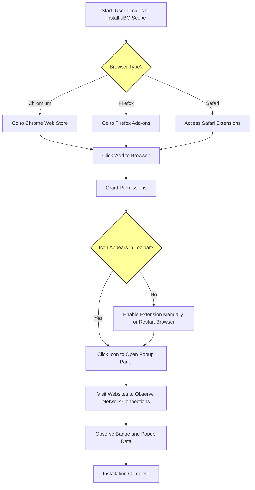

# Installing and Setting Up uBO Scope

uBO Scope is a lightweight browser extension designed to transparently reveal all attempted and successful remote server connections initiated by your browser. This guide walks you through installing the extension on supported browsers and completing the initial setup to start monitoring your network activity immediately.

---

## 1. Overview

### What This Guide Helps You Achieve
- Install uBO Scope safely on supported browsers (Chromium-based browsers, Firefox, Safari).
- Enable the extension and grant necessary permissions.
- Perform initial setup steps to start monitoring remote server connections.

### Prerequisites
- You must have a supported browser installed:
  - **Chromium-based browsers** (Chrome 122+, Edge, Brave, etc.)
  - **Firefox 128+** (desktop and Android)
  - **Safari 18.5+**
- Access to your browser's extension store or side-loading capability.
- Internet connection to download the extension.

### Expected Outcome
By following this guide, you will have uBO Scope installed and enabled, ready to observe all network requests in your browser with real-time badge counts and an interactive popup panel.

### Time Estimate
Approximately 5 minutes.

### Difficulty Level
Beginner to Intermediate.

---

## 2. Installation Steps

### Step 1: Choose Your Browser

Confirm your browser version meets the minimum supported release:

| Browser              | Minimum Version      |
|----------------------|---------------------|
| Chromium-based       | 122.0 or later       |
| Firefox (desktop & Android) | 128.0 or later       |
| Safari               | 18.5 or later        |

If your browser is not up to date, please update before proceeding.

### Step 2: Install From Official Extension Store

Locate uBO Scope in your browser's official extension store using the links below:

- **Chromium (Chrome Web Store):** [uBO Scope on Chrome Web Store](https://chromewebstore.google.com/detail/ubo-scope/bbdpgcaljkaaigfcomhidmneffjjjfgp)
- **Firefox:** [uBO Scope Add-on on Mozilla Add-ons](https://addons.mozilla.org/firefox/addon/ubo-scope/)

For Safari, installation is typically done through the App Store or via developer provisioning compatible with Safari Web Extensions.

### Step 3: Add the Extension

- Click the **Add to Browser** or **Install** button.
- Approve any permission requests presented:
  - Access to active tabs.
  - Access to web requests (`webRequest` permission).
  - Storage permissions for saving session data.

These are essential for uBO Scope to monitor network requests and record its data.

### Step 4: Confirm the Extension is Enabled

- Verify the uBO Scope icon appears in your browser toolbar.
- Ensure the icon does not show a disabled or grayed-out state.

If the icon is missing after installation, enable the extension through your browser's extensions or add-ons management page.

---

## 3. Initial Setup and First Actions

### Step 1: Understand Permissions

Upon activation, uBO Scope asks for access to monitor web requests across all HTTP/HTTPS URLs. This access is mandatory for its core functionality of reporting remote connections.

<Tip>
Granting these permissions ensures the extension can observe requests to all domains, including third-party servers, enabling comprehensive reports.
</Tip>

### Step 2: Access the Popup Panel

- Click the uBO Scope toolbar icon.
- The popup panel will open, showing an overview of network connections for the current active tab, including:
  - Domains contacted without being blocked ("not blocked" section).
  - Stealth-blocked domains.
  - Completely blocked domains.
  - Summary count of distinct third-party domains contacted.

### Step 3: Verify Initial Data Collection

- Visit a trusted website or a site you frequently use.
- Open the uBO Scope popup panel.
- Observe that domain counts and domain lists populate, reflecting active network connections.

### Step 4: Check Badge Behavior

- Notice the badge count on the toolbar icon updates to show the number of distinct third-party remote servers allowed.
- A lower badge count generally indicates fewer third-party connections, reflecting better privacy.

### Step 5: Basic Configuration (If Applicable)

uBO Scope currently does not require or offer configuration settings upon installation. It operates transparently with default settings.

---

## 4. Practical Tips and Best Practices

- Keep uBO Scope enabled alongside your primary content blocker (e.g., uBlock Origin) to gain independent and detailed network visibility.
- Use the popup panel regularly to audit third-party connections on sites you visit.
- Remember that some connections reported as allowed are legitimate services (e.g., content delivery networks).
- Do not judge content blocker performance solely on “block count” badges; instead, focus on the distinct remote connections count.

---

## 5. Troubleshooting Common Installation Issues

<AccordionGroup title="Installation Troubleshooting">
<Accordion title="Extension Icon Not Visible in Toolbar">
- Ensure the extension is enabled in your browser’s extension management page.
- If hidden, pin the extension icon to the toolbar.
- Restart the browser if changes do not reflect immediately.
</Accordion>
<Accordion title="Badge Count Not Updating">
- Wait a few seconds after loading a webpage for the badge to update as network requests are processed asynchronously.
- Verify the extension has permissions to observe web requests.
- Disable conflicting extensions temporarily to check for interference.
</Accordion>
<Accordion title='Popup Panel Shows No Data or "NO DATA" Message'>
- Confirm you have an active tab with network activity.
- Refresh the current tab and reopen the popup panel.
- If persistent, reinstall the extension to reset session data.
</Accordion>
</AccordionGroup>

---

## 6. Next Steps

- Visit the **Understanding the Badge and Popup Panel** documentation to learn how to interpret the detailed network connection reports.
- Explore the **Quick Validation: Is It Working?** guide to confirm everything is running correctly.
- Consider reading **Troubleshooting Installation Issues** if you encounter persistent problems.

For ongoing updates, advanced configurations, and development details, visit the official uBO Scope repository on GitHub: [https://github.com/gorhill/uBO-Scope](https://github.com/gorhill/uBO-Scope).

---

## 7. Additional Resources

| Resource                                         | Link                                                                |
| ------------------------------------------------|-------------------------------------------------------------------- |
| Official GitHub Repository                        | https://github.com/gorhill/uBO-Scope                               |
| Chrome Web Store Installation Link               | https://chromewebstore.google.com/detail/ubo-scope/bbdpgcaljkaaigfcomhidmneffjjjfgp |
| Firefox Add-ons Installation Link                 | https://addons.mozilla.org/firefox/addon/ubo-scope/                |
| Understanding Badge and Reports                   | /getting-started/introduction-overview/understanding-badge-and-reports |
| Troubleshooting Installation Issues               | /getting-started/first-steps-usage/troubleshooting-installation-issues |

---

Thank you for choosing uBO Scope to gain unparalleled transparency into your browser’s network connections.

---

# Diagram: Basic Installation and First Use Workflow

