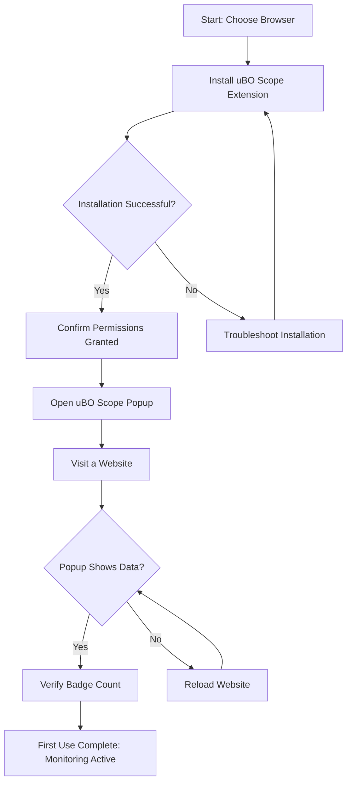

# Installation and First Use Guide for uBO Scope

Welcome to your step-by-step guide to installing and starting with uBO Scope. This guide will walk you through installing the extension on your preferred browser, understanding the permissions it requires, and verifying that it's actively monitoring network connections on the first webpage you visit. You'll also learn how to access the extension popup and interpret the badge on your toolbar.

---

## 1. Workflow Overview

### What This Guide Helps You Accomplish
- Successfully install uBO Scope on Chrome/Chromium, Firefox, or Safari.
- Understand required permissions and why they are needed.
- Activate and open uBO Scope to begin monitoring your browser's network connections.
- Confirm that uBO Scope is working on your browsing sessions by inspecting badge counts and popup data.

### Prerequisites
- A supported browser (see [Supported Browsers & System Requirements](getting-started/requirements-installation/supported-platforms-browsers) for details).
- Internet connection to download and install the extension.
- Basic familiarity with installing browser extensions.

### Expected Outcome
- uBO Scope installed with required permissions granted.
- Toolbar icon visible and interactive.
- Badge count showing live data representing third-party connection counts.
- Functioning popup panel displaying connection details for the active tab.

### Time Estimate
- Approximately 5-10 minutes for installation and validation.

### Difficulty Level
- Beginner-friendly, no advanced technical skills required.

---

## 2. Step-by-Step Installation and First Use

### 2.1 Install uBO Scope on Your Browser

1. **Choose Your Browser:**
   - Chromium-based browsers (Google Chrome, Edge, Brave, etc.)
   - Mozilla Firefox
   - Apple Safari

2. **Install Via Official Store:**
   - Chromium: Visit the [Chrome Web Store](https://chromewebstore.google.com/detail/ubo-scope/bbdpgcaljkaaigfcomhidmneffjjjfgp), click **Add to Chrome**.
   - Firefox: Visit [Firefox Add-ons](https://addons.mozilla.org/firefox/addon/ubo-scope/), click **Add to Firefox**.
   - Safari: Install manually from source or Safari Extensions Gallery, ensuring browser version is 18.5 or higher.

<Tip>
For Safari users, due to platform restrictions, manual installation may require additional steps such as enabling developer mode or loading the extension temporarily.
</Tip>

3. **Verify Installation:**
   - After installation, the uBO Scope icon (a stylized badge) should appear in the browser toolbar.

### 2.2 Understanding uBO Scope Permissions

uBO Scope requires specific permissions to monitor network connections:

- **activeTab:** Allows the extension to access data related to the active browser tab.
- **storage:** Enables the extension to save and retrieve session data locally.
- **webRequest:** Grants the ability to observe and report network requests.
- **host permissions:** Access to all http(s) and websocket URLs to monitor network traffic.

<Note>
These permissions are essential for uBO Scope’s transparent monitoring of third-party connections. No content is blocked or modified; this is a reporting tool.
</Note>

### 2.3 Accessing the uBO Scope Popup

1. Click the uBO Scope icon in your browser toolbar.

2. The popup panel will open showing:
   - The domain of the active tab.
   - Counts of connected domains grouped by **allowed**, **blocked**, and **stealth-blocked**.
   - Detailed lists of domains under each category.

3. The toolbar badge displays the count of distinct third-party remote domains allowed on that tab.

### 2.4 Confirming uBO Scope is Working

1. Open any website you trust and want to analyze.

2. Observe the toolbar badge number — this reflects third-party domains contacted.

3. Click the uBO Scope icon to open the popup and view detailed connection outcomes.

4. Verify that domain names and counts appear correctly under their respective sections.

<Check>
If the popup shows “NO DATA” or is empty, refresh the page or try visiting a different site to generate network requests.
</Check>

### 2.5 Best Practices for a Smooth First Use

- Start with frequently visited, stable websites to see predictable connection patterns.
- Understand that a lower badge number indicates fewer third-party connections — generally better for privacy.
- Refresh pages after installing uBO Scope to generate accurate network data.

---

## 3. Practical Tips and Examples

### Example: Installing on Google Chrome

1. Open Chrome.
2. Go to the [Chrome Web Store uBO Scope page](https://chromewebstore.google.com/detail/ubo-scope/bbdpgcaljkaaigfcomhidmneffjjjfgp).
3. Click **Add to Chrome** and confirm.
4. After install, navigate to a news website.
5. Observe the uBO Scope badge showing a number.
6. Click the icon to see detailed domains connected.

### Example: Interpreting the Popup

- The popup shows three sections:
  - **Allowed:** Domains where network requests succeeded.
  - **Stealth-blocked:** Domains where requests were redirected stealthily.
  - **Blocked:** Domains where requests failed or were explicitly blocked.

Each domain entry includes a count of requests.

---

## 4. Troubleshooting Common Issues

<AccordionGroup title="Common Installation and First Use Issues">
<Accordion title="uBO Scope Icon Not Visible After Installation">
- Ensure the extension is enabled in your browser extensions or add-ons manager.
- Refresh or restart your browser.
- Verify your browser version meets minimum requirements.
- For Safari, ensure the extension is enabled in Safari’s preferences.
</Accordion>
<Accordion title="Popup Displays ‘NO DATA’ or Empty">
- Reload the active webpage to generate new network requests.
- Confirm that uBO Scope has permission to access the active tab.
- Try browsing to different websites known to generate third-party requests.
- Check browser console for errors (advanced users).
</Accordion>
<Accordion title="Badge Count Does Not Appear or Updates Infrequently">
- Confirm that the browser supports the required webRequest API events.
- Check for conflicts with other extensions that might interfere.
- Restart browser and reload pages after extension installation.
- See [Troubleshooting Common Issues](getting-started/first-use-validation/troubleshooting-common-issues) for detailed diagnostics.
</Accordion>
</AccordionGroup>

---

## 5. Next Steps and Further Exploration

After confirming your installation and first use:

- Explore the [Using the Popup: First Run](getting-started/first-use-validation/using-the-popup) guide to understand the interface in-depth.
- Review [Validate Extension Working](getting-started/first-use-validation/validate-extension-working) to solidify your confidence in live monitoring.
- Learn about [Initial Setup & Configuration](getting-started/requirements-installation/initial-setup-configuration) if you want to customize or verify permissions.
- Familiarize yourself with core concepts and architecture in [How uBO Scope Works (with Diagram)](overview/core-concepts-architecture/system-architecture).

---

## Summary Diagram: Installation to First Use Flow

This diagram highlights the entire user journey from installation to validating uBO Scope is actively monitoring network connections.

---

For additional help or to report issues, visit the official GitHub repository at [https://github.com/gorhill/uBO-Scope](https://github.com/gorhill/uBO-Scope).

Thank you for choosing uBO Scope to gain transparent insights into your browser’s network activity.

---