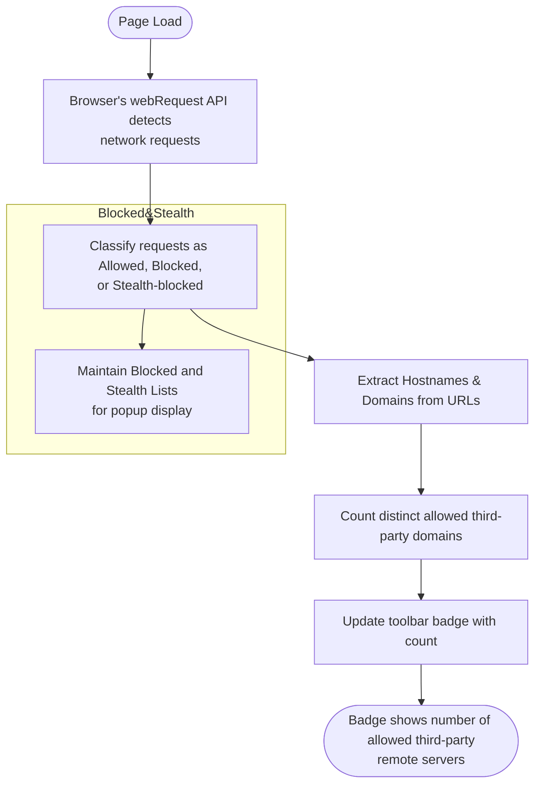

# Interpreting Toolbar Badge Counts and Metrics

## Overview
This guide clarifies the meaning behind the uBO Scope toolbar badge count, explains why a lower number typically indicates better privacy, describes scenarios that impact these counts, and shows how to effectively use the badge as a quick reference to third-party server connections on each site you visit. You will also learn common usage patterns, myths to avoid, and how to read the outcomes meaningfully.

## What the Badge Count Represents

- The badge number on the uBO Scope toolbar icon shows the **number of distinct third-party remote servers** contacted by the active browser tab.
- It counts only servers for which the browser reported a network request that was allowed (not blocked).
- Third-party servers are any remote domains that differ from the actual site domain you are visiting.

### Why a Lower Badge Count is Preferable

- Fewer third-party connections imply less exposure of your browsing data and better privacy.
- Many legitimate sites minimize third-party content to trusted CDNs.
- A high badge count typically means your browser is connecting to more external servers, increasing tracking or data leakage risk.

<Tip>
Always interpret the badge count in context: a low count is a positive privacy indicator, but not all third-party connections are inherently bad. Content Delivery Networks (CDNs) or essential service domains often appear as third parties but are generally safe.
</Tip>

## Factors That Affect the Badge Count

### 1. The Nature of the Website
- Complex websites may load content from many third-party providers, increasing the badge count.
- Simple, privacy-focused sites often connect to just a few trusted domains.

### 2. Content Blocker Effectiveness
- uBO Scope shows the count of allowed connections, **not blocked requests**.
- A content blocker that blocks aggressively may lower the badge count.
- However, a higher block count does not always mean fewer third-party connections; sometimes it means more connections were attempted.

### 3. Network Events Impacting Counts
- **Allowed**: Requests allowed to load resources from third-party domains count toward the badge.
- **Blocked**: Requests explicitly blocked do not increment the badge but appear in the popup UI under 'blocked'.
- **Stealth-blocked**: Requests redirected or stealth blocked by filtering are also excluded from the badge but shown under 'stealth' in the UI.

### 4. Browser API Limitations
- The extension relies on the browser's `webRequest` API to detect connections.
- Requests made outside this API scope (e.g., some WebSocket or service worker connections) may not be counted.

## How to Use the Badge Effectively

### Quick Privacy Indicator
- When browsing, glance at the badge to understand the quantity of third-party servers your browser connected to on the active tab.
- **Example**: Seeing a badge of `0` or `1` on a site means minimal third-party connections, indicating high privacy.

### Correlate with Popup UI
- Open the extension popup to explore detailed domain lists categorized as:
  - **Not blocked (Allowed)**: Domains actively contacted.
  - **Stealth-blocked**: Redirected or suppressed requests.
  - **Blocked**: Requests prevented by blocking.
- This helps you understand what the badge number summarizes visually.

### Myth Busting

<u>Myth:</u> "Higher block count on content blockers means better privacy."

- In reality, a high block count can coincide with more third-party connections allowed, which increases exposure.
- uBO Scope focuses on **allowed connections**, so a lower badge indicates fewer actual connections.

<u>Myth:</u> "Ad blocker test websites reflect real-world extension performance."

- Such test sites generate artificial network requests and cannot emulate real-world browsing.
- uBO Scope reveals actual, real-site third-party connections for meaningful insight.

## Practical Scenarios

### Scenario 1: Trusted Corporate Site
- You visit a corporate site and see a badge count of `3`.
- Popup shows domains belonging to main site CDN and authorized analytics services.
- Interpretation: Site uses minimal third-party services, good privacy footprint.

### Scenario 2: News Website with Ads
- Badge count is `15`.
- Popup shows many advertising and tracking domains allowed.
- Interpretation: High exposure to multiple third-party services; privacy risk is heightened.

### Scenario 3: Privacy-Enhanced Browsing Setup
- Badge count often reads near zero despite browsing various sites.
- Indicates a strict content blocking framework actively minimizing third-party connections.

## Common Pitfalls and How to Avoid Them

- Do not rely on block counts alone; they can be misleading if the browser still fetches many third-party resources.
- Avoid trusting third-party "ad blocker test" webpages; they do not reflect actual network behavior.
- Remember, the badge count resets per tab and reflects only the current active tab.
- Not all third-party connections indicate malicious behavior; some are essential.

## Summary

| Aspect | Meaning | User Action |
|-|-|-|
| Badge Number | Distinct allowed third-party servers per tab | Use as a quick privacy reference |
| Lower Badge | Fewer exposures, better privacy | Aim to minimize this number |
| Higher Badge | More third-party connections | Investigate using popup UI details |
| Popup Domains | Lists allowed, blocked, stealth domains | Review to understand content sources |

## Troubleshooting Badge Count Discrepancies

If the badge count seems unusually high or low, try the following:

1. **Reload the Page:** Ensure the extension captures all network requests fresh.
2. **Check for Browser Updates:** Some browser API changes can affect reporting.
3. **Confirm Extension Permissions:** Verify uBO Scope has required permissions.
4. **Review Popup UI:** Look at detailed allowed domains; see if many third-party hosts are present.

If issues persist, consult the [Troubleshooting Installation & Usage Issues](../../getting-started/getting-using/troubleshooting) guide.

## Next Steps and Related Documentation

- **Explore Popup UI:** Deep dive into domain statuses in [Exploring the Popup UI: Domains and Statuses](./understanding-popup-ui).
- **Understand Core Concepts:** Learn about third-party servers, outcome definitions in [Core Concepts & Terminology](../../overview/architecture-concepts/core-terminology).
- **Compare Content Blockers:** Use uBO Scope metrics for advanced analysis in [Comparing Content Blockers Using uBO Scope](../practical-analyses-advanced-usage/analyzing-content-blockers).

---

## Appendix: Practical Tips

- **Tip:** Monitor badge counts as you browse different types of sites to build intuition on what typical privacy footprints look like.
- **Tip:** Use the badge alongside your active content blocker’s metrics to get a full picture of network activity.
- **Tip:** Frequent high badge counts signal you may want to review or tighten your blocking rules.

---

For further clarity, below is a visual flow describing how the badge count is determined:

This flow is executed continuously as network requests occur, always reflecting up-to-date counts.

---

## Frequently Asked Questions

**Q: Does the badge count include first-party connections?**  
A: No, the badge counts only third-party domains different from the site domain.

**Q: Can I rely solely on uBO Scope badge to gauge my privacy?**  
A: The badge is a strong indicator but review popup details and complement with other tools for comprehensive privacy assessment.

**Q: Why does some domain show counts greater than one in popup?**  
A: The count reflects the number of successful requests from that domain during the session.

---

<u>For full onboarding and best use practices, refer to the broader uBO Scope documentation suite and onboarding guides linked in the summary below.</u>
